

# LAPORAN PRAKTIKUM  
## PEMROGRAMAN MOBILE  

---

## JOBSHEET 02  
### Pengantar Bahasa Pemrograman Dart - Bagian 2  

---

**Dosen Pengampu:**  
Habibie Ed Dien, S.Kom., M.T.

---

**Disusun oleh:**  
Chiko Abilla Basya  
2341720005  
TI-3G  
D-4 Teknik Informatika  
Politeknik Negeri Malang

---

Jl. Soekarno Hatta No.9, Jatimulyo,  
Kec. Lowokwaru, Kota Malang, Jawa Timur 65141  

Phone: (0341) 404424, 404425  
Email: [Polinema.ac.id](https://www.polinema.ac.id)  

---

## Praktikum 1: Menerapkan Control Flows ("if/else")

Selesaikan langkah-langkah praktikum berikut ini menggunakan DartPad di browser Anda.

### Langkah 1
Ketik atau salin kode program berikut ke dalam fungsi `main()`.

**Kode Program**  
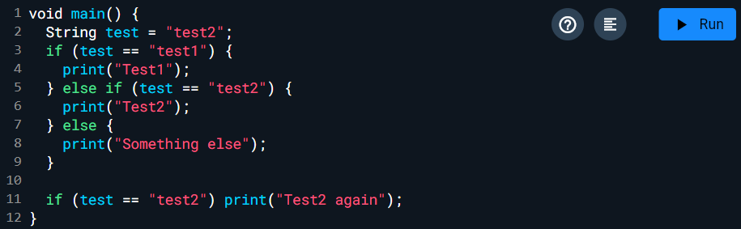

### Langkah 2
Silakan coba eksekusi (Run) kode pada langkah 1 tersebut. Apa yang terjadi? Jelaskan!

**Output**  
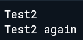

> Karena variabel test bernilai "test2", maka kondisi pertama `if (test == "test1")` bernilai false sehingga tidak dijalankan. Kondisi kedua `else if (test == "test2")` bernilai true, sehingga program mengeksekusi perintah mencetak "Test2". Selanjutnya, pada pernyataan terakhir `if (test == "test2") print("Test2 again");`, kondisi kembali bernilai true, sehingga program juga mencetak "Test2 again".

### Langkah 3
Tambahkan kode program berikut, lalu coba eksekusi (Run) kode Anda.

**Kode Program**  
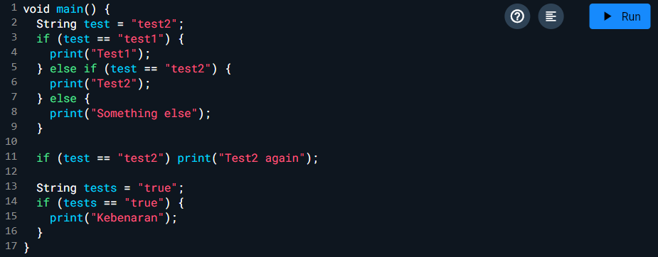

**Output**  
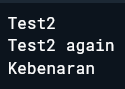

---

## Praktikum 2: Menerapkan Perulangan "while" dan "do-while"

Selesaikan langkah-langkah praktikum berikut ini menggunakan DartPad di browser Anda.

### Langkah 1
Ketik atau salin kode program berikut ke dalam fungsi `main()`.

**Kode Program**  
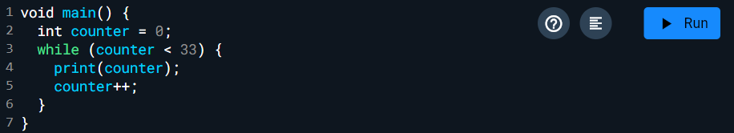

### Langkah 2
Silakan coba eksekusi (Run) kode pada langkah 1 tersebut. Apa yang terjadi? Jelaskan! Lalu perbaiki jika terjadi error.

**Output**  
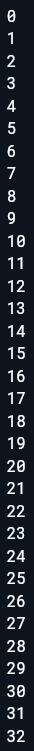

> Variabel counter diawali dengan nilai 0. Selama nilai counter masih lebih kecil dari 33, perulangan while akan terus dijalankan. Pada setiap putaran, nilai counter dicetak ke layar lalu ditambah satu. Ketika nilai counter mencapai 33, kondisi `while (counter < 33)` menjadi salah, sehingga perulangan berhenti.

### Langkah 3
Tambahkan kode program berikut, lalu coba eksekusi (Run) kode Anda.

**Kode Program**  
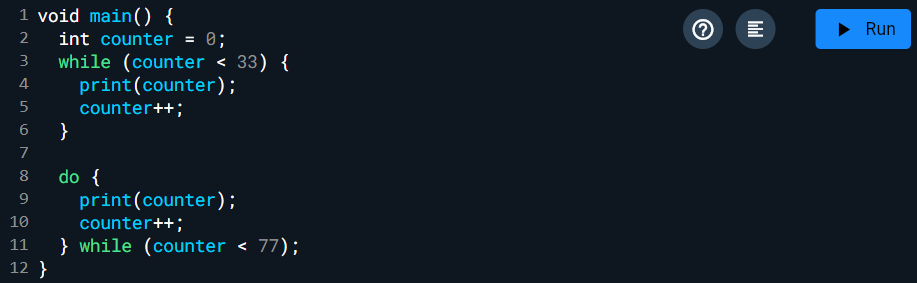

Apa yang terjadi? Jika terjadi error, silakan perbaiki namun tetap menggunakan do-while.

**Output**  
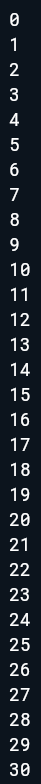 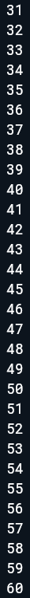 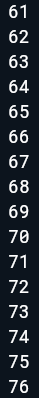

---

## Praktikum 3: Menerapkan Perulangan "for" dan "break-continue"

Selesaikan langkah-langkah praktikum berikut ini menggunakan DartPad di browser Anda.

### Langkah 1
Ketik atau salin kode program berikut ke dalam fungsi `main()`.

**Kode Program**  
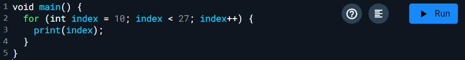

### Langkah 2
Silakan coba eksekusi (Run) kode pada langkah 1 tersebut. Apa yang terjadi? Jelaskan! Lalu perbaiki jika terjadi error.

**Output**  
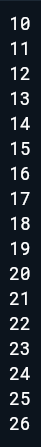

> Variabel index dimulai dengan nilai 10. Selama nilai index masih kurang dari 27, perulangan akan terus dijalankan. Pada setiap putaran, nilai index dicetak ke layar kemudian ditambah satu. Perulangan akan berhenti ketika nilai index mencapai 27.

### Langkah 3
Tambahkan kode program berikut di dalam for-loop, lalu coba eksekusi (Run) kode Anda.

**Kode Program**  
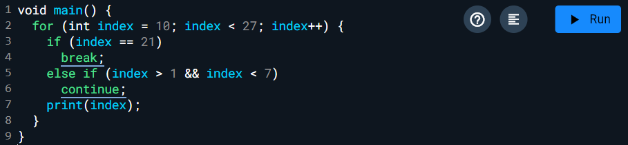

Apa yang terjadi? Jika terjadi error, silakan perbaiki namun tetap menggunakan for dan break-continue.

**Output**  
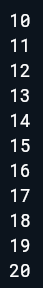

---

## Tugas Praktikum

1. **Silakan selesaikan Praktikum 1 sampai 3, lalu dokumentasikan berupa screenshot hasil pekerjaan beserta penjelasannya!**

2. **Buatlah sebuah program yang dapat menampilkan bilangan prima dari angka 0 sampai 201 menggunakan Dart. Ketika bilangan prima ditemukan, maka tampilkan nama lengkap dan NIM Anda.**

   **Kode Program**  
   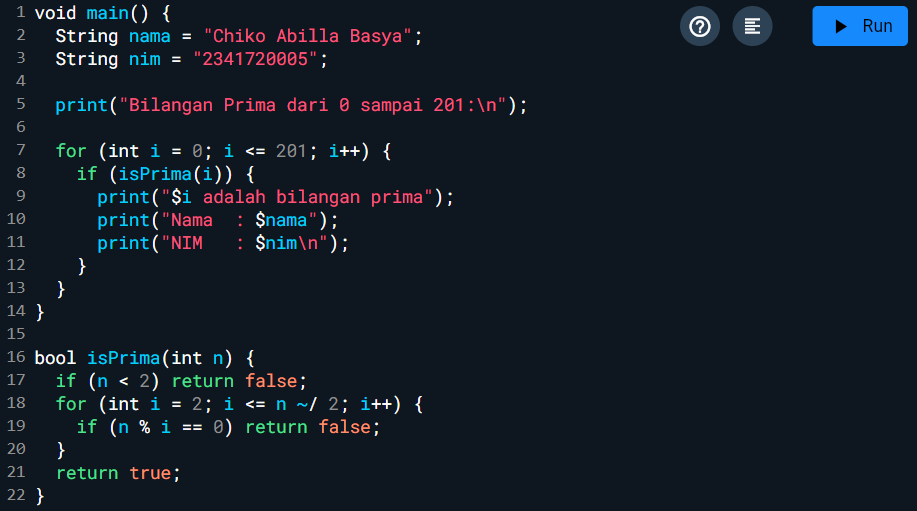

   **Output**  
   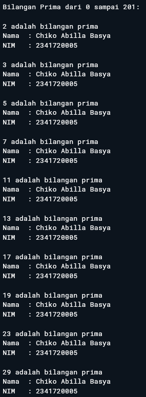 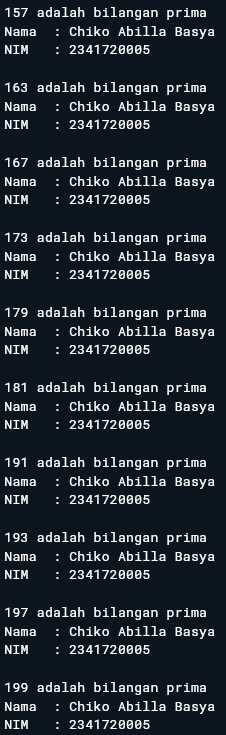 

3. **Kumpulkan berupa link commit repo GitHub pada tautan yang telah disediakan di grup Telegram!**