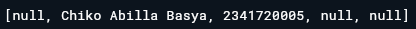
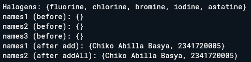
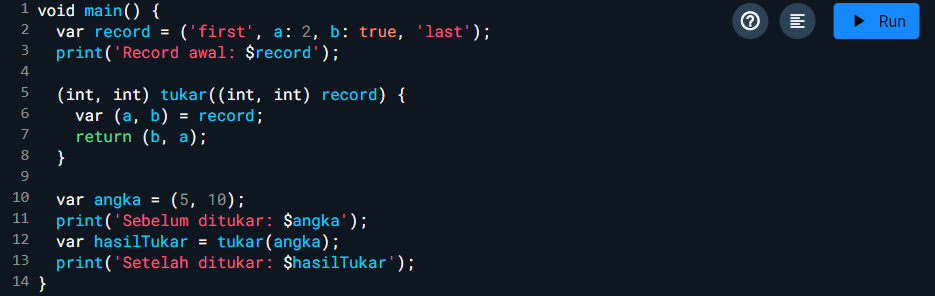

<div align="center">

# LAPORAN PRAKTIKUM

## PEMROGRAMAN MOBILE


---

## JOBSHEET 02

### Pemrograman Dasar Dart - Bag.3 (Collections dan Functions) 

---

**Dosen Pengampu:**  
Habibie Ed Dien, S.Kom., M.T.

---

**Disusun oleh:**  
Chiko Abilla Basya  
2341720005  
TI-3G  
D-4 Teknik Informatika  
Politeknik Negeri Malang

---

Jl. Soekarno Hatta No.9, Jatimulyo,  
Kec. Lowokwaru, Kota Malang, Jawa Timur 65141

Phone: (0341) 404424, 404425  
Email: [Polinema.ac.id](https://www.polinema.ac.id)

</div>

---

## Praktikum 1: Eksperimen Tipe Data List

Selesaikan langkah-langkah praktikum berikut ini menggunakan VS Code atau Code Editor favorit Anda.

### Langkah 1:
Ketik atau salin kode program berikut ke dalam `void main()`.

```dart
var list = [1, 2, 3];
assert(list.length == 3);
assert(list[1] == 2);
print(list.length);
print(list[1]);

list[1] = 1;
assert(list[1] == 1);
print(list[1]);
```

 

### Langkah 2:
Silakan coba eksekusi (Run) kode pada langkah 1 tersebut. Apa yang terjadi? Jelaskan!


Ketika kode dijalankan, program membuat list [1, 2, 3] dan melakukan beberapa operasi. Pertama, program memverifikasi bahwa list memiliki 3 elemen dan elemen kedua bernilai 2. Kemudian mencetak panjang list (output: 3) dan nilai elemen kedua (output: 2). Selanjutnya, program mengubah elemen kedua dari 2 menjadi 1, sehingga list menjadi [1, 1, 3]. Program memverifikasi perubahan berhasil dan mencetak nilai elemen kedua yang baru (output: 1).

### Langkah 3:
Ubah kode pada langkah 1 menjadi variabel final yang mempunyai index = 5 dengan default value = `null`. Isilah nama dan NIM Anda pada elemen index ke-1 dan ke-2. Lalu print dan capture hasilnya.

Apa yang terjadi ? Jika terjadi error, silakan perbaiki.




Ketika kode dijalankan, program akan membuat sebuah list dengan tipe List<String?> yang memiliki 5 elemen dan semuanya diinisialisasi dengan nilai null. Kemudian program mengisi elemen pada index ke-1 dengan string "Chiko Abilla Basya" dan elemen pada index ke-2 dengan string "2341720005". Terakhir, program mencetak seluruh isi list.

---

## Praktikum 2: Eksperimen Tipe Data Set

Selesaikan langkah-langkah praktikum berikut ini menggunakan VS Code atau Code Editor favorit Anda.

### Langkah 1:
Ketik atau salin kode program berikut ke dalam fungsi `main()`.

```dart
var halogens = {'fluorine', 'chlorine', 'bromine', 'iodine', 'astatine'};
print(halogens);
```


### Langkah 2:
Silakan coba eksekusi (Run) kode pada langkah 1 tersebut. Apa yang terjadi? Jelaskan! Lalu perbaiki jika terjadi error.


Ketika kode dijalankan, program membuat sebuah Set yang berisi lima elemen string yaitu nama-nama unsur halogen: 'fluorine', 'chlorine', 'bromine', 'iodine', dan 'astatine'. Set dibuat menggunakan sintaks kurung kurawal {} yang membedakannya dari list yang menggunakan kurung siku [].

### Langkah 3:
Tambahkan kode program berikut, lalu coba eksekusi (Run) kode Anda.

```dart
var names1 = <String>{};
Set<String> names2 = {}; // This works, too.
var names3 = {}; // Creates a map, not a set.

print(names1);
print(names2);
print(names3);
```

Apa yang terjadi ? Jika terjadi error, silakan perbaiki namun tetap menggunakan ketiga variabel tersebut. Tambahkan elemen nama dan NIM Anda pada kedua variabel Set tersebut dengan dua fungsi berbeda yaitu `.add()` dan `.addAll()`. Untuk variabel Map dihapus, nanti kita coba di praktikum selanjutnya.

Dokumentasikan code dan hasil di console, lalu buat laporannya.




Ketika kode dijalankan, program membuat names1 dan names2 sebagai Set kosong untuk String, sedangkan names3 adalah Map karena tidak ada type annotation. Program menambahkan nama dan NIM menggunakan .add() untuk satu elemen dan .addAll() untuk multiple elemen. Variabel names3 di-comment karena bukan Set. Kedua Set berhasil menyimpan data dengan metode berbeda namun hasil sama.

---

## Praktikum 3: Eksperimen Tipe Data Maps

Selesaikan langkah-langkah praktikum berikut ini menggunakan VS Code atau Code Editor favorit Anda.

### Langkah 1:
Ketik atau salin kode program berikut ke dalam fungsi `main()`.

```dart
var gifts = {
  // Key:    Value
  'first': 'partridge',
  'second': 'turtledoves',
  'fifth': 1
};

var nobleGases = {
  2: 'helium',
  10: 'neon',
  18: 2,
};

print(gifts);
print(nobleGases);
```


### Langkah 2:
Silakan coba eksekusi (Run) kode pada langkah 1 tersebut. Apa yang terjadi? Jelaskan! Lalu perbaiki jika terjadi error.


Ketika kode langkah 1 dijalankan, program akan membuat dua Map dengan tipe data yang berbeda. Map gifts menggunakan String sebagai key dan mixed type sebagai value, sedangkan Map nobleGases menggunakan int sebagai key dan mixed type sebagai value. Program akan mencetak kedua Map tersebut.

### Langkah 3:
Tambahkan kode program berikut, lalu coba eksekusi (Run) kode Anda.

```dart
var mhs1 = Map<String, String>();
gifts['first'] = 'partridge';
gifts['second'] = 'turtledoves';
gifts['fifth'] = 'golden rings';

var mhs2 = Map<int, String>();
nobleGases[2] = 'helium';
nobleGases[10] = 'neon';
nobleGases[18] = 'argon';
```

Apa yang terjadi ? Jika terjadi error, silakan perbaiki.

Tambahkan elemen nama dan NIM Anda pada tiap variabel di atas (`gifts`, `nobleGases`, `mhs1`, dan `mhs2`). Dokumentasikan hasilnya dan buat laporannya!


Ketika kode dijalankan, program membuat empat Map yang berbeda untuk mendemonstrasikan penggunaan Map di Dart. Map gifts dan nobleGases awalnya berisi data mixed type, kemudian dimodifikasi dengan nilai baru. Map mhs1 dibuat kosong dengan tipe String untuk key dan value, sedangkan mhs2 menggunakan int sebagai key dan String sebagai value. Program berhasil menambahkan nama dan NIM ke semua Map menggunakan sintaks bracket notation. Map secara otomatis mengganti value jika key sudah ada atau menambahkan pasangan key-value baru jika key belum ada.

---

## Praktikum 4: Eksperimen Tipe Data List: Spread dan Control-flow Operators

Selesaikan langkah-langkah praktikum berikut ini menggunakan VS Code atau Code Editor favorit Anda.

### Langkah 1:
Ketik atau salin kode program berikut ke dalam fungsi `main()`.

```dart
var list = [1, 2, 3];
var list2 = [0, ...list];
print(list1);
print(list2);
print(list2.length);
```


### Langkah 2:
Silakan coba eksekusi (Run) kode pada langkah 1 tersebut. Apa yang terjadi? Jelaskan! Lalu perbaiki jika terjadi error.


Ketika kode dijalankan, program membuat dua list dan mendemonstrasikan penggunaan Spread Operator (...) untuk menyebarkan elemen dari satu list ke list lain.

### Langkah 3:
Tambahkan kode program berikut, lalu coba eksekusi (Run) kode Anda.

```dart
list1 = [1, 2, null];
print(list1);
var list3 = [0, ...?list1];
print(list3.length);
```

Apa yang terjadi ? Jika terjadi error, silakan perbaiki.

Tambahkan variabel list berisi NIM Anda menggunakan Spread Operators. Dokumentasikan hasilnya dan buat laporannya!


Ketika kode dijalankan, program mendemonstrasikan penggunaan Null-aware Spread Operator (...?) dan Spread Operator biasa (...) untuk bekerja dengan list yang mengandung nilai null dan membuat list berisi NIM.

### Langkah 4:
Tambahkan kode program berikut, lalu coba eksekusi (Run) kode Anda.

```dart
var nav = ['Home', 'Furniture', 'Plants', if (promoActive) 'Outlet'];
print(nav);
```

Apa yang terjadi ? Jika terjadi error, silakan perbaiki. Tunjukkan hasilnya jika variabel promoActive ketika `true` dan `false`.


Ketika kode dijalankan, program mendemonstrasikan penggunaan Collection If untuk menambahkan elemen secara kondisional ke dalam list berdasarkan nilai boolean.

### Langkah 5:
Tambahkan kode program berikut, lalu coba eksekusi (Run) kode Anda.

```dart
var nav2 = ['Home', 'Furniture', 'Plants', if (login case 'Manager') 'Inventory'];
print(nav2);
```

Apa yang terjadi ? Jika terjadi error, silakan perbaiki. Tunjukkan hasilnya jika variabel `login` mempunyai kondisi lain.


Ketika kode dijalankan, program mendemonstrasikan penggunaan Collection If dengan Case Pattern Matching untuk menambahkan elemen secara kondisional berdasarkan nilai string tertentu.

### Langkah 6:
Tambahkan kode program berikut, lalu coba eksekusi (Run) kode Anda.

```dart
var listOfInts = [1, 2, 3];
var listOfStrings = ['#0', for (var i in listOfInts) '#$i'];
assert(listOfStrings[1] == '#1');
print(listOfStrings);
```

Apa yang terjadi ? Jika terjadi error, silakan perbaiki. Jelaskan manfaat Collection For dan dokumentasikan hasilnya.


Collection for memungkinkan pembuatan elemen list secara dinamis berdasarkan iterasi dari collection lain. Ini membuat kode lebih concise dan readable dibandingkan menggunakan loop tradisional untuk membangun list. Dalam contoh ini, setiap angka dari listOfInts diubah menjadi string dengan prefix '#' dan ditambahkan ke listOfStrings.

---

## Praktikum 5: Eksperimen Tipe Data Records

**Catatan:** Tipe data Records mulai diperkenalkan pada Dart versi 3.0. Pastikan Anda sudah setup menggunakan Dart 3.0 atau yang lebih baru.

Selesaikan langkah-langkah praktikum berikut ini menggunakan VS Code atau Code Editor favorit Anda.

### Langkah 1:
Ketik atau salin kode program berikut ke dalam fungsi `main()`.

```dart
var record = ('first', a: 2, b: true, 'last');
print(record)
```


### Langkah 2:
Silakan coba eksekusi (Run) kode pada langkah 1 tersebut. Apa yang terjadi? Jelaskan! Lalu perbaiki jika terjadi error.


Ketika kode dijalankan, program akan membuat sebuah Record yang berisi kombinasi positional fields dan named fields. Record ini memiliki dua positional fields ('first' dan 'last') dan dua named fields (a: 2 dan b: true). Program akan mencetak seluruh Record tersebut.

### Langkah 3:
Tambahkan kode program berikut di luar scope `void main()`, lalu coba eksekusi (Run) kode Anda.

```dart
(int, int) tukar((int, int) record) {
  var (a, b) = record;
  return (b, a);
}
```

Apa yang terjadi ? Jika terjadi error, silakan perbaiki. Gunakan fungsi `tukar()` di dalam `main()` sehingga tampak jelas proses pertukaran value field di dalam Records.




Fungsi tukar() menerima Record dengan dua integer dan mengembalikan Record baru dengan posisi yang ditukar menggunakan destructuring assignment.

### Langkah 4:
Tambahkan kode program berikut di dalam scope void `main()`, lalu coba eksekusi (Run) kode Anda.

```dart
// Record type annotation in a variable declaration:
(String, int) mahasiswa;
print(mahasiswa);
```

Apa yang terjadi ? Jika terjadi error, silakan perbaiki. Inisialisasi field nama dan NIM Anda pada variabel record `mahasiswa` di atas. Dokumentasikan hasilnya dan buat laporannya!


Ketika kode dijalankan, program mendemonstrasikan Record Type Annotation untuk mendeklarasikan variabel Record dengan tipe data yang spesifik, kemudian menginisialisasi dan mencetak nilai Record tersebut.

### Langkah 5:
Tambahkan kode program berikut di dalam scope `void main()`, lalu coba eksekusi (Run) kode Anda.

```dart
var mahasiswa2 = ('first', a: 2, b: true, 'last');

print(mahasiswa2.$1); // Prints 'first'
print(mahasiswa2.a); // Prints 2
print(mahasiswa2.b); // Prints true
print(mahasiswa2.$2); // Prints 'last'
```

Apa yang terjadi ? Jika terjadi error, silakan perbaiki. Gantilah salah satu isi record dengan nama dan NIM Anda, lalu dokumentasikan hasilnya dan buat laporannya!


Records adalah tipe data baru di Dart 3.0 yang memungkinkan penyimpanan multiple values dalam satu struktur. Records dapat memiliki positional fields (diakses dengan $1, $2, dst.) dan named fields (diakses dengan nama field). Fungsi tukar mendemonstrasikan destructuring assignment untuk menu

---

## Tugas Praktikum

### 1. Silakan selesaikan Praktikum 1 sampai 5, lalu dokumentasikan berupa screenshot hasil pekerjaan Anda beserta penjelasannya!

### 2. Jelaskan yang dimaksud Functions dalam bahasa Dart!

**Jawab:**

Functions dalam bahasa pemrograman Dart merupakan blok kode yang dirancang untuk melakukan tugas tertentu dan dapat digunakan berulang kali dalam program. Functions membantu programmer mengorganisir kode menjadi bagian-bagian yang lebih kecil dan mudah dikelola, sehingga meningkatkan efisiensi dan keterbacaan program.

**Contoh Kode**
```dart
// Contoh function dasar
String sapa(String nama) {
  return 'Halo, $nama!';
}

void main() {
  print(sapa('Chiko'));
}
```

### 3. Jelaskan jenis-jenis parameter di Functions beserta contoh sintaksnya!

**Jawab:**

Functions di Dart memiliki beberapa jenis parameter yang memberikan fleksibilitas dalam penggunaan. Parameter required positional merupakan parameter wajib yang harus diberikan sesuai urutan saat memanggil function. Parameter optional positional memungkinkan programmer memberikan nilai tambahan yang tidak wajib dengan menggunakan tanda kurung siku. Parameter named memberikan kemudahan dengan menyebutkan nama parameter secara eksplisit menggunakan kata kunci, sehingga urutan parameter tidak harus diikuti. Parameter mixed menggabungkan parameter positional dan named dalam satu function untuk memberikan fleksibilitas maksimal.

**Contoh Kode**
```dart
// 1. Required Positional Parameters
String buatPesan(String nama, int umur) {
  return '$nama berumur $umur tahun';
}

// 2. Optional Positional Parameters
String sapaNama(String nama, [String? gelar]) {
  return gelar != null ? '$gelar $nama' : nama;
}

// 3. Named Parameters
void tampilkanInfo({required String nama, int umur = 0, String? alamat}) {
  print('Nama: $nama');
  print('Umur: $umur');
  if (alamat != null) print('Alamat: $alamat');
}

// 4. Mixed Parameters
String profilLengkap(String nama, {required String nim, String jurusan = 'Teknik Informatika'}) {
  return 'Nama: $nama, NIM: $nim, Jurusan: $jurusan';
}

void main() {
  // Penggunaan berbagai jenis parameter
  print(buatPesan('Chiko Abilla Basya', 20));
  print(sapaNama('Chiko', 'Mr.'));
  print(sapaNama('Chiko Abilla'));
  
  tampilkanInfo(nama: 'Chiko Abilla Basya', umur: 20, alamat: 'Malang');
  print(profilLengkap('Chiko Abilla Basya', nim: '2341720005'));
}
```

### 4. Jelaskan maksud Functions sebagai first-class objects beserta contoh sintaknya!

**Jawab:**

Functions dalam Dart diperlakukan sebagai first-class objects, yang berarti functions dapat disimpan dalam variabel layaknya nilai lainnya. Functions juga dapat diteruskan sebagai argumen ke function lain, memungkinkan pembuatan higher-order functions yang powerful. Selain itu, functions dapat dikembalikan sebagai hasil dari function lain, menciptakan factory functions yang dapat menghasilkan functions baru sesuai kebutuhan.

**Contoh Kode**
```dart
// Function sebagai first-class object
int tambah(int a, int b) => a + b;
int kali(int a, int b) => a * b;

// Function yang menerima function sebagai parameter
int operasi(int a, int b, int Function(int, int) operasiFunc) {
  return operasiFunc(a, b);
}

// Function yang mengembalikan function
Function buatPenambah(int nilai) {
  return (int x) => x + nilai;
}

void main() {
  // Menyimpan function dalam variabel
  var fungsiTambah = tambah;
  print('5 + 3 = ${fungsiTambah(5, 3)}');
  
  // Mengirim function sebagai argumen
  print('Operasi tambah: ${operasi(5, 3, tambah)}');
  print('Operasi kali: ${operasi(5, 3, kali)}');
  
  // Function yang mengembalikan function
  var tambahLima = buatPenambah(5);
  print('10 + 5 = ${tambahLima(10)}');
}
```

### 5. Apa itu Anonymous Functions? Jelaskan dan berikan contohnya!

**Jawab:**

Anonymous functions adalah functions tanpa nama yang sering disebut sebagai lambda atau closure. Functions ini sangat berguna untuk operasi sederhana yang tidak memerlukan penamaan khusus, seperti dalam operasi map, filter, atau forEach pada collections. Anonymous functions dapat ditulis dalam bentuk lengkap dengan kurung kurawal atau dalam bentuk arrow function yang lebih ringkas untuk operasi satu baris.

**Contoh Kode**
```dart
void main() {
  var list = ['apel', 'banana', 'cherry'];
  
  // Anonymous function dalam forEach
  list.forEach((item) {
    print('Buah: $item');
  });
  
  // Arrow function (anonymous function pendek)
  var angka = [1, 2, 3, 4, 5];
  var kuadrat = angka.map((x) => x * x).toList();
  print('Kuadrat: $kuadrat');
  
  // Anonymous function dalam variabel
  var salam = (String nama) {
    return 'Selamat datang, $nama!';
  };
  print(salam('Chiko Abilla Basya'));
  
  // Anonymous function sebagai callback
  void eksekusiCallback(void Function() callback) {
    print('Sebelum callback');
    callback();
    print('Setelah callback');
  }
  
  eksekusiCallback(() {
    print('Ini adalah callback anonymous function');
  });
}
```

### 6. Jelaskan perbedaan Lexical scope dan Lexical closures! Berikan contohnya!

**Jawab:**

Lexical scope dalam Dart menentukan bahwa variabel dapat diakses berdasarkan lokasi deklarasinya dalam struktur kode, dimana function dalam dapat mengakses variabel dari function luar namun tidak sebaliknya. Lexical closures merupakan kemampuan function untuk "mengingat" dan mengakses variabel dari scope tempat function tersebut didefinisikan, bahkan setelah scope tersebut selesai dieksekusi. Closure memungkinkan encapsulation data dan behavior yang sangat berguna untuk membuat counter, factory functions, atau pola singleton.

**Contoh Kode**
```dart
// Lexical Scope
String globalVar = 'Global';

void lexicalScopeExample() {
  String outerVar = 'Outer';
  
  void innerFunction() {
    String innerVar = 'Inner';
    print('Akses dari inner: $globalVar, $outerVar, $innerVar');
  }
  
  innerFunction();
  // print(innerVar); // Error: innerVar tidak bisa diakses di sini
}

// Lexical Closures
Function buatCounter() {
  int count = 0; // Variabel ini akan "tertangkap" oleh closure
  
  return () {
    count++; // Closure dapat mengakses dan memodifikasi variabel count
    return count;
  };
}

Function buatPengali(int faktor) {
  return (int angka) => angka * faktor; // faktor tertangkap oleh closure
}

void main() {
  lexicalScopeExample();
  
  // Contoh Closure
  var counter1 = buatCounter();
  var counter2 = buatCounter();
  
  print('Counter1: ${counter1()}'); // 1
  print('Counter1: ${counter1()}'); // 2
  print('Counter2: ${counter2()}'); // 1 (instance terpisah)
  
  var kaliDua = buatPengali(2);
  var kaliTiga = buatPengali(3);
  
  print('5 x 2 = ${kaliDua(5)}'); // 10
  print('5 x 3 = ${kaliTiga(5)}'); // 15
}
```

### 7. Jelaskan dengan contoh cara membuat return multiple value di Functions!

**Jawab:**

Dart menyediakan beberapa cara untuk mengembalikan multiple values dari sebuah function. Cara pertama menggunakan List untuk mengembalikan sekumpulan nilai dengan tipe data yang sama atau berbeda. Cara kedua menggunakan Map untuk mengembalikan nilai dengan key-value pairs yang memberikan context lebih jelas. Cara ketiga menggunakan Records yang merupakan fitur baru di Dart 3.0, memungkinkan pengembalian multiple values dengan type safety yang lebih baik. Cara keempat menggunakan custom class yang memberikan struktur data yang lebih terorganisir dan dapat dikembangkan dengan method tambahan.

**Contoh Kode**
```dart
// 1. Menggunakan List
List<int> operasiMatematika(int a, int b) {
  return [a + b, a - b, a * b, a ~/ b];
}

// 2. Menggunakan Map
Map<String, dynamic> hitungLingkaran(double radius) {
  const pi = 3.14159;
  return {
    'radius': radius,
    'diameter': radius * 2,
    'keliling': 2 * pi * radius,
    'luas': pi * radius * radius,
  };
}

// 3. Menggunakan Records (Dart 3.0+)
(String, int, bool) getDataMahasiswa() {
  return ('Chiko Abilla Basya', 2341720005, true);
}

// 4. Menggunakan Records dengan Named Fields
({String nama, int nim, String jurusan, double ipk}) getProfilMahasiswa() {
  return (
    nama: 'Chiko Abilla Basya',
    nim: 2341720005,
    jurusan: 'Teknik Informatika',
    ipk: 3.85
  );
}

// 5. Menggunakan Custom Class
class HasilPembagian {
  final int hasil;
  final int sisa;
  
  HasilPembagian(this.hasil, this.sisa);
  
  @override
  String toString() => 'Hasil: $hasil, Sisa: $sisa';
}

HasilPembagian bagi(int dividend, int divisor) {
  return HasilPembagian(dividend ~/ divisor, dividend % divisor);
}

void main() {
  // 1. Multiple values dengan List
  var hasil = operasiMatematika(10, 3);
  print('Tambah: ${hasil[0]}, Kurang: ${hasil[1]}, Kali: ${hasil[2]}, Bagi: ${hasil[3]}');
  
  // 2. Multiple values dengan Map
  var lingkaran = hitungLingkaran(7.0);
  print('Radius: ${lingkaran['radius']}');
  print('Keliling: ${lingkaran['keliling']}');
  print('Luas: ${lingkaran['luas']}');
  
  // 3. Multiple values dengan Records
  var (nama, nim, aktif) = getDataMahasiswa();
  print('Nama: $nama, NIM: $nim, Aktif: $aktif');
  
  // 4. Multiple values dengan Named Records
  var profil = getProfilMahasiswa();
  print('Nama: ${profil.nama}');
  print('NIM: ${profil.nim}');
  print('Jurusan: ${profil.jurusan}');
  print('IPK: ${profil.ipk}');
  
  // 5. Multiple values dengan Custom Class
  var pembagian = bagi(17, 5);
  print(pembagian);
}
```

### 8. Kumpulkan berupa link commit repo GitHub kepada dosen pengampu sesuai kesepakatan di kelas!