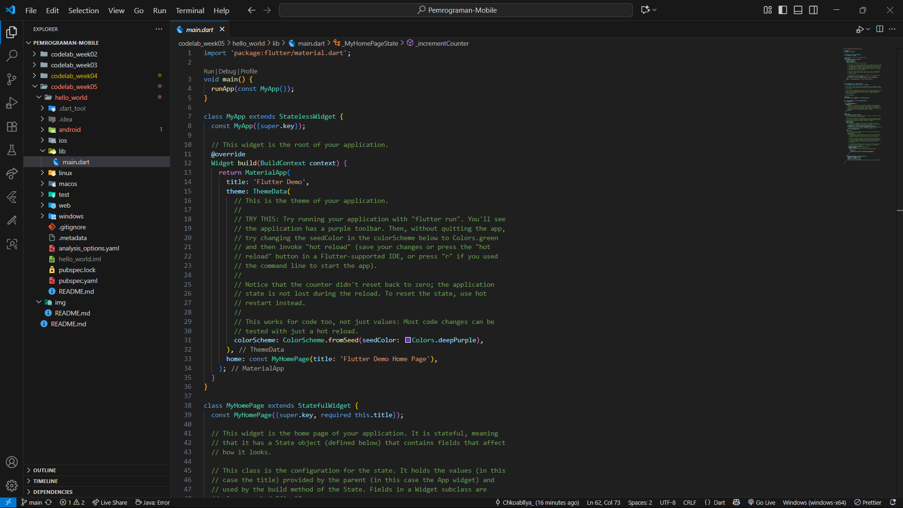

# LAPORAN PRAKTIKUM

## PEMROGRAMAN MOBILE

---

## JOBSHEET 02

### Aplikasi Pertama & Widget Dasar Flutter

---

**Dosen Pengampu:**  
Habibie Ed Dien, S.Kom., M.T.

---

**Disusun oleh:**  
Chiko Abilla Basya  
2341720005  
TI-3G  
D-4 Teknik Informatika  
Politeknik Negeri Malang

---

Jl. Soekarno Hatta No.9, Jatimulyo,  
Kec. Lowokwaru, Kota Malang, Jawa Timur 65141

Phone: (0341) 404424, 404425  
Email: [Polinema.ac.id](https://www.polinema.ac.id)

---

Praktikum 1: Membuat Project Flutter Baru

Selesaikan langkah-langkah praktikum berikut ini menggunakan editor Visual Studio Code (VS Code) atau Android Studio atau code editor lain kesukaan Anda.

Jika sudah selesai proses pembuatan project baru, pastikan tampilan seperti berikut. Pesan akan tampil berupa "Your Flutter Project is ready!" artinya Anda telah berhasil membuat project Flutter baru.

