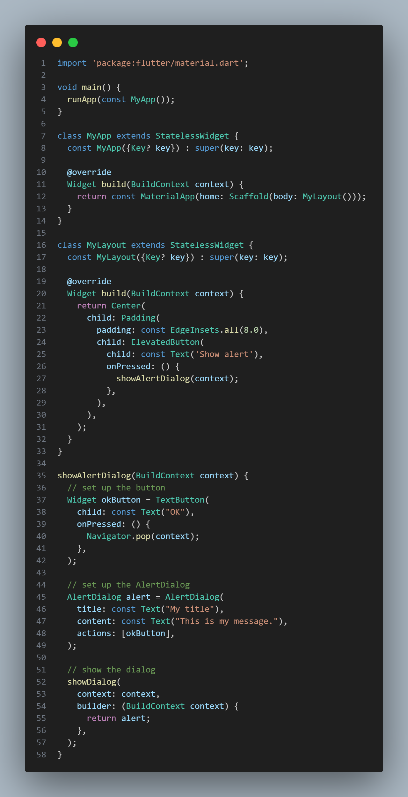

<div align="center">

# LAPORAN PRAKTIKUM

## PEMROGRAMAN MOBILE


---

## JOBSHEET 04

### Aplikasi Pertama & Widget Dasar Flutter

---

**Dosen Pengampu:**  
Habibie Ed Dien, S.Kom., M.T.

---

**Disusun oleh:**  
Chiko Abilla Basya  
2341720005  
TI-3G  
D-4 Teknik Informatika  
Politeknik Negeri Malang

---

Jl. Soekarno Hatta No.9, Jatimulyo,  
Kec. Lowokwaru, Kota Malang, Jawa Timur 65141

Phone: (0341) 404424, 404425  
Email: [Polinema.ac.id](https://www.polinema.ac.id)

</div>

---

## Praktikum 1: Membuat Project Flutter Baru

Selesaikan langkah-langkah praktikum berikut ini menggunakan editor Visual Studio Code (VS Code) atau Android Studio atau code editor lain kesukaan Anda.

Jika sudah selesai proses pembuatan project baru, pastikan tampilan seperti berikut. Pesan akan tampil berupa "**Your Flutter Project is ready!**" artinya Anda telah berhasil membuat project Flutter baru.


**Penjelasan:**
Praktikum pertama ini merupakan tahap inisialisasi dalam pengembangan aplikasi Flutter di mana kita membuat project baru menggunakan command `flutter create hello_world`. Pesan "Your Flutter Project is ready!" yang muncul menandakan bahwa Flutter SDK telah berhasil menggenerate struktur project dasar dengan semua file dan folder yang diperlukan seperti lib, android, ios, dan pubspec.yaml. Struktur project ini akan menjadi foundation untuk semua pengembangan aplikasi selanjutnya.

---

## Praktikum 2: Menghubungkan Perangkat Android atau Emulator

Melanjutkan dari praktikum 1, Anda diminta untuk menjalankan aplikasi ke perangkat fisik (device Android atau iOS). Silakan ikuti langkah-langkah pada codelab tautan berikut ini.

https://developer.android.com/codelabs/basic-android-kotlin-compose-connect-device?hl=id#0


**Memilih device, menggunakan perangkat fisik (Vivo Y35):**


**Bukti sudah tersambung handphone**


**Hasil run dari android**


**Penjelasan:**
Praktikum kedua mengajarkan cara menghubungkan aplikasi Flutter ke perangkat fisik, dalam hal ini menggunakan smartphone Vivo Y35. Proses ini melibatkan aktivasi Developer Options dan USB Debugging pada perangkat Android, kemudian menjalankan command `flutter devices` untuk memverifikasi koneksi. Pengalaman menggunakan perangkat fisik memberikan insight yang lebih realistis tentang performa aplikasi dibandingkan dengan emulator, serta memungkinkan testing fitur-fitur yang bergantung pada hardware seperti sensor dan kamera.

---

## Praktikum 3: Membuat Repository GitHub dan Laporan Praktikum

Melanjutkan dari praktikum 2, silakan selesaikan langkah-langkah berikut ini.

>**Perhatian:** Diasumsikan Anda telah mempunyai akun GitHub dan Anda telah memahami konsep dasar dalam bekerja menggunakan Git pada pertemuan pertama. Praktikum ini dapat Anda **lewati langsung ke langkah 11** jika sudah paham cara membuat laporan praktikum sesuai style yang Anda pilih.

### Langkah 11:
Kembali ke VS Code, ubah platform di pojok kanan bawah ke emulator atau device atau bisa juga menggunakan browser Chrome. Lalu coba running project **hello_world** dengan tekan **F5** atau **Run > Start Debugging**. Tunggu proses kompilasi hingga selesai, maka aplikasi flutter pertama Anda akan tampil seperti berikut.


>**Perhatian:** Proses Run atau kompilasi untuk pertama kali akan memakan waktu cukup lama (3-5 menit). Namun, proses kompilasi berikutnya menjadi lebih cepat. Berbeda ketika melakukan kompilasi ke device, hal ini akan memakan waktu lebih lama lagi.

**Penjelasan:**
Langkah 11 mendemonstrasikan proses menjalankan aplikasi Flutter untuk pertama kali dengan menekan F5 atau menggunakan menu Run > Start Debugging.

### Langkah 12:
Silakan screenshot seperti pada Langkah 11, namun teks yang ditampilkan dalam aplikasi berupa nama lengkap Anda. Simpan file screenshot dengan nama **01.png** pada folder **images** (buat folder baru jika belum ada) di project hello_world Anda. Lalu ubah isi README.md seperti berikut, sehingga tampil hasil screenshot pada file README.md. Kemudian push ke repository Anda.


>**Perhatian:** Lakukan proses screenshot seperti pada Langkah 12 untuk setiap Laporan Praktikum yang Anda akan buat pada praktikum selanjutnya hingga pertemuan project final.

**Penjelasan:**
Langkah 12 melibatkan customization sederhana dengan mengganti teks default menjadi nama lengkap "Chiko Abilla Basya".

---

## Praktikum 4: Menerapkan Widget Dasar

Selesaikan langkah-langkah praktikum berikut ini dengan melanjutkan dari praktikum sebelumnya.

### Langkah 1: Text Widget
Buat folder baru **basic_widgets** di dalam folder **lib**. Kemudian buat file baru di dalam basic_widgets dengan nama `text_widget.dart`. Ketik atau salin kode program berikut ke project hello_world Anda pada file `text_widget.dart`.

```dart
import 'package:flutter/material.dart';

class MyTextWidget extends StatelessWidget {
  const MyTextWidget({Key? key}) : super(key: key);

  @override
  Widget build(BuildContext context) {
    return const Text(
      "Nama saya Fulan, sedang belajar Pemrograman Mobile",
      style: TextStyle(color: Colors.red, fontSize: 14),
      textAlign: TextAlign.center);
  }
}
```

>**Perhatian:** Gantilah teks **Fulan** dengan nama lengkap Anda.

**Kode Program**


Lakukan import file `text_widget.dart` ke main.dart, lalu ganti bagian text widget dengan kode di atas. Maka hasilnya seperti gambar berikut. Screenshot hasil milik Anda, lalu dibuat laporan pada file README.md.

**Output**


**Penjelasan:**
Langkah 1 memperkenalkan Text Widget sebagai komponen fundamental dalam Flutter UI. Implementasi MyTextWidget menunjukkan penggunaan TextStyle untuk mengatur warna merah dan ukuran font 14, serta textAlign untuk mengatur alignment ke tengah. Pembuatan file terpisah di folder basic_widgets mengajarkan konsep modular programming dan separation of concerns.

### Langkah 2: Image Widget
Buat sebuah file `image_widget.dart` di dalam folder basic_widgets dengan isi kode berikut.

```dart
import 'package:flutter/material.dart';

class MyImageWidget extends StatelessWidget {
  const MyImageWidget({Key? key}) : super(key: key);

  @override
  Widget build(BuildContext context) {
    return const Image(
      image: AssetImage("logo_polinema.jpg")
    );
  }
}
```

**Kode Program**


Lakukan penyesuaian asset pada file `pubspec.yaml` dan tambahkan file logo Anda di folder `assets` project hello_world.

```yaml
flutter:
  assets:
     - logo_polinema.jpg
```

**Kode Program**


Jangan lupa sesuaikan kode dan import di file `main.dart` kemudian akan tampil gambar seperti berikut.

**Output**


**Penjelasan:**
Langkah 2 mengimplementasikan Image Widget untuk menampilkan logo Polinema, yang melibatkan konfigurasi assets di pubspec.yaml dan pemahaman tentang AssetImage untuk menampilkan gambar lokal dalam aplikasi Flutter.

---

## Praktikum 5: Menerapkan Widget Material Design dan iOS Cupertino

Selesaikan langkah-langkah praktikum berikut ini dengan melanjutkan project hello_world Anda. Lakukan langkah yang sama seperti pada Praktikum 3, yaitu setiap widget dibuat file sendiri lalu import ke `main.dart` dan screenshot hasilnya.

### Langkah 1: Cupertino Button dan Loading Bar
Buat file di basic_widgets > `loading_cupertino.dart`. Import stateless widget dari material dan cupertino. Lalu isi kode di dalam method Widget build adalah sebagai berikut.

```dart
return MaterialApp(
      home: Container(
        margin: const EdgeInsets.only(top: 30),
        color: Colors.white,
        child: Column(
          children: <Widget>[
            CupertinoButton(
              child: const Text("Contoh button"),
              onPressed: () {},
            ),
            const CupertinoActivityIndicator(),
          ],
        ),
      ),
    );
```

**Kode Program**


**Output**


**Penjelasan:**
Langkah 1 memperkenalkan Cupertino widgets yang memberikan tampilan iOS-style pada aplikasi Flutter. CupertinoButton dan CupertinoActivityIndicator digunakan untuk menciptakan konsistensi dengan design language iOS. Container dengan margin dan Column layout menunjukkan cara mengatur spacing dan arrangement widget secara vertikal.

### Langkah 2: Floating Action Button (FAB)
Button widget terdapat beberapa macam pada flutter yaitu ButtonBar, DropdownButton, TextButton, FloatingActionButton, IconButton, OutlineButton, PopupMenuButton, dan ElevatedButton.

Buat file di basic_widgets > `fab_widget.dart`. Import stateless widget dari material. Lalu isi kode di dalam method Widget build adalah sebagai berikut.

```dart
return MaterialApp(
      home: Scaffold(
        floatingActionButton: FloatingActionButton(
          onPressed: () {
            // Add your onPressed code here!
          },
          child: const Icon(Icons.thumb_up),
          backgroundColor: Colors.pink,
        ),
      ),
    );
```

**Kode Program**


**Output**


**Penjelasan:**
Langkah 2 mengimplementasikan FloatingActionButton (FAB) sebagai komponen khas Material Design yang biasanya diposisikan di bottom-right corner. Penggunaan backgroundColor Colors.pink dan Icons.thumb_up mendemonstrasikan customization visual, sementara empty onPressed callback menunjukkan struktur event handling.

### Langkah 3: Scaffold Widget
Scaffold widget digunakan untuk mengatur tata letak sesuai dengan material design.

Ubah isi kode `main.dart` seperti berikut.

```dart
import 'package:flutter/material.dart';

void main() {
  runApp(const MyApp());
}

class MyApp extends StatelessWidget {
  const MyApp({Key? key}) : super(key: key);

  @override
  Widget build(BuildContext context) {
    return MaterialApp(
      title: 'Flutter Demo',
      theme: ThemeData(
        primarySwatch: Colors.red,
      ),
      home: const MyHomePage(title: 'My Increment App'),
    );
  }
}

class MyHomePage extends StatefulWidget {
  const MyHomePage({Key? key, required this.title}) : super(key: key);

  final String title;

  @override
  State<MyHomePage> createState() => _MyHomePageState();
}

class _MyHomePageState extends State<MyHomePage> {
  int _counter = 0;

  void _incrementCounter() {
    setState(() {
      _counter++;
    });
  }

  @override
  Widget build(BuildContext context) {
    return Scaffold(
      appBar: AppBar(
        title: Text(widget.title),
      ),
      body: Center(
        child: Column(
          mainAxisAlignment: MainAxisAlignment.center,
          children: <Widget>[
            const Text(
              'You have pushed the button this many times:',
            ),
            Text(
              '$_counter',
              style: Theme.of(context).textTheme.headline4,
            ),
          ],
        ),
      ),
      bottomNavigationBar: BottomAppBar(
        child: Container(
          height: 50.0,
        ),
      ),
      floatingActionButton: FloatingActionButton(
        onPressed: _incrementCounter,
        tooltip: 'Increment Counter',
        child: const Icon(Icons.add),
      ), 
      floatingActionButtonLocation: FloatingActionButtonLocation.centerDocked,
    );
  }
}
```

**Kode Program**


**Output**


**Penjelasan:**
Langkah 3 memperkenalkan Scaffold sebagai struktur layout utama dalam Material Design. Scaffold menyediakan AppBar untuk header, body untuk konten utama, bottomNavigationBar untuk area navigasi bawah, dan floatingActionButton dengan FloatingActionButtonLocation.centerDocked. Implementasi counter dengan StatefulWidget dan setState() mengajarkan dasar-dasar state management dalam Flutter.

### Langkah 4: Dialog Widget
Dialog widget pada flutter memiliki dua jenis dialog yaitu `AlertDialog` dan `SimpleDialog`.

Ubah isi kode `main.dart` seperti berikut.

```dart
class MyApp extends StatelessWidget {
  const MyApp({Key? key}) : super(key: key);

  @override
  Widget build(BuildContext context) {
    return const MaterialApp(
      home: Scaffold(
        body: MyLayout(),
      ),
    );
  }
}

class MyLayout extends StatelessWidget {
  const MyLayout({Key? key}) : super(key: key);

  @override
  Widget build(BuildContext context) {
    return Padding(
      padding: const EdgeInsets.all(8.0),
      child: ElevatedButton(
        child: const Text('Show alert'),
        onPressed: () {
          showAlertDialog(context);
        },
      ),
    );
  }
}

showAlertDialog(BuildContext context) {
  // set up the button
  Widget okButton = TextButton(
    child: const Text("OK"),
    onPressed: () {
      Navigator.pop(context);
    },
  );

  // set up the AlertDialog
  AlertDialog alert = AlertDialog(
    title: const Text("My title"),
    content: const Text("This is my message."),
    actions: [
      okButton,
    ],
  );

  // show the dialog
  showDialog(
    context: context,
    builder: (BuildContext context) {
      return alert;
    },
  );
}
```

**Kode Program**



**Output**


**Penjelasan:**
Langkah 4 mengimplementasikan AlertDialog untuk menampilkan modal dialog dengan title, content, dan action buttons. Function showAlertDialog() mendemonstrasikan penggunaan showDialog() untuk menampilkan dialog dan Navigator.pop() untuk menutupnya. Pattern ini sangat umum digunakan untuk konfirmasi user atau menampilkan informasi penting.

### Langkah 5: Input dan Selection Widget
Flutter menyediakan widget yang dapat menerima input dari pengguna aplikasi yaitu antara lain Checkbox, Date and Time Pickers, Radio Button, Slider, Switch, TextField.

Contoh penggunaan TextField widget adalah sebagai berikut:

```dart
class MyApp extends StatelessWidget {
  const MyApp({Key? key}) : super(key: key);

  @override
  Widget build(BuildContext context) {
    return MaterialApp(
      home: Scaffold(
        appBar: AppBar(title: const Text("Contoh TextField")),
        body: const TextField(
          obscureText: false,
          decoration: InputDecoration(
            border: OutlineInputBorder(),
            labelText: 'Nama',
          ),
        ),
      ),
    );
  }
}
```

**Kode Program**


**Output**


**Penjelasan:**
Langkah 5 memperkenalkan TextField sebagai widget input teks dengan InputDecoration untuk styling. OutlineInputBorder memberikan border yang modern, sementara labelText berfungsi sebagai hint untuk user. Widget ini fundamental untuk form input dalam aplikasi mobile.

### Langkah 6: Date and Time Pickers
Date and Time Pickers termasuk pada kategori input dan selection widget, berikut adalah contoh penggunaan Date and Time Pickers.

```dart
import 'dart:async';
import 'package:flutter/material.dart';

void main() => runApp(const MyApp());

class MyApp extends StatelessWidget {
  const MyApp({Key? key}) : super(key: key);

  @override
  Widget build(BuildContext context) {
    return const MaterialApp(
      title: 'Contoh Date Picker',
      home: MyHomePage(title: 'Contoh Date Picker'),
    );
  }
}

class MyHomePage extends StatefulWidget {
  const MyHomePage({Key? key, required this.title}) : super(key: key);

  final String title;

  @override
  _MyHomePageState createState() => _MyHomePageState();
}

class _MyHomePageState extends State<MyHomePage> {
  // Variable/State untuk mengambil tanggal
  DateTime selectedDate = DateTime.now();

  //  Initial SelectDate FLutter
  Future<void> _selectDate(BuildContext context) async {
    // Initial DateTime FIinal Picked
    final DateTime? picked = await showDatePicker(
        context: context,
        initialDate: selectedDate,
        firstDate: DateTime(2015, 8),
        lastDate: DateTime(2101));
    if (picked != null && picked != selectedDate) {
      setState(() {
        selectedDate = picked;
      });
    }
  }

  @override
  Widget build(BuildContext context) {
    return Scaffold(
      appBar: AppBar(
        title: Text(widget.title),
      ),
      body: Center(
        child: Column(
          mainAxisSize: MainAxisSize.min,
          children: <Widget>[
            Text("${selectedDate.toLocal()}".split(' ')[0]),
            const SizedBox(
              height: 20.0,
            ),
            ElevatedButton(
              onPressed: () => {
                _selectDate(context),
                print(selectedDate.day + selectedDate.month + selectedDate.year)
              },
              child: const Text('Pilih Tanggal'),
            ),
          ],
        ),
      ),
    );
  }
}
```

**Kode Program**


**Output**


**Penjelasan:**
Langkah 6 mengimplementasikan Date Picker yang melibatkan StatefulWidget untuk menyimpan selectedDate, async/await pattern untuk showDatePicker(), dan setState() untuk update UI ketika user memilih tanggal baru. Implementation ini menunjukkan kompleksitas yang lebih tinggi dengan asynchronous programming dan date manipulation menggunakan DateTime.toLocal() dan string splitting untuk format display.

---

## Tugas Praktikum
1. Selesaikan Praktikum 1 sampai 5, lalu dokumentasikan dan push ke repository Anda berupa screenshot setiap hasil pekerjaan beserta penjelasannya di file README.md!
2. Selesaikan Praktikum 2 dan Anda wajib menjalankan aplikasi hello_world pada perangkat fisik (device Android/iOS) agar Anda mempunyai pengalaman untuk menghubungkan ke perangkat fisik. Capture hasil aplikasi di perangkat, lalu buatlah laporan praktikum pada file README.md.
3. Pada praktikum 5 mulai dari Langkah 3 sampai 6, buatlah file widget tersendiri di folder basic_widgets, kemudian pada file main.dart cukup melakukan import widget sesuai masing-masing langkah tersebut!
4. Selesaikan Codelabs: Your first Flutter app, lalu buatlah laporan praktikumnya dan push ke repository GitHub Anda!
5. README.md berisi: capture hasil akhir tiap praktikum (side-by-side, bisa juga berupa file GIF agar terlihat proses perubahan ketika ada aksi dari pengguna) dengan menampilkan NIM dan Nama Anda sebagai ciri pekerjaan Anda.
6. Kumpulkan berupa link repository/commit GitHub Anda kepada dosen yang telah disepakati!