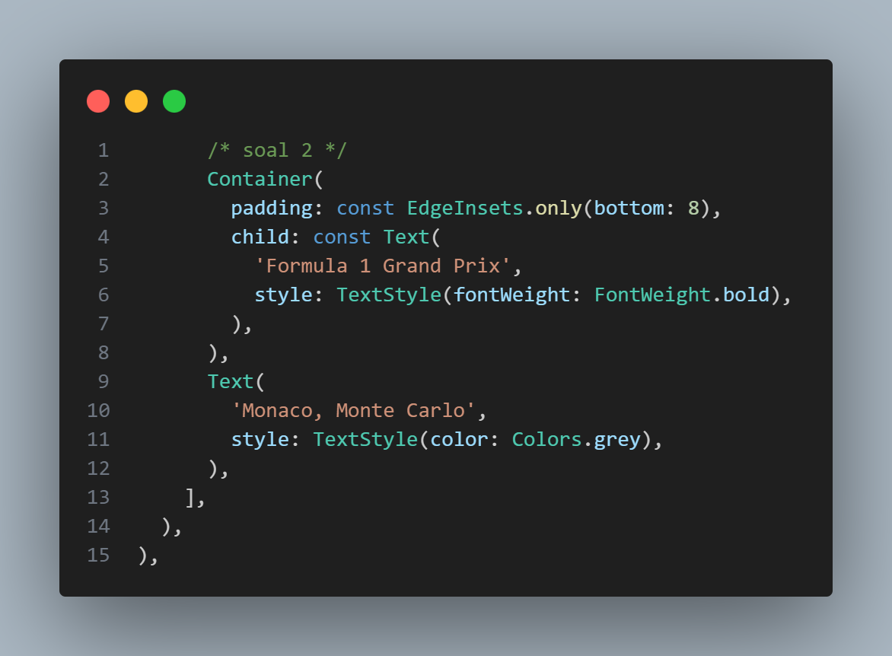
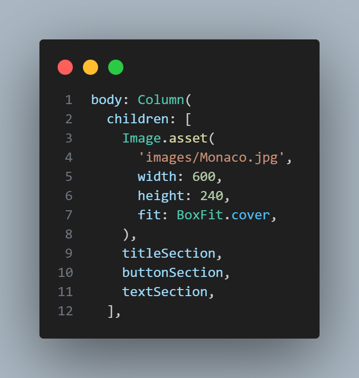

<div align="center">

# LAPORAN PRAKTIKUM

## PEMROGRAMAN MOBILE


---

## JOBSHEET 05

### Layout dan Navigasi

---

**Dosen Pengampu:**  
Habibie Ed Dien, S.Kom., M.T.

---

**Disusun oleh:**  
Chiko Abilla Basya  
2341720005  
TI-3G  
D-4 Teknik Informatika  
Politeknik Negeri Malang

---

Jl. Soekarno Hatta No.9, Jatimulyo,  
Kec. Lowokwaru, Kota Malang, Jawa Timur 65141

Phone: (0341) 404424, 404425  
Email: [Polinema.ac.id](https://www.polinema.ac.id)

</div>

---

## Praktikum 1: Membangun Layout di Flutter

### Apa yang akan Anda pelajari

* Cara kerja mekanisme tata letak Flutter.
* Cara menata widget secara vertikal dan horizontal.
* Cara membuat tata letak Flutter.

Selesaikan langkah-langkah praktikum berikut ini menggunakan editor Visual Studio Code (VS Code) atau Android Studio atau code editor lain kesukaan Anda.

> **Perhatian**: Diasumsikan Anda telah berhasil melakukan setup environment Flutter SDK, VS Code, Flutter Plugin, dan Android SDK pada pertemuan pertama.

### Tampilan akhir yang akan Anda buat


### Langkah 1: Buat Project Baru

Buatlah sebuah project flutter baru dengan nama **layout_flutter**. Atau sesuaikan style laporan praktikum yang Anda buat.


**Penjelasan:** Langkah ini bertujuan untuk membuat project Flutter baru yang akan digunakan sebagai foundation untuk mempelajari konsep layout. Nama project "layout_flutter" dipilih untuk memberikan identitas yang jelas tentang tujuan pembelajaran yaitu implementasi layout di Flutter.

### Langkah 2: Buka file lib/main.dart

Buka file `main.dart` lalu ganti dengan kode berikut. Isi nama dan NIM Anda di `text title`.

```dart
import 'package:flutter/material.dart';

void main() => runApp(const MyApp());

class MyApp extends StatelessWidget {
  const MyApp({super.key});

  @override
  Widget build(BuildContext context) {
    return MaterialApp(
      title: 'Flutter layout: Nama dan NIM Anda',
      home: Scaffold(
        appBar: AppBar(
          title: const Text('Flutter layout demo'),
        ),
        body: const Center(
          child: Text('Hello World'),
        ),
      ),
    );
  }
}
```

**Kode Program:**


**Output:**


**Penjelasan:** Pada langkah ini, kita menginisialisasi struktur dasar aplikasi Flutter dengan MaterialApp sebagai root widget. Scaffold menyediakan struktur dasar halaman dengan AppBar dan body. Text "Hello World" berfungsi sebagai placeholder yang nantinya akan diganti dengan layout yang lebih kompleks. Struktur ini menjadi fondasi untuk implementasi layout selanjutnya.

### Langkah 3: Identifikasi layout diagram

Langkah pertama adalah memecah tata letak menjadi elemen dasarnya:

* Identifikasi baris dan kolom.
* Apakah tata letaknya menyertakan kisi-kisi (grid)?
* Apakah ada elemen yang tumpang tindih?
* Apakah UI memerlukan tab?
* Perhatikan area yang memerlukan alignment, padding, atau borders.

Pertama, identifikasi elemen yang lebih besar. Dalam contoh ini, empat elemen disusun menjadi sebuah kolom: sebuah gambar, dua baris, dan satu blok teks.


Selanjutnya, buat diagram setiap baris. Baris pertama, disebut bagian Judul, memiliki 3 anak: kolom teks, ikon bintang, dan angka. Anak pertamanya, kolom, berisi 2 baris teks. Kolom pertama itu memakan banyak ruang, sehingga harus dibungkus dengan widget yang Diperluas.


Baris kedua, disebut bagian Tombol, juga memiliki 3 anak: setiap anak merupakan kolom yang berisi ikon dan teks.


Setelah tata letak telah dibuat diagramnya, cara termudah adalah dengan menerapkan pendekatan bottom-up. Untuk meminimalkan kebingungan visual dari kode tata letak yang banyak bertumpuk, tempatkan beberapa implementasi dalam variabel dan fungsi.

**Penjelasan:** Langkah identifikasi layout sangat penting dalam pengembangan UI Flutter. Proses ini membantu developer memahami struktur hierarkis widget dan merencanakan implementasi yang efisien. Pendekatan bottom-up memungkinkan pembangunan layout secara sistematis, dimulai dari komponen terkecil hingga struktur lengkap. Pemecahan menjadi section-section (title, button, text) membuat kode lebih terorganisir dan mudah di-maintain.

### Langkah 4: Implementasi title row

Pertama, Anda akan membuat kolom bagian kiri pada judul. Tambahkan kode berikut di bagian atas metode `build()` di dalam kelas `MyApp`:

```dart
Widget titleSection = Container(
  padding: const EdgeInsets.all(...),
  child: Row(
    children: [
      Expanded(
        /* soal 1*/
        child: Column(
          crossAxisAlignment: ...,
          children: [
            /* soal 2*/
            Container(
              padding: const EdgeInsets.only(bottom: ...),
              child: const Text(
                'Wisata Gunung di Batu',
                style: TextStyle(
                  fontWeight: FontWeight.bold,
                ),
              ),
            ),
            Text(
              'Batu, Malang, Indonesia',
              style: TextStyle(...),
            ),
          ],
        ),
      ),
      /* soal 3*/
      Icon(
       ...,
        color: ...,
      ),
      const Text(...),
    ],
  ),
);
```

**/* soal 1 */** Letakkan widget `Column` di dalam widget `Expanded` agar menyesuaikan ruang yang tersisa di dalam widget `Row`. Tambahkan properti `crossAxisAlignment` ke `CrossAxisAlignment.start` sehingga posisi kolom berada di awal baris.

**Kode Program:**


**Penjelasan:** Widget Expanded digunakan untuk memberikan fleksibilitas pada Column agar mengambil ruang yang tersedia dalam Row. CrossAxisAlignment.start memastikan teks rata kiri, memberikan tampilan yang konsisten dan profesional pada title section.

**/* soal 2 */** Letakkan baris pertama teks di dalam `Container` sehingga memungkinkan Anda untuk menambahkan padding = 8. Teks '`Batu, Malang, Indonesia`' di dalam `Column`, set warna menjadi abu-abu.

**Kode Program:**



**Penjelasan:** Container dengan padding memberikan spacing yang tepat antara judul dan subjudul. Warna abu-abu pada teks lokasi menciptakan hierarki visual yang jelas, dimana judul lebih menonjol daripada informasi lokasi.

**/* soal 3 */** Dua item terakhir di baris judul adalah ikon bintang, set dengan warna merah, dan teks "41". Seluruh baris ada di dalam `Container` dan beri padding di sepanjang setiap tepinya sebesar 32 piksel. Kemudian ganti isi `body text 'Hello World'` dengan variabel `titleSection` seperti berikut:


**Kode Program:**

 


**Penjelasan:** Icon bintang dengan warna merah dan angka rating menciptakan elemen visual yang menarik dan informatif. Padding 32 piksel memberikan breathing space yang cukup, membuat layout tidak terlihat cramped dan mudah dibaca.

**Kode Program Lengkap:**


**Output:**


**Penjelasan:**

Praktikum pertama fokus pada pembuatan struktur dasar layout Flutter dengan implementasi title section. Pada langkah ini, saya membuat aplikasi Flutter dengan tema Formula 1 Grand Prix Monaco yang menampilkan:
- Title section yang berisi nama tempat "Formula 1 Grand Prix" dan lokasi "Monaco, Monte Carlo"
- Rating bintang dengan nilai 95 yang mencerminkan popularitas tinggi Formula 1
- Layout menggunakan Row dan Column dengan proper alignment dan padding

Hasil implementasi menunjukkan title section yang responsif dengan teks yang aligned ke kiri dan rating di sebelah kanan, sesuai dengan prinsip layout Flutter yang menggunakan widget hierarchy. Implementasi ini mendemonstrasikan konsep dasar Flutter layout seperti Row, Column, Expanded, dan styling yang akan menjadi foundation untuk layout yang lebih kompleks.

---

## Praktikum 2: Implementasi button row

Selesaikan langkah-langkah praktikum berikut ini dengan melanjutkan dari praktikum sebelumnya.

### Langkah 1: Buat method Column _buildButtonColumn

Bagian tombol berisi 3 kolom yang menggunakan tata letak yang sama—sebuah ikon di atas baris teks. Kolom pada baris ini diberi jarak yang sama, dan teks serta ikon diberi warna primer.

Karena kode untuk membangun setiap kolom hampir sama, buatlah metode pembantu pribadi bernama `buildButtonColumn()`, yang mempunyai parameter warna, `Icon` dan `Text`, sehingga dapat mengembalikan kolom dengan widgetnya sesuai dengan warna tertentu.

**lib/main.dart (_buildButtonColumn):**

```dart
class MyApp extends StatelessWidget {
  const MyApp({super.key});

  @override
  Widget build(BuildContext context) {
    // ···
  }

  Column _buildButtonColumn(Color color, IconData icon, String label) {
    return Column(
      mainAxisSize: MainAxisSize.min,
      mainAxisAlignment: MainAxisAlignment.center,
      children: [
        Icon(icon, color: color),
        Container(
          margin: const EdgeInsets.only(top: 8),
          child: Text(
            label,
            style: TextStyle(
              fontSize: 12,
              fontWeight: FontWeight.w400,
              color: color,
            ),
          ),
        ),
      ],
    );
  }
}
```

**Kode Program:**


**Penjelasan:** Method `_buildButtonColumn` adalah implementasi dari prinsip DRY (Don't Repeat Yourself) dalam Flutter. Method ini menerima parameter untuk customization (color, icon, label) dan mengembalikan widget Column yang konsisten. MainAxisSize.min memastikan Column hanya mengambil ruang yang dibutuhkan, sementara MainAxisAlignment.center memusatkan konten secara vertikal. Margin top 8 piksel memberikan spacing yang tepat antara icon dan text.

### Langkah 2: Buat widget buttonSection

Buat Fungsi untuk menambahkan ikon langsung ke kolom. Teks berada di dalam `Container` dengan margin hanya di bagian atas, yang memisahkan teks dari ikon.

Bangun baris yang berisi kolom-kolom ini dengan memanggil fungsi dan set warna, `Icon`, dan teks khusus melalui parameter ke kolom tersebut. Sejajarkan kolom di sepanjang sumbu utama menggunakan `MainAxisAlignment.spaceEvenly` untuk mengatur ruang kosong secara merata sebelum, di antara, dan setelah setiap kolom. Tambahkan kode berikut tepat di bawah deklarasi `titleSection` di dalam metode `build()`:

**lib/main.dart (buttonSection):**

```dart
Color color = Theme.of(context).primaryColor;

Widget buttonSection = Row(
  mainAxisAlignment: MainAxisAlignment.spaceEvenly,
  children: [
    _buildButtonColumn(color, Icons.call, 'CALL'),
    _buildButtonColumn(color, Icons.near_me, 'ROUTE'),
    _buildButtonColumn(color, Icons.share, 'SHARE'),
  ],
);
```

**Kode Program:**


**Penjelasan:** ButtonSection menggunakan Row dengan MainAxisAlignment.spaceEvenly untuk mendistribusikan tiga tombol secara merata. Penggunaan Theme.of(context).primaryColor memastikan konsistensi dengan tema aplikasi. Setiap tombol dibuat menggunakan method helper yang sama dengan parameter berbeda, mendemonstrasikan reusability dan maintainability code.

### Langkah 3: Tambah button section ke body

Tambahkan variabel `buttonSection` ke dalam `body` seperti berikut:


**Kode Program:**


**Penjelasan:** Integrasi buttonSection ke dalam body menggunakan Column memungkinkan penumpukan vertikal dari titleSection dan buttonSection. Struktur ini menciptakan layout yang terorganisir dan mudah dibaca, dimana setiap section memiliki fungsi dan tampilan yang distinct.

**Kode Program Lengkap:**


**Output:**


**Penjelasan:**

Praktikum kedua mengimplementasikan button section dengan tiga tombol interaktif. Pada tahap ini, saya membuat:
- Method helper `_buildButtonColumn()` yang menerima parameter color, icon, dan label
- Button section dengan tiga tombol: RACE (ikon motorsports), SCHEDULE (ikon jadwal), dan SHARE (ikon berbagi)
- Layout menggunakan MainAxisAlignment.spaceEvenly untuk distribusi ruang yang merata

Implementasi ini menunjukkan konsep reusable component dalam Flutter dimana satu method dapat digunakan untuk membuat multiple button dengan parameter yang berbeda, sesuai dengan prinsip DRY (Don't Repeat Yourself). Hasil akhir menampilkan interface yang clean dan functional dengan spacing yang konsisten dan tema warna yang unified.

---

## Praktikum 3: Implementasi text section

Selesaikan langkah-langkah praktikum berikut ini dengan melanjutkan dari praktikum sebelumnya.

### Langkah 1: Buat widget textSection

Tentukan bagian teks sebagai variabel. Masukkan teks ke dalam `Container` dan tambahkan padding di sepanjang setiap tepinya. Tambahkan kode berikut tepat di bawah deklarasi `buttonSection`:

```dart
Widget textSection = Container(
  padding: const EdgeInsets.all(32),
  child: const Text(
    'Carilah teks di internet yang sesuai '
    'dengan foto atau tempat wisata yang ingin '
    'Anda tampilkan. '
    'Tambahkan nama dan NIM Anda sebagai '
    'identitas hasil pekerjaan Anda. '
    'Selamat mengerjakan 🙂.',
    softWrap: true,
  ),
);
```

Dengan memberi nilai `softWrap` = true, baris teks akan memenuhi lebar kolom sebelum membungkusnya pada batas kata.

**Kode Program:**


**Penjelasan:** TextSection menggunakan Container dengan padding 32 piksel untuk memberikan spacing yang generous di semua sisi. SoftWrap: true adalah property penting yang memungkinkan teks untuk wrap secara otomatis ketika mencapai batas lebar container, memastikan readability pada berbagai ukuran layar. Property ini sangat penting untuk responsive design.

### Langkah 2: Tambahkan variabel text section ke body

Tambahkan widget variabel `textSection` ke dalam `body` seperti berikut:


**Kode Program:**


**Penjelasan:** Penambahan textSection ke dalam Column body melengkapi struktur layout vertikal: titleSection → buttonSection → textSection. Struktur ini menciptakan flow yang natural untuk user, dimulai dari informasi utama, aksi yang dapat dilakukan, hingga deskripsi detail.

**Kode Program Lengkap:**


**Output:**


**Penjelasan:**

Praktikum ketiga menambahkan text section yang berisi deskripsi lengkap tentang Formula 1. Text section ini:
- Menggunakan Container dengan padding 32 piksel di semua sisi
- Menampilkan informasi detail tentang Formula 1, teknologi, kecepatan, dan sirkuit Monaco
- Menggunakan properti softWrap: true untuk automatic text wrapping
- Menyertakan identitas mahasiswa (nama dan NIM) sebagai bagian dari konten

Text section memberikan konteks yang kaya tentang topik yang dipilih dan menunjukkan bagaimana Flutter menangani text formatting dan layout yang responsive. Implementasi ini mendemonstrasikan pentingnya typography dan content hierarchy dalam mobile UI design.

---

## Praktikum 4: Implementasi image section

Selesaikan langkah-langkah praktikum berikut ini dengan melanjutkan dari praktikum sebelumnya.

### Langkah 1: Siapkan aset gambar

Anda dapat mencari gambar di internet yang ingin ditampilkan. Buatlah folder `images` di root project layout_flutter. Masukkan file gambar tersebut ke folder `images`, lalu set nama file tersebut ke file `pubspec.yaml` seperti berikut:


Contoh nama file gambar di atas adalah `lake.jpg`

**Kode Program:**


**Penjelasan:** Konfigurasi assets di pubspec.yaml adalah langkah krusial untuk menggunakan local images dalam Flutter. File pubspec.yaml sangat sensitif terhadap indentasi dan case-sensitive. Struktur folder images di root project membantu mengorganisir asset dengan baik. Setelah modifikasi pubspec.yaml, hot restart diperlukan untuk memuat assets yang baru.

> **Tips:**
> * Perhatikan bahwa `pubspec.yaml` sensitif terhadap huruf besar-kecil, jadi tulis `assets`: dan URL gambar seperti yang ditunjukkan di atas.
> * File pubspec juga sensitif terhadap spasi, jadi gunakan indentasi yang tepat.
> * Anda mungkin perlu memulai ulang program yang sedang berjalan (baik di simulator atau perangkat yang terhubung) agar perubahan pubspec dapat diterapkan.

### Langkah 2: Tambahkan gambar ke body

Tambahkan aset gambar ke dalam `body` seperti berikut:


**Kode Program:**



`BoxFit.cover` memberi tahu kerangka kerja bahwa gambar harus sekecil mungkin tetapi menutupi seluruh kotak rendernya.

**Penjelasan:** Image.asset digunakan untuk memuat gambar lokal dari folder assets. BoxFit.cover memastikan gambar mengisi seluruh area yang tersedia sambil mempertahankan aspect ratio, dengan cropping jika diperlukan. Ini memberikan hasil visual yang konsisten terlepas dari dimensi gambar asli.

### Langkah 3: Terakhir, ubah menjadi ListView

Pada langkah terakhir ini, atur semua elemen dalam `ListView`, bukan Column, karena `ListView` mendukung scroll yang dinamis saat aplikasi dijalankan pada perangkat yang resolusinya lebih kecil.


**Kode Program:**


**Penjelasan:** Perubahan dari Column ke ListView adalah upgrade penting untuk user experience. ListView menyediakan scrolling capability yang essential untuk mobile devices dengan berbagai ukuran layar. Ini memastikan semua konten dapat diakses bahkan pada device dengan layar kecil atau ketika konten melebihi tinggi layar.

**Kode Program Lengkap:**


**Output:**


**Penjelasan:**

Praktikum keempat melengkapi aplikasi dengan menambahkan gambar dan mengubah struktur menjadi scrollable. Implementasi meliputi:
- Penambahan folder images dan konfigurasi assets di pubspec.yaml
- Implementasi Image.asset dengan BoxFit.cover untuk optimal image rendering
- Perubahan dari Column menjadi ListView untuk mendukung scrolling pada berbagai ukuran layar
- Struktur final: Image → Title Section → Button Section → Text Section

ListView memberikan pengalaman user yang lebih baik karena konten dapat di-scroll pada perangkat dengan layar yang lebih kecil, menunjukkan pentingnya responsive design dalam pengembangan mobile. Hasil akhir adalah aplikasi yang fully functional dengan visual hierarchy yang jelas dan user experience yang optimal.

---

## Tugas Praktikum 1

1. Selesaikan Praktikum 1 sampai 4, lalu dokumentasikan dan push ke repository Anda berupa screenshot setiap hasil pekerjaan beserta penjelasannya di file README.md!

2. Silakan implementasikan di project baru "basic_layout_flutter" dengan mengakses sumber ini: https://docs.flutter.dev/codelabs/layout-basics


**Kode Program:**


**Output:**


**Penjelasan:** Implementasi basic layout Flutter dari dokumentasi resmi mendemonstrasikan konsep fundamental layout yang telah dipelajari. Project ini mengaplikasikan kombinasi Row, Column, dan berbagai widget layout lainnya dalam skenario yang berbeda, memperkuat pemahaman tentang layout principles di Flutter.

3. Kumpulkan link commit repository GitHub Anda kepada dosen yang telah disepakati!

---

## Konsep Navigasi dan Rute

Perpindahan halaman di Flutter, ditangani oleh Navigator dengan melibatkan konsep sebagai berikut:

* **Navigator**: sebuah widget yang mengatur tumpukan (struktur data stack) dari objek rute.
* **Route**: sebuah objek yang merepresentasikan tampilan, umumnya diimplementasikan oleh class seperti `MaterialPageRoute`.

Sebuah `Route` umumnya dimasukkan (push) atau diambil (pop) dari dan ke tumpukan `Navigator`. Ketika sebuah halaman dilakukan operasi push, maka halaman tersebut akan diletakkan di atas halaman yang memanggilnya. Ilustrasi tersebut dapat anda lihat pada gambar berikut. Dan jika pop dipanggil (tombol back ditekan) maka aplikasi akan menampilkan halaman sebelumnya. Selain itu Flutter juga mendukung adanya penamaan Route yang didefinisikan di awal.


---

## Praktikum 5: Membangun Navigasi di Flutter

### Apa yang akan Anda pelajari

* Cara kerja mekanisme navigation dan route di Flutter.
* Cara membuat navigation dan route di Flutter.

Selesaikan langkah-langkah praktikum berikut ini menggunakan editor Visual Studio Code (VS Code) atau Android Studio atau code editor lain kesukaan Anda. Materi ini dapat dimasukkan ke Laporan Praktikum folder **Week** atau **Pertemuan 06**.

### Tampilan akhir yang akan Anda buat


Pada praktikum 5 ini anda akan belajar mengenai pembangunan aplikasi bergerak multi halaman. Aplikasi yang dikembangkan berupa kasus daftar barang belanja. Pada aplikasi ini anda akan belajar untuk berpindah halaman dan mengirimkan data ke halaman lainnya. Gambaran mockup hasil akhir aplikasi dapat anda lihat pada gambar di atas (mockup dibuat sederhana, sehingga Anda mempunyai banyak ruang untuk berkreasi). Desain aplikasi menampilkan sebuah `ListView` widget yang datanya bersumber dari `List`. Ketika item ditekan, data akan dikirimkan ke halaman berikutnya.

### Langkah 1: Siapkan project baru

Sebelum melanjutkan praktikum, buatlah sebuah project baru Flutter dengan nama **belanja** dan susunan folder seperti pada gambar berikut. Penyusunan ini dimaksudkan untuk mengorganisasi kode dan widget yang lebih mudah.


### Langkah 2: Mendefinisikan Route

Buatlah dua buah file dart dengan nama `home_page.dart` dan `item_page.dart` pada folder **pages**. Untuk masing-masing file, deklarasikan `class HomePage` pada `file home_page`.dart dan `ItemPage` pada `item_page.dart`. Turunkan class dari `StatelessWidget`. Gambaran potongan kode dapat anda lihat sebagai berikut.


### Langkah 3: Lengkapi Kode di main.dart

Setelah kedua halaman telah dibuat dan didefinisikan, bukalah file `main.dart`. Pada langkah ini anda akan mendefinisikan **Route** untuk kedua halaman tersebut. Definisi penamaan **route** harus bersifat **unique**. Halaman **HomePage** didefinisikan sebagai /. Dan halaman **ItemPage** didefinisikan sebagai /**item**. Untuk mendefinisikan halaman awal, anda dapat menggunakan `named argument initialRoute`. Gambaran tahapan ini, dapat anda lihat pada potongan kode berikut.


### Langkah 4: Membuat data model

Sebelum melakukan perpindahan halaman dari `HomePage` ke `ItemPage`, dibutuhkan proses pemodelan data. Pada desain mockup, dibutuhkan dua informasi yaitu nama dan harga. Untuk menangani hal ini, buatlah sebuah file dengan nama `item.dart` dan letakkan pada folder **models**. Pada file ini didefinisikan pemodelan data yang dibutuhkan. Ilustrasi kode yang dibutuhkan, dapat anda lihat pada potongan kode berikut.


### Langkah 5: Lengkapi kode di class HomePage

Pada halaman `HomePage` terdapat `ListView` widget. Sumber data `ListView` diambil dari model List dari object Item. Gambaran kode yang dibutuhkan untuk melakukan definisi model dapat anda lihat sebagai berikut.


### Langkah 6: Membuat ListView dan itemBuilder

Untuk menampilkan `ListView` pada praktikum ini digunakan `itemBuilder`. Data diambil dari definisi model yang telah dibuat sebelumnya. Untuk menunjukkan batas data satu dan berikutnya digunakan widget `Card`. Kode yang telah umum pada bagian ini tidak ditampilkan. Gambaran kode yang dibutuhkan dapat anda lihat sebagai berikut.


Jalankan aplikasi pada emulator atau pada device anda.

> **Perhatian:** Pastikan pada halaman awal telah berhasil menampilkan `ListView`. Jika ada kesalahan, segera perbaiki sebelum melanjutkan ke langkah berikutnya.

### Langkah 7: Menambahkan aksi pada ListView

Item pada ListView saat ini ketika ditekan masih belum memberikan aksi tertentu. Untuk menambahkan aksi pada ListView dapat digunakan widget `InkWell` atau `GestureDetector`. Perbedaan utamanya `InkWell` merupakan material widget yang memberikan efek ketika ditekan. Sedangkan `GestureDetector` bersifat umum dan bisa juga digunakan untuk gesture lain selain sentuhan. Pada praktikum ini akan digunakan widget `InkWell`.

Untuk menambahkan sentuhan, letakkan cursor pada widget pembuka `Card`. Kemudian gunakan shortcut quick fix dari VSCode (**Ctrl +** . pada Windows atau **Cmd +** . pada MacOS). Sorot menu `wrap with widget...` Ubah nilai widget menjadi `InkWell` serta tambahkan named argument `onTap` yang berisi fungsi untuk berpindah ke halaman `ItemPage`. Ilustrasi potongan kode dapat anda lihat pada potongan berikut.


Jalankan aplikasi kembali dan pastikan ListView dapat disentuh dan berpindah ke halaman berikutnya. Periksa kembali jika terdapat kesalahan.

**Kode Program:** 

* lib/pages/home_page.dart:


* lib/pages/item_page.dart:


* lib/models/item.dart:


* lib/widgets/item_card.dart:


* lib/main.dart:


**Output:**

  

**Penjelasan:** Implementasi lengkap menunjukkan working navigation system dengan clean architecture. Separation of concerns terlihat jelas dengan model, view, dan widget components yang terpisah. Navigation flow berjalan smooth dengan proper route management dan user feedback melalui InkWell ripple effects.

---

## Tugas Praktikum 2

1. Untuk melakukan pengiriman data ke halaman berikutnya, cukup menambahkan informasi arguments pada penggunaan `Navigator`. Perbarui kode pada bagian `Navigator` menjadi seperti berikut.
```dart
Navigator.pushNamed(context, '/item', arguments: item);
```

2. Pembacaan nilai yang dikirimkan pada halaman sebelumnya dapat dilakukan menggunakan `ModalRoute`. Tambahkan kode berikut pada blok fungsi build dalam halaman `ItemPage`. Setelah nilai didapatkan, anda dapat menggunakannya seperti penggunaan variabel pada umumnya. (https://docs.flutter.dev/cookbook/navigation/navigate-with-arguments)
```dart
final itemArgs = ModalRoute.of(context)!.settings.arguments as Item;
```

3. Pada hasil akhir dari aplikasi **belanja** yang telah anda selesaikan, tambahkan atribut foto produk, stok, dan rating. Ubahlah tampilan menjadi `GridView` seperti di aplikasi marketplace pada umumnya.

4. Silakan implementasikan `Hero widget` pada aplikasi **belanja** Anda dengan mempelajari dari sumber ini: https://docs.flutter.dev/cookbook/navigation/hero-animations

5. Sesuaikan dan modifikasi tampilan sehingga menjadi aplikasi yang menarik. Selain itu, pecah widget menjadi kode yang lebih kecil. Tambahkan **Nama** dan **NIM** di footer aplikasi **belanja** Anda.

**Kode Program:**

* lib/models/item.dart:


**Penjelasan:** Enhanced Item model dengan additional properties (photo, stock, rating) untuk functionality yang lebih lengkap.

* lib/pages/home_page.dart:


**Penjelasan:** HomePage menggunakan GridView.builder untuk modern marketplace layout dengan sample data yang comprehensive.

* lib/pages/item_page.dart:


**Penjelasan:** ItemPage menampilkan detail lengkap produk dengan Hero animation dan layout yang informative.

* lib/widgets/item_card.dart:


**Penjelasan:** ItemCard adalah reusable component dengan Hero widget integration dan comprehensive product information display.

* lib/widgets/footer.dart:


**Penjelasan:** Footer widget menyediakan persistent identification di bottom aplikasi dengan styling yang konsisten.

* lib/main.dart:


**Penjelasan:** Main app dengan route configuration dan theme setup untuk consistent user experience.

**Output:**


**Penjelasan:** Final output menunjukkan aplikasi e-commerce yang fully functional dengan modern UI, smooth navigation, Hero animations, dan complete product information system. GridView layout memberikan experience yang familiar untuk user mobile shopping apps.

6. Selesaikan Praktikum 5: Navigasi dan Rute tersebut. Cobalah modifikasi menggunakan plugin [go_router](https://pub.dev/packages/go_router), lalu dokumentasikan dan push ke repository Anda berupa screenshot setiap hasil pekerjaan beserta penjelasannya di file `README.md`. Kumpulkan link commit repository GitHub Anda kepada dosen yang telah disepakati!