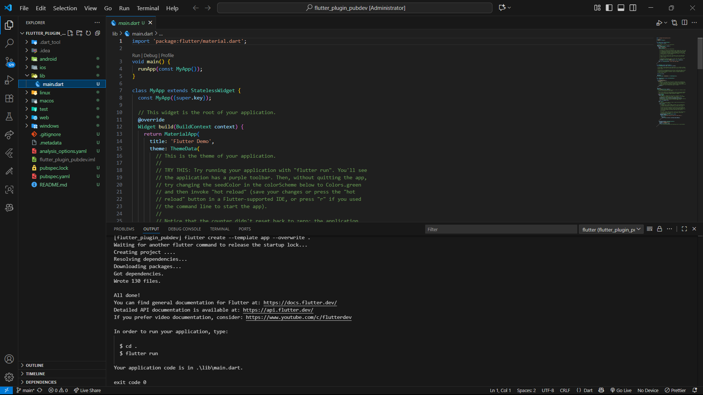
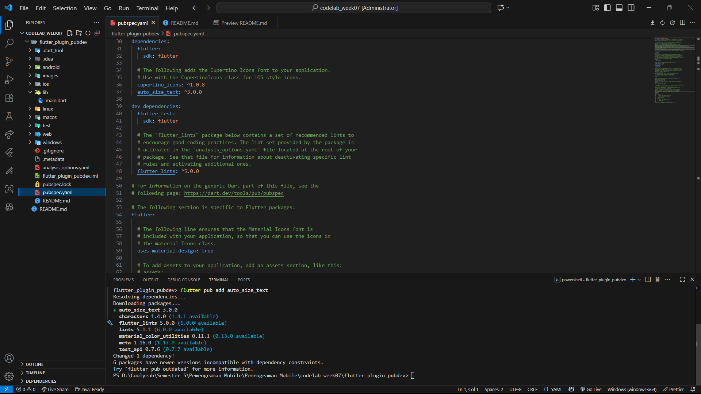
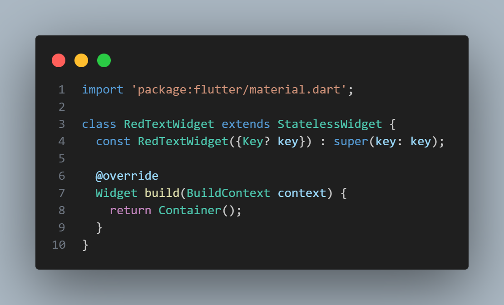
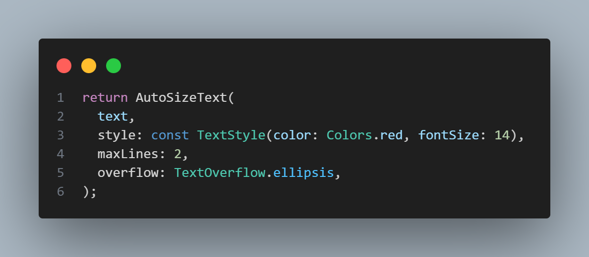
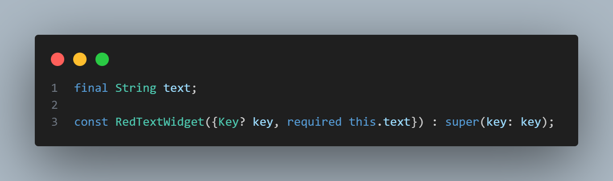
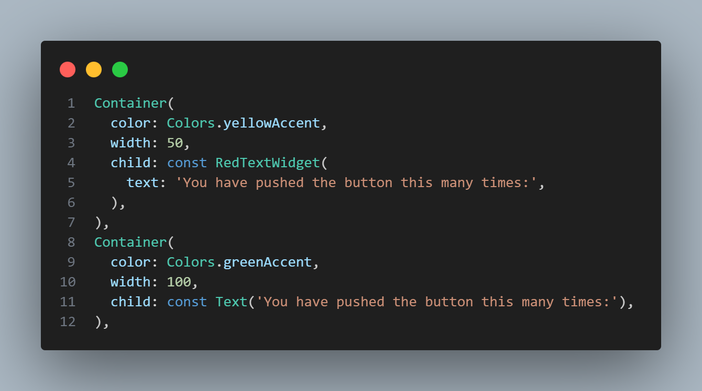
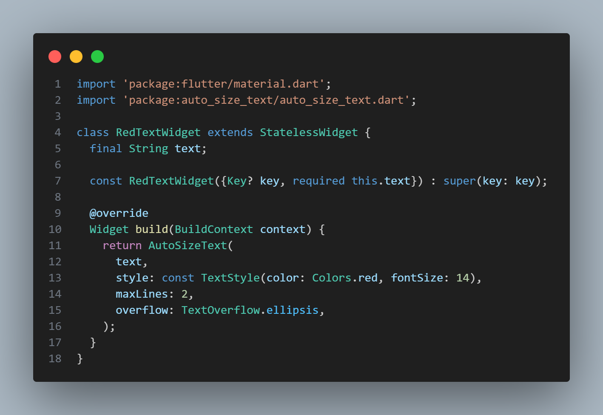
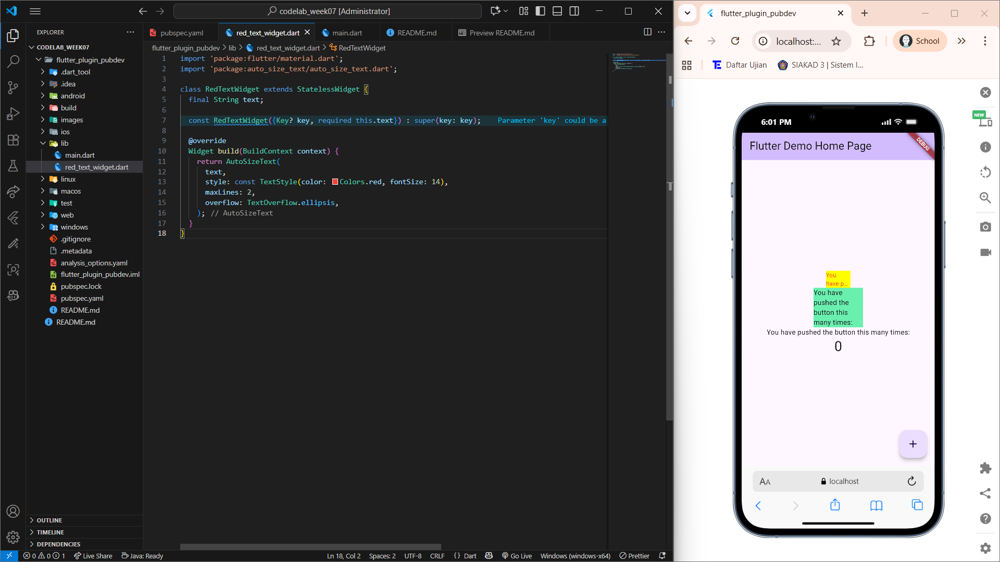

<div align="center">

# LAPORAN PRAKTIKUM

## PEMROGRAMAN MOBILE


---

## JOBSHEET 06

### Manajemen Plugin

---

**Dosen Pengampu:**  
Habibie Ed Dien, S.Kom., M.T.

---

**Disusun oleh:**  
Chiko Abilla Basya  
2341720005  
TI-3G  
D-4 Teknik Informatika  
Politeknik Negeri Malang

---

Jl. Soekarno Hatta No.9, Jatimulyo,  
Kec. Lowokwaru, Kota Malang, Jawa Timur 65141

Phone: (0341) 404424, 404425  
Email: [Polinema.ac.id](https://www.polinema.ac.id)

</div>

---

# **Praktikum Menerapkan Plugin di Project Flutter**

Selesaikan langkah-langkah praktikum berikut ini menggunakan editor Visual Studio Code (VS Code) atau Android Studio atau code editor lain kesukaan Anda.

> **Perhatian:** Diasumsikan Anda telah berhasil melakukan setup environment Flutter SDK, VS Code, Flutter Plugin, dan Android SDK pada pertemuan pertama.

**Langkah 1: Buat Project Baru**

Buatlah sebuah project flutter baru dengan nama **flutter_plugin_pubdev**. Lalu jadikan repository di GitHub Anda dengan nama **flutter_plugin_pubdev**.



**Langkah 2: Menambahkan Plugin**

Tambahkan plugin `auto_size_text` menggunakan perintah berikut di terminal:

```bash
flutter pub add auto_size_text
```
Jika berhasil, maka akan tampil nama plugin beserta versinya di file `pubspec.yaml` pada bagian dependencies.



**Langkah 3: Buat file red_text_widget.dart**

Buat file baru bernama `red_text_widget.dart` di dalam folder `lib` lalu isi kode seperti berikut:
```dart
import 'package:flutter/material.dart';

class RedTextWidget extends StatelessWidget {
  const RedTextWidget({Key? key}) : super(key: key);

  @override
  Widget build(BuildContext context) {
    return Container();
  }
}
```



**Langkah 4: Tambah Widget AutoSizeText**

Masih di file `red_text_widget.dart`, untuk menggunakan plugin `auto_size_text`, ubahlah kode `return Container()` menjadi seperti berikut:
```dart
return AutoSizeText(
      text,
      style: const TextStyle(color: Colors.red, fontSize: 14),
      maxLines: 2,
      overflow: TextOverflow.ellipsis,
);
```
Setelah Anda menambahkan kode di atas, Anda akan mendapatkan info error. Mengapa demikian? Jelaskan dalam laporan praktikum Anda!



**Penjelasan Error:**

Ketika menambahkan kode AutoSizeText pada langkah 4, akan mendapatkan error karena dua alasan utama:

1. **Import belum ditambahkan** - Package `auto_size_text` belum di-import ke dalam file, sehingga Flutter tidak mengenali widget `AutoSizeText` yang digunakan.

2. **Variabel text belum didefinisikan** - Variabel `text` yang digunakan sebagai parameter dalam widget `AutoSizeText` belum didefinisikan dalam class `RedTextWidget`, sehingga compiler tidak dapat menemukan referensi untuk variabel tersebut.

Error ini akan teratasi setelah menambahkan import statement `import 'package:auto_size_text/auto_size_text.dart';` di bagian atas file dan mendefinisikan variabel text beserta constructor yang menerima parameter text pada langkah selanjutnya.

**Langkah 5: Buat Variabel text dan parameter di constructor**

Tambahkan variabel `text` dan parameter di constructor seperti berikut:
```dart
final String text;

const RedTextWidget({Key? key, required this.text}) : super(key: key);
```



**Langkah 6: Tambahkan widget di main.dart**

Buka file `main.dart` lalu tambahkan di dalam `children:` pada `class _MyHomePageState`:
```dart
Container(
   color: Colors.yellowAccent,
   width: 50,
   child: const RedTextWidget(
             text: 'You have pushed the button this many times:',
          ),
),
Container(
    color: Colors.greenAccent,
    width: 100,
    child: const Text(
           'You have pushed the button this many times:',
          ),
),
```



**Run** aplikasi tersebut dengan tekan **F5**, maka hasilnya akan seperti berikut:

### **Kode Program**



### **Output**



---

# **Tugas Praktikum**

## 1. Selesaikan Praktikum tersebut, lalu dokumentasikan dan push ke repository Anda berupa screenshot hasil pekerjaan beserta penjelasannya di file `README.md`!

**Jawab:**

Praktikum telah diselesaikan dengan semua langkah-langkah yang diminta. Screenshot dan penjelasan sudah terdokumentasi di atas.

## 2. Jelaskan maksud dari langkah 2 pada praktikum tersebut!

**Jawab:**

Langkah 2 bertujuan untuk **menambahkan plugin external ke dalam project Flutter**. Dengan menjalankan perintah:
```bash
flutter pub add auto_size_text
```

Perintah ini melakukan beberapa hal:
- **Menambahkan dependensi** `auto_size_text` ke dalam file `pubspec.yaml` secara otomatis
- **Mengunduh package** dari pub.dev (repository resmi Dart/Flutter packages)
- **Memperbarui file pubspec.lock** yang berisi informasi versi spesifik dari semua dependensi
- **Menyiapkan plugin** agar dapat digunakan dalam kode Dart/Flutter

Plugin `auto_size_text` adalah sebuah widget yang dapat **menyesuaikan ukuran teks secara otomatis** agar sesuai dengan batasan container yang diberikan, menghindari overflow text yang sering terjadi pada tampilan responsive.

## 3. Jelaskan maksud dari langkah 5 pada praktikum tersebut!

**Jawab:**

Langkah 5 bertujuan untuk **memperbaiki error yang terjadi pada langkah 4** dengan:

### a. Menambahkan Variabel Instance
```dart
final String text;
```
- Mendeklarasikan **variabel text bertipe String** yang bersifat final (tidak dapat diubah setelah inisialisasi)
- Variabel ini akan menyimpan **teks yang akan ditampilkan** oleh widget AutoSizeText

### b. Memperbarui Constructor
```dart
const RedTextWidget({Key? key, required this.text}) : super(key: key);
```
- Menambahkan **parameter required this.text** pada constructor
- Parameter `required` memastikan bahwa text **wajib diisi** saat membuat instance widget
- **Mengaitkan parameter dengan variabel instance** melalui `this.text`

Langkah ini menerapkan prinsip **parameterized widget** dalam Flutter, memungkinkan widget menerima data dari parent widget dan menjadi reusable.

## 4. Pada langkah 6 terdapat dua widget yang ditambahkan, jelaskan fungsi dan perbedaannya!

**Jawab:**

Pada langkah 6 ditambahkan dua widget dalam children list dengan fungsi dan perbedaan sebagai berikut:

### Widget Pertama - Container dengan RedTextWidget:
```dart
Container(
   color: Colors.yellowAccent,
   width: 50,
   child: const RedTextWidget(
             text: 'You have pushed the button this many times:',
          ),
),
```

**Fungsi:**
- Menggunakan **widget custom** `RedTextWidget` yang telah dibuat
- Menerapkan **plugin auto_size_text** untuk penyesuaian ukuran teks otomatis
- Container dengan **lebar 50 pixel** dan background **kuning**

### Widget Kedua - Container dengan Text Widget:
```dart
Container(
    color: Colors.greenAccent,
    width: 100,
    child: const Text(
           'You have pushed the button this many times:',
          ),
),
```

**Fungsi:**
- Menggunakan **widget Text standar** Flutter
- **Tidak ada auto-sizing**, teks akan overflow jika melebihi container
- Container dengan **lebar 100 pixel** dan background **hijau**

### Perbedaan Utama:

| Aspek | RedTextWidget (AutoSizeText) | Text Widget |
|-------|------------------------------|-------------|
| **Responsivitas** | Otomatis menyesuaikan ukuran font | Fixed size, bisa overflow |
| **Lebar Container** | 50px (lebih sempit) | 100px (lebih lebar) |
| **Warna Background** | Yellow Accent | Green Accent |
| **Plugin Usage** | Menggunakan auto_size_text plugin | Widget bawaan Flutter |
| **Text Handling** | Smart text fitting dengan ellipsis | Standar text rendering |

**Tujuan Perbandingan:** Menunjukkan **perbedaan visual** antara text yang menggunakan auto-sizing (menyesuaikan container sempit) dengan text biasa (dalam container lebih lebar).

## 5. Jelaskan maksud dari tiap parameter yang ada di dalam plugin `auto_size_text` berdasarkan tautan pada dokumentasi ini !

**Jawab:**

Berdasarkan dokumentasi resmi [auto_size_text](https://pub.dev/documentation/auto_size_text/latest/), berikut penjelasan lengkap setiap parameter yang tersedia:

### A. Parameter Utama (Core Parameters):

#### 1. `data` (String) - Parameter Wajib
- **Fungsi:** String teks yang akan ditampilkan oleh widget
- **Tipe:** String (positional parameter)
- **Wajib:** Ya
- **Contoh:** `AutoSizeText('Hello World')`

#### 2. `style` (TextStyle?)
- **Fungsi:** Mendefinisikan gaya visual teks seperti warna, ukuran font, weight, dll
- **Tipe:** TextStyle (optional)
- **Default:** Menggunakan DefaultTextStyle dari context
- **Contoh:** `style: TextStyle(color: Colors.red, fontSize: 14, fontWeight: FontWeight.bold)`

### B. Parameter Pengaturan Ukuran Font:

#### 1. `minFontSize` (double)
- **Fungsi:** Menentukan ukuran font minimum yang diizinkan saat auto-sizing
- **Tipe:** double
- **Default:** 12.0
- **Contoh:** `minFontSize: 8.0` → font tidak akan lebih kecil dari 8px

#### 2. `maxFontSize` (double)
- **Fungsi:** Menentukan ukuran font maksimum yang diizinkan
- **Tipe:** double  
- **Default:** double.infinity
- **Contoh:** `maxFontSize: 24.0` → font tidak akan lebih besar dari 24px

#### 3. `stepGranularity` (double)
- **Fungsi:** Mengatur langkah penurunan ukuran font pada setiap iterasi
- **Tipe:** double
- **Default:** 1.0
- **Contoh:** `stepGranularity: 0.5` → font berkurang 0.5px setiap iterasi

#### 4. `presetFontSizes` (List<double>?)
- **Fungsi:** Daftar ukuran font yang telah ditentukan, digunakan sebagai alternatif stepGranularity
- **Tipe:** List<double> (optional)
- **Default:** null
- **Contoh:** `presetFontSizes: [20, 18, 16, 14, 12]`

### C. Parameter Layout dan Tampilan:

#### 1. `textAlign` (TextAlign?)
- **Fungsi:** Mengatur alignment/perataan teks dalam widget
- **Tipe:** TextAlign (optional)
- **Pilihan:** left, right, center, justify, start, end
- **Contoh:** `textAlign: TextAlign.center`

#### 2. `textDirection` (TextDirection?)
- **Fungsi:** Menentukan arah penulisan teks (kiri-ke-kanan atau kanan-ke-kiri)
- **Tipe:** TextDirection (optional)
- **Pilihan:** ltr (left-to-right), rtl (right-to-left)
- **Contoh:** `textDirection: TextDirection.rtl`

#### 3. `maxLines` (int?)
- **Fungsi:** Membatasi jumlah maksimal baris yang dapat digunakan untuk menampilkan teks
- **Tipe:** int (optional)
- **Default:** null (unlimited)
- **Contoh:** `maxLines: 2` → maksimal 2 baris

#### 4. `overflow` (TextOverflow?)
- **Fungsi:** Menentukan cara menangani teks yang masih overflow setelah auto-sizing
- **Tipe:** TextOverflow (optional)
- **Pilihan:** 
  - `clip`: Memotong teks yang overflow
  - `fade`: Memberikan efek fade pada teks yang overflow
  - `ellipsis`: Menambahkan "..." di akhir teks
  - `visible`: Membiarkan teks overflow terlihat
- **Contoh:** `overflow: TextOverflow.ellipsis`

### D. Parameter Kontrol Teks:

#### 1. `softWrap` (bool?)
- **Fungsi:** Menentukan apakah teks dapat dibungkus (wrap) ke baris berikutnya
- **Tipe:** bool (optional)
- **Default:** null (mengikuti behavior default Text)
- **Contoh:** `softWrap: false` → teks tidak akan wrap ke baris baru

#### 2. `wrapWords` (bool)
- **Fungsi:** Mengontrol apakah kata dapat dipotong untuk line wrapping
- **Tipe:** bool
- **Default:** true
- **Detail:** 
  - `true`: Kata dapat dipotong di tengah jika perlu
  - `false`: Hanya break di whitespace/spasi
- **Contoh:** `wrapWords: false`

#### 3. `locale` (Locale?)
- **Fungsi:** Menentukan locale untuk formatting teks dan line breaking
- **Tipe:** Locale (optional)
- **Default:** null (menggunakan locale dari Localizations widget)
- **Penggunaan:** Mendukung internationalization dan localization
- **Contoh:** `locale: Locale('id', 'ID')` → untuk bahasa Indonesia

### E. Parameter Khusus AutoSizeText:

#### 1. `group` (AutoSizeGroup?)
- **Fungsi:** Mengelompokkan beberapa AutoSizeText widget agar menggunakan ukuran font yang sama
- **Tipe:** AutoSizeGroup (optional)
- **Default:** null
- **Kegunaan:** Sinkronisasi ukuran font antar multiple widget
- **Contoh:**
```dart
final group = AutoSizeGroup();
AutoSizeText('Text 1', group: group);
AutoSizeText('Text 2', group: group);
```

#### 2. `textScaleFactor` (double?) - Deprecated
- **Fungsi:** Faktor skala untuk ukuran font (sudah deprecated)
- **Tipe:** double (optional)
- **Default:** null
- **Status:** Deprecated, gunakan `textScaler` sebagai gantinya

#### 3. `textScaler` (TextScaler?)
- **Fungsi:** Menentukan bagaimana teks diskalakan (pengganti textScaleFactor)
- **Tipe:** TextScaler (optional)
- **Default:** null
- **Contoh:** `textScaler: TextScaler.linear(1.5)` → scale 1.5x

#### 4. `semanticsLabel` (String?)
- **Fungsi:** Label untuk accessibility/screen readers
- **Tipe:** String (optional)
- **Default:** null
- **Kegunaan:** Meningkatkan aksesibilitas aplikasi
- **Contoh:** `semanticsLabel: 'Counter button pressed times'`

### F. Parameter yang Digunakan dalam Praktikum:

**Dalam kode praktikum kita menggunakan:**

```dart
AutoSizeText(
  text,                                           // Parameter data (String)
  style: const TextStyle(color: Colors.red, fontSize: 14),  // Parameter style
  maxLines: 2,                                    // Parameter maxLines
  overflow: TextOverflow.ellipsis,                // Parameter overflow
)
```

### G. Contoh Penggunaan Lengkap dengan Berbagai Parameter:

#### 🔹 Contoh 1: Penggunaan Dasar
```dart
AutoSizeText(
  'Teks yang akan menyesuaikan ukuran otomatis',
  style: TextStyle(fontSize: 20, color: Colors.blue),
  maxLines: 1,
  overflow: TextOverflow.ellipsis,
)
```

#### 🔹 Contoh 2: Penggunaan dengan Kontrol Font Size
```dart
AutoSizeText(
  'Teks dengan kontrol ukuran font minimum dan maksimum',
  style: TextStyle(fontSize: 18, fontWeight: FontWeight.bold),
  minFontSize: 10,
  maxFontSize: 24,
  stepGranularity: 2,
  maxLines: 2,
  textAlign: TextAlign.center,
)
```

#### 🔹 Contoh 3: Penggunaan dengan Preset Font Sizes
```dart
AutoSizeText(
  'Teks dengan ukuran font yang telah ditentukan',
  presetFontSizes: [24, 20, 18, 16, 14, 12, 10],
  maxLines: 3,
  overflow: TextOverflow.fade,
  textAlign: TextAlign.justify,
)
```

#### 🔹 Contoh 4: Penggunaan dengan AutoSizeGroup
```dart
final group = AutoSizeGroup();

Column(
  children: [
    AutoSizeText(
      'Teks pertama dalam grup',
      group: group,
      style: TextStyle(fontSize: 16),
    ),
    AutoSizeText(
      'Teks kedua yang akan mengikuti ukuran font yang sama',
      group: group,
      style: TextStyle(fontSize: 16),
    ),
  ],
)
```

## 6. Kumpulkan laporan praktikum Anda berupa link repository GitHub kepada dosen!

**Jawab:**

**Repository URL:** [https://github.com/ChikoAbillaBasya/Pemrograman-Mobile/tree/main/codelab_week07](https://github.com/ChikoAbillaBasya/Pemrograman-Mobile/tree/main/codelab_week07)