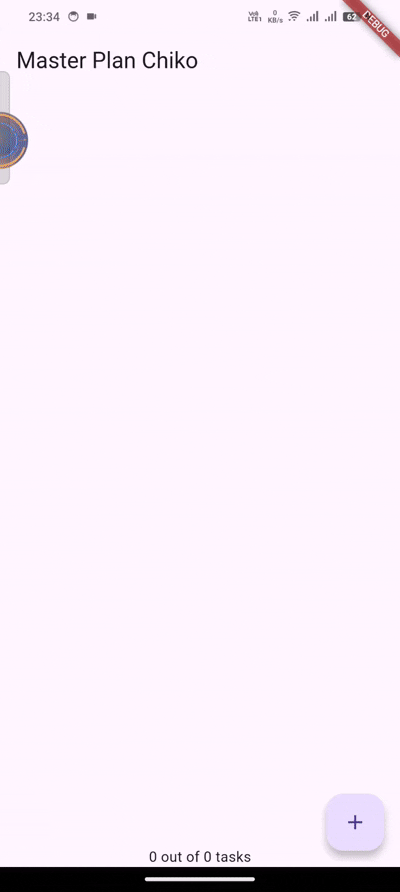

<div align="center">

# LAPORAN PRAKTIKUM

## PEMROGRAMAN MOBILE


---

## JOBSHEET 8

### Dasar Manajemen State

---

**Dosen Pengampu:**  
Habibie Ed Dien, S.Kom., M.T.

---

**Disusun oleh:**  
Chiko Abilla Basya  
2341720005  
TI-3G  
D-4 Teknik Informatika  
Politeknik Negeri Malang

---

Jl. Soekarno Hatta No.9, Jatimulyo,  
Kec. Lowokwaru, Kota Malang, Jawa Timur 65141

Phone: (0341) 404424, 404425  
Email: [Polinema.ac.id](https://www.polinema.ac.id)

</div>

---

## **Praktikum 1: Dasar State dengan Model-View**

Selesaikan langkah-langkah praktikum berikut ini menggunakan editor Visual Studio Code (VS Code) atau Android Studio atau code editor lain kesukaan Anda.

**Perhatian:** Diasumsikan Anda telah berhasil melakukan setup environment Flutter SDK, VS Code, Flutter Plugin, dan Android SDK pada pertemuan pertama.

### **Langkah 1: Buat Project Baru**

Buatlah sebuah project flutter baru dengan nama master_plan di folder src week-10 repository GitHub Anda atau sesuai style laporan praktikum yang telah disepakati. Lalu buatlah susunan folder dalam project seperti gambar berikut ini.


### **Langkah 2: Membuat model task.dart**

Praktik terbaik untuk memulai adalah pada lapisan data (data layer). Ini akan memberi Anda gambaran yang jelas tentang aplikasi Anda, tanpa masuk ke detail antarmuka pengguna Anda. Di folder model, buat file bernama task.dart dan buat class Task. Class ini memiliki atribut description dengan tipe data String dan complete dengan tipe data Boolean, serta ada konstruktor. Kelas ini akan menyimpan data tugas untuk aplikasi kita. Tambahkan kode berikut:

```dart
class Task {
  final String description;
  final bool complete;
  
  const Task({
    this.complete = false,
    this.description = '',
  });
}
```

### **Langkah 3: Buat file plan.dart**

Kita juga perlu sebuah List untuk menyimpan daftar rencana dalam aplikasi to-do ini. Buat file plan.dart di dalam folder models dan isi kode seperti berikut.

```dart
import './task.dart';

class Plan {
  final String name;
  final List<Task> tasks;
  
  const Plan({this.name = '', this.tasks = const []});
}
```

### **Langkah 4: Buat file data_layer.dart**

Kita dapat membungkus beberapa data layer ke dalam sebuah file yang nanti akan mengekspor kedua model tersebut. Dengan begitu, proses impor akan lebih ringkas seiring berkembangnya aplikasi. Buat file bernama data_layer.dart di folder models. Kodenya hanya berisi export seperti berikut.

```dart
export 'plan.dart';
export 'task.dart';
```

### **Langkah 5: Pindah ke file main.dart**

Ubah isi kode main.dart sebagai berikut.

```dart
import 'package:flutter/material.dart';
import './views/plan_screen.dart';

void main() => runApp(MasterPlanApp());

class MasterPlanApp extends StatelessWidget {
  const MasterPlanApp({super.key});

  @override
  Widget build(BuildContext context) {
    return MaterialApp(
     theme: ThemeData(primarySwatch: Colors.purple),
     home: PlanScreen(),
    );
  }
}
```

### **Langkah 6: buat plan_screen.dart**

Pada folder views, buatlah sebuah file plan_screen.dart dan gunakan templat StatefulWidget untuk membuat class PlanScreen. Isi kodenya adalah sebagai berikut. Gantilah teks 'Namaku' dengan nama panggilan Anda pada title AppBar.

```dart
import '../models/data_layer.dart';
import 'package:flutter/material.dart';

class PlanScreen extends StatefulWidget {
  const PlanScreen({super.key});

  @override
  State createState() => _PlanScreenState();
}

class _PlanScreenState extends State<PlanScreen> {
  Plan plan = const Plan();

  @override
  Widget build(BuildContext context) {
   return Scaffold(
    // ganti 'Namaku' dengan Nama panggilan Anda
    appBar: AppBar(title: const Text('Master Plan Namaku')),
    body: _buildList(),
    floatingActionButton: _buildAddTaskButton(),
   );
  }
}
```

### **Langkah 7: buat method _buildAddTaskButton()**

Anda akan melihat beberapa error di langkah 6, karena method yang belum dibuat. Ayo kita buat mulai dari yang paling mudah yaitu tombol Tambah Rencana. Tambah kode berikut di bawah method build di dalam class _PlanScreenState.

```dart
Widget _buildAddTaskButton() {
  return FloatingActionButton(
   child: const Icon(Icons.add),
   onPressed: () {
     setState(() {
      plan = Plan(
       name: plan.name,
       tasks: List<Task>.from(plan.tasks)
       ..add(const Task()),
     );
    });
   },
  );
}
```

### **Langkah 8: buat widget _buildList()**

Kita akan buat widget berupa List yang dapat dilakukan scroll, yaitu ListView.builder. Buat widget ListView seperti kode berikut ini.

```dart
Widget _buildList() {
  return ListView.builder(
   itemCount: plan.tasks.length,
   itemBuilder: (context, index) =>
   _buildTaskTile(plan.tasks[index], index),
  );
}
```

### **Langkah 9: buat widget _buildTaskTile**

Dari langkah 8, kita butuh ListTile untuk menampilkan setiap nilai dari plan.tasks. Kita buat dinamis untuk setiap index data, sehingga membuat view menjadi lebih mudah. Tambahkan kode berikut ini.

```dart
Widget _buildTaskTile(Task task, int index) {
  return ListTile(
    leading: Checkbox(
        value: task.complete,
        onChanged: (selected) {
          setState(() {
            plan = Plan(
              name: plan.name,
              tasks: List<Task>.from(plan.tasks)
                ..[index] = Task(
                  description: task.description,
                  complete: selected ?? false,
                ),
            );
          });
        }),
    title: TextFormField(
      initialValue: task.description,
      onChanged: (text) {
        setState(() {
          plan = Plan(
            name: plan.name,
            tasks: List<Task>.from(plan.tasks)
              ..[index] = Task(
                description: text,
                complete: task.complete,
              ),
          );
        });
      },
    ),
  );
}
```

Run atau tekan F5 untuk melihat hasil aplikasi yang Anda telah buat. Capture hasilnya untuk soal praktikum nomor 4.


**Penjelasan Hasil:**

Aplikasi berhasil menampilkan interface dasar Master Plan dengan AppBar yang menampilkan judul "Master Plan Namaku", FloatingActionButton dengan icon tambah untuk menambah task baru, dan ListView yang masih kosong namun siap menampilkan daftar tasks dengan state management menggunakan setState() untuk update UI secara reactive.

### **Langkah 10: Tambah Scroll Controller**

Anda dapat menambah tugas sebanyak-banyaknya, menandainya jika sudah beres, dan melakukan scroll jika sudah semakin banyak isinya. Namun, ada salah satu fitur tertentu di iOS perlu kita tambahkan. Ketika keyboard tampil, Anda akan kesulitan untuk mengisi yang paling bawah. Untuk mengatasi itu, Anda dapat menggunakan ScrollController untuk menghapus focus dari semua TextField selama event scroll dilakukan. Pada file plan_screen.dart, tambahkan variabel scroll controller di class State tepat setelah variabel plan.

```dart
late ScrollController scrollController;
```

### **Langkah 11: Tambah Scroll Listener**

Tambahkan method initState() setelah deklarasi variabel scrollController seperti kode berikut.

```dart
@override
void initState() {
  super.initState();
  scrollController = ScrollController()
    ..addListener(() {
      FocusScope.of(context).requestFocus(FocusNode());
    });
}
```

### **Langkah 12: Tambah controller dan keyboard behavior**

Tambahkan controller dan keyboard behavior pada ListView di method _buildList seperti kode berikut ini.

```dart
return ListView.builder(
  controller: scrollController,
  keyboardDismissBehavior: Theme.of(context).platform == TargetPlatform.iOS
      ? ScrollViewKeyboardDismissBehavior.onDrag
      : ScrollViewKeyboardDismissBehavior.manual,
```

### **Langkah 13: Terakhir, tambah method dispose()**

Terakhir, tambahkan method dispose() berguna ketika widget sudah tidak digunakan lagi.

```dart
@override
void dispose() {
  scrollController.dispose();
  super.dispose();
}
```

### **Langkah 14: Hasil**

Lakukan Hot restart (bukan hot reload) pada aplikasi Flutter Anda. Anda akan melihat tampilan akhir seperti gambar berikut. Jika masih terdapat error, silakan diperbaiki hingga bisa running.

 

**Penjelasan Hasil:**

Aplikasi Master Plan telah berhasil dibuat dengan menampilkan interface yang sederhana namun fungsional. Pengguna dapat menambah task baru dengan menekan tombol FAB yang menampilkan icon plus, dimana setiap task yang ditambahkan akan langsung muncul dalam list. Setiap item task dilengkapi dengan checkbox di sebelah kiri yang dapat di-tap untuk menandai status complete atau incomplete, serta TextFormField untuk mengedit deskripsi task secara langsung tanpa perlu membuka dialog terpisah. Aplikasi juga mendukung scroll untuk menampilkan banyak task, dengan fitur otomatis dismiss keyboard saat user melakukan scroll untuk pengalaman yang lebih baik terutama di iOS. State management menggunakan StatefulWidget dengan setState() yang menerapkan immutability pattern, dimana setiap perubahan akan membuat Plan object baru sehingga UI dapat rebuild secara otomatis dan reactive. Lifecycle management juga diterapkan dengan baik melalui initState() untuk inisialisasi ScrollController dan dispose() untuk cleanup resources guna mencegah memory leaks.

**Catatan:** Kedua fitur hot reload dan hot restart memiliki performa lebih cepat dibanding melakukan build ulang secara keseluruhan aplikasi. Secara umum, gunakan hot reload untuk melihat perubahan pada tampilan UI dimana perubahan paling banyak terjadi di metode build dengan state pada aplikasi tetap dipertahankan, dan gunakan hot restart untuk melihat perubahan pada state aplikasi seperti memperbarui variabel global, static fields, atau metode main() dimana kondisi app state akan reset kembali seperti awal.

---

## **Tugas Praktikum 1: Dasar State dengan Model-View**

**1. Selesaikan langkah-langkah praktikum tersebut, lalu dokumentasikan berupa GIF hasil akhir praktikum beserta penjelasannya di file README.md! Jika Anda menemukan ada yang error atau tidak berjalan dengan baik, silakan diperbaiki.**

**2. Jelaskan maksud dari langkah 4 pada praktikum tersebut! Mengapa dilakukan demikian?**

**Jawab:**

Langkah 4 membuat file `data_layer.dart` yang berfungsi sebagai barrel file atau index file untuk mengekspor semua model yang ada dalam folder models. File ini menggunakan export statement untuk meng-export kedua file yaitu plan.dart dan task.dart dalam satu tempat. Tujuan dilakukannya hal ini adalah untuk simplifikasi dan efisiensi dalam proses import, dimana alih-alih melakukan multiple imports seperti `import './models/task.dart'` dan `import './models/plan.dart'` di setiap file yang membutuhkan, kita cukup melakukan satu kali import dengan `import './models/data_layer.dart'` untuk mendapatkan akses ke semua model. Pendekatan ini memberikan beberapa keuntungan yaitu maintainability yang lebih baik karena jika terjadi perubahan struktur file atau penambahan model baru, kita hanya perlu update satu file barrel saja tanpa harus mengubah semua file yang menggunakannya, clean code dengan mengurangi clutter di bagian import statements pada setiap file, dan scalability dimana aplikasi dapat dengan mudah berkembang dengan menambahkan model-model baru ke dalam data layer tanpa perlu refactor import di berbagai tempat.

**3. Mengapa perlu variabel plan di langkah 6 pada praktikum tersebut? Mengapa dibuat konstanta?**

**Jawab:**

Variabel `plan` di langkah 6 diperlukan untuk menyimpan state dari aplikasi yang berisi daftar tasks yang akan ditampilkan dan dikelola dalam PlanScreen. Variabel ini berfungsi sebagai single source of truth untuk data plan dalam screen tersebut, menyimpan informasi tentang nama plan dan list tasks yang ada, serta memungkinkan tracking perubahan ketika user menambah task baru atau mengubah task yang sudah ada. Setiap kali ada perubahan pada plan seperti menambah task, mengedit deskripsi, atau mengubah status checkbox, variabel ini akan di-update dan setState() akan dipanggil untuk trigger rebuild UI agar menampilkan perubahan terbaru. Alasan dibuat konstanta dengan `const Plan()` adalah untuk memberikan initial value atau nilai awal berupa empty plan dengan default values. Penggunaan const keyword menandakan bahwa object tersebut bersifat immutable atau tidak dapat diubah, yang merupakan best practice dalam Flutter untuk beberapa alasan yaitu performance optimization karena const object dibuat pada compile-time sehingga lebih efisien, predictable state management dimana setiap perubahan akan membuat instance baru alih-alih memodifikasi yang lama sehingga perubahan state menjadi lebih terprediksi dan mudah di-track, serta menghindari accidental mutations yang dapat menyebabkan bugs.

**4. Lakukan capture hasil dari Langkah 9 berupa GIF, kemudian jelaskan apa yang telah Anda buat!**

**5. Apa kegunaan method pada Langkah 11 dan 13 dalam lifecyle state?**

**Jawab:**

Method `initState()` pada langkah 11 merupakan lifecycle method yang dipanggil sekali saat widget pertama kali diinsert ke dalam widget tree, sebelum method build() pertama kali dipanggil. Kegunaan utamanya dalam konteks aplikasi ini adalah untuk menginisialisasi ScrollController dan menambahkan listener yang akan dismiss keyboard setiap kali user melakukan scroll pada list, sehingga meningkatkan user experience terutama ketika ada banyak task dan user perlu scroll sambil keyboard masih terbuka. InitState() cocok digunakan untuk initialization tasks yang memerlukan akses ke BuildContext, seperti setup controllers, listeners, atau fetch initial data, karena pada tahap ini widget sudah ter-mount ke widget tree dan context sudah tersedia. Method `dispose()` pada langkah 13 merupakan lifecycle method yang dipanggil ketika widget akan dihapus secara permanen dari widget tree, biasanya ketika user navigate ke screen lain atau aplikasi ditutup. Kegunaan utamanya adalah untuk cleanup atau pembersihan resources yang tidak lagi dibutuhkan, dalam hal ini mendispose ScrollController dengan memanggil `scrollController.dispose()` untuk mencegah memory leaks dan membebaskan memory yang digunakan oleh controller. Dispose() sangat penting untuk resource management karena tanpa proper cleanup, resources seperti controllers, streams, atau animations akan terus berjalan di background dan mengkonsumsi memory meskipun widget sudah tidak digunakan lagi, yang dapat menyebabkan memory leaks dan performance issues. Lifecycle flow yang terjadi adalah initState() dipanggil untuk initialization, kemudian build() dipanggil untuk render UI, dan terakhir dispose() dipanggil untuk cleanup ketika widget dihapus dari tree.

**6. Kumpulkan laporan praktikum Anda berupa link commit atau repository GitHub ke dosen yang telah disepakati!**

---

## **Praktikum 2: Mengelola Data Layer dengan InheritedWidget dan InheritedNotifier**

Bagaimana seharusnya Anda mengakses data pada aplikasi? Beberapa pilihan yang bisa dilakukan adalah meletakkan data dalam satu kelas yang sama sehingga menjadi bagian dari life cycle aplikasi Anda.

Kemudian muncul pertanyaan, bagaimana meletakkan model dalam pohon widget? sedangkan model bukanlah widget, sehingga tidak akan tampil pada screen.

Solusi yang memungkinkan adalah menggunakan **InheritedWidget**. Sejauh ini kita hanya menggunakan dua jenis widget, yaitu StatelessWidget dan StatefulWidget. Kedua widget tersebut digunakan untuk layouting UI di screen. Di mana satu bersifat statis dan dinamis. Sedangkan InheritedWidget itu berbeda, ia dapat meneruskan data ke sub-widget turunannya (biasanya ketika Anda menerapkan decomposition widget). Jika dilihat dari perspektif user, itu tidak akan terlihat prosesnya (invisible). InheritedWidget dapat digunakan sebagai pintu untuk komunikasi antara view dan data layers.

Pada codelab ini, kita akan memperbarui kode dari aplikasi Master Plan dengan memisahkan data todo list ke luar class view-nya.

Setelah Anda menyelesaikan praktikum 1, Anda dapat melanjutkan praktikum 2 ini. Selesaikan langkah-langkah praktikum berikut ini menggunakan editor Visual Studio Code (VS Code) atau Android Studio atau code editor lain kesukaan Anda.

**Perhatian:** Diasumsikan Anda telah berhasil menyelesaikan Praktikum 1 Model-View.

### **Langkah 1: Buat file plan_provider.dart**

Buat folder baru provider di dalam folder lib, lalu buat file baru dengan nama plan_provider.dart berisi kode seperti berikut.

```dart
import 'package:flutter/material.dart';
import '../models/data_layer.dart';

class PlanProvider extends InheritedNotifier<ValueNotifier<Plan>> {
  const PlanProvider({super.key, required Widget child, required
   ValueNotifier<Plan> notifier})
  : super(child: child, notifier: notifier);

  static ValueNotifier<Plan> of(BuildContext context) {
   return context.
    dependOnInheritedWidgetOfExactType<PlanProvider>()!.notifier!;
  }
}
```

### **Langkah 2: Edit main.dart**

Gantilah pada bagian atribut home dengan PlanProvider seperti berikut. Jangan lupa sesuaikan bagian impor jika dibutuhkan.

```dart
return MaterialApp(
  theme: ThemeData(primarySwatch: Colors.purple),
  home: PlanProvider(
    notifier: ValueNotifier<Plan>(const Plan()),
    child: const PlanScreen(),
   ),
);
```

### **Langkah 3: Tambah method pada model plan.dart**

Tambahkan dua method di dalam model class Plan seperti kode berikut.

```dart
int get completedCount => tasks
  .where((task) => task.complete)
  .length;

String get completenessMessage =>
  '$completedCount out of ${tasks.length} tasks';
```

### **Langkah 4: Pindah ke PlanScreen**

Edit PlanScreen agar menggunakan data dari PlanProvider. Hapus deklarasi variabel plan (ini akan membuat error). Kita akan perbaiki pada langkah 5 berikut ini.

### **Langkah 5: Edit method _buildAddTaskButton**

Tambahkan BuildContext sebagai parameter dan gunakan PlanProvider sebagai sumber datanya. Edit bagian kode seperti berikut.

```dart
Widget _buildAddTaskButton(BuildContext context) {
  ValueNotifier<Plan> planNotifier = PlanProvider.of(context);
  return FloatingActionButton(
    child: const Icon(Icons.add),
    onPressed: () {
      Plan currentPlan = planNotifier.value;
      planNotifier.value = Plan(
        name: currentPlan.name,
        tasks: List<Task>.from(currentPlan.tasks)..add(const Task()),
      );
    },
  );
}
```

### **Langkah 6: Edit method _buildTaskTile**

Tambahkan parameter BuildContext, gunakan PlanProvider sebagai sumber data. Ganti TextField menjadi TextFormField untuk membuat inisial data provider menjadi lebih mudah.

```dart
Widget _buildTaskTile(Task task, int index, BuildContext context) {
  ValueNotifier<Plan> planNotifier = PlanProvider.of(context);
  return ListTile(
    leading: Checkbox(
       value: task.complete,
       onChanged: (selected) {
         Plan currentPlan = planNotifier.value;
         planNotifier.value = Plan(
           name: currentPlan.name,
           tasks: List<Task>.from(currentPlan.tasks)
             ..[index] = Task(
               description: task.description,
               complete: selected ?? false,
             ),
         );
       }),
    title: TextFormField(
      initialValue: task.description,
      onChanged: (text) {
        Plan currentPlan = planNotifier.value;
        planNotifier.value = Plan(
          name: currentPlan.name,
          tasks: List<Task>.from(currentPlan.tasks)
            ..[index] = Task(
              description: text,
              complete: task.complete,
            ),
        );
      },
    ),
  );
}
```

### **Langkah 7: Edit _buildList**

Sesuaikan parameter pada bagian _buildTaskTile seperti kode berikut.

```dart
Widget _buildList(Plan plan) {
   return ListView.builder(
     controller: scrollController,
     itemCount: plan.tasks.length,
     itemBuilder: (context, index) =>
        _buildTaskTile(plan.tasks[index], index, context),
   );
}
```

### **Langkah 8: Tetap di class PlanScreen**

Edit method build sehingga bisa tampil progress pada bagian bawah (footer). Caranya, bungkus (wrap) _buildList dengan widget Expanded dan masukkan ke dalam widget Column seperti kode pada Langkah 9.

### **Langkah 9: Tambah widget SafeArea**

Terakhir, tambahkan widget SafeArea dengan berisi completenessMessage pada akhir widget Column. Perhatikan kode berikut ini.

```dart
@override
Widget build(BuildContext context) {
   return Scaffold(
     appBar: AppBar(title: const Text('Master Plan')),
     body: ValueListenableBuilder<Plan>(
       valueListenable: PlanProvider.of(context),
       builder: (context, plan, child) {
         return Column(
           children: [
             Expanded(child: _buildList(plan)),
             SafeArea(child: Text(plan.completenessMessage))
           ],
         );
       },
     ),
     floatingActionButton: _buildAddTaskButton(context),
   );
}
```

Akhirnya, run atau tekan F5 jika aplikasi belum running. Tidak akan terlihat perubahan pada UI, namun dengan melakukan langkah-langkah di atas, Anda telah menerapkan cara memisahkan dengan baik antara view dan model. Ini merupakan hal terpenting dalam mengelola state di aplikasi Anda.



**Penjelasan Hasil:**

Praktikum 2 mengimplementasikan InheritedWidget untuk memisahkan data layer dari presentation layer dengan lebih baik. PlanProvider yang extends InheritedNotifier digunakan untuk mengelola state Plan dan secara otomatis memberikan notifikasi ke descendant widgets ketika data berubah, sehingga hanya widget yang bergantung pada data tersebut yang akan rebuild. Tampilan UI sekarang dilengkapi dengan progress indicator di bagian footer yang menampilkan pesan "X out of Y tasks" untuk memberikan informasi real-time tentang jumlah task yang telah diselesaikan. Progress ini dihitung menggunakan getter completedCount yang memfilter task dengan status complete, dan completenessMessage untuk menghasilkan text yang mudah dibaca. ValueListenableBuilder digunakan untuk listen perubahan pada ValueNotifier<Plan>, sehingga setiap kali plan berubah, builder callback akan dipanggil dan UI akan diperbarui secara efisien dengan hanya rebuild subtree yang diperlukan. Architecture ini memberikan benefit separation of concerns dimana logic terpisah dari UI, sehingga kode menjadi lebih testable, maintainable, dan scalable untuk pengembangan aplikasi yang lebih kompleks.

---

## **Tugas Praktikum 2: InheritedWidget**

**1. Selesaikan langkah-langkah praktikum tersebut, lalu dokumentasikan berupa GIF hasil akhir praktikum beserta penjelasannya di file README.md! Jika Anda menemukan ada yang error atau tidak berjalan dengan baik, silakan diperbaiki sesuai dengan tujuan aplikasi tersebut dibuat.**

**2. Jelaskan mana yang dimaksud InheritedWidget pada langkah 1 tersebut! Mengapa yang digunakan InheritedNotifier?**

**Jawab:**

Pada langkah 1, yang dimaksud InheritedWidget adalah class `PlanProvider` yang extends dari `InheritedNotifier<ValueNotifier<Plan>>`. InheritedWidget merupakan base class khusus di Flutter yang memungkinkan data dapat di-share ke seluruh widget tree dibawahnya tanpa perlu passing data secara eksplisit melalui constructor di setiap level. PlanProvider ini bertindak sebagai wrapper yang menyimpan ValueNotifier<Plan> dan menyediakan method static `of(BuildContext context)` untuk mengakses notifier tersebut dari widget manapun dalam tree. Alasan menggunakan InheritedNotifier dibanding InheritedWidget biasa adalah karena InheritedNotifier sudah built-in dengan mekanisme notification, dimana ia secara otomatis akan memberi tahu semua dependent widgets ketika ValueNotifier yang di-wrap mengalami perubahan nilai. Dengan InheritedNotifier, kita tidak perlu manual implement `updateShouldNotify()` method karena sudah di-handle secara otomatis oleh framework berdasarkan Listenable object yang di-pass. Ini membuat code menjadi lebih clean dan mengurangi boilerplate code, serta memastikan efficient rebuild dimana hanya widgets yang benar-benar depend pada data tersebut yang akan di-rebuild ketika terjadi perubahan. InheritedNotifier juga seamlessly terintegrasi dengan ValueListenableBuilder, sehingga kita bisa easily create reactive UI yang responds to state changes dengan pattern yang declarative dan predictable.

**3. Jelaskan maksud dari method di langkah 3 pada praktikum tersebut! Mengapa dilakukan demikian?**

**Jawab:**

Method yang ditambahkan di langkah 3 pada class Plan adalah getter `completedCount` dan `completenessMessage` yang berfungsi sebagai computed properties untuk menghitung derived state dari tasks list. Getter completedCount menggunakan method `where()` untuk memfilter tasks yang memiliki property complete bernilai true, kemudian mengambil length dari hasil filter tersebut untuk mendapatkan jumlah task yang sudah diselesaikan. Sementara completenessMessage adalah getter yang mengembalikan String dengan format "X out of Y tasks" dimana X adalah completedCount dan Y adalah total jumlah tasks. Alasan dilakukan demikian adalah untuk menerapkan prinsip encapsulation dan single responsibility, dimana business logic untuk menghitung progress berada di dalam model Plan itu sendiri, bukan tersebar di berbagai widget yang menggunakannya. Dengan menjadikannya sebagai getter, nilai ini akan selalu up-to-date dan ter-compute secara otomatis setiap kali tasks list berubah, tanpa perlu menyimpan redundant data atau melakukan manual calculation di UI layer. Pendekatan ini juga membuat code lebih maintainable karena jika ada perubahan format message atau cara perhitungan progress, kita hanya perlu update di satu tempat yaitu di model Plan, dan semua UI yang menggunakan property ini akan otomatis mendapat update. Selain itu, dengan menempatkan logic di model, kita bisa dengan mudah membuat unit test untuk memastikan calculation berjalan dengan benar, terpisah dari UI testing.

**4. Lakukan capture hasil dari Langkah 9 berupa GIF, kemudian jelaskan apa yang telah Anda buat!**

**5. Kumpulkan laporan praktikum Anda berupa link commit atau repository GitHub ke dosen yang telah disepakati!**

---

## **Praktikum 3: Membuat State di Multiple Screens**

Satu kalimat populer atau viral yang beredar dalam komunitas Flutter adalah **"Lift State Up"**. Mantra ini merujuk ke sebuah ide di mana objek State seharusnya berada lebih tinggi dari pada widget yang membutuhkannya di dalam sebuah widget tree. InheritedWidget yang telah kita buat sebelumnya bekerja dengan sempurna pada satu screen, tapi apa yang akan terjadi jika kita tambah screen kedua?

Pada codelab ini, Anda akan menambah screen lain pada aplikasi Master Plan sehingga bisa membuat kelompok daftar plan lebih dari satu.

Selesaikan langkah-langkah praktikum berikut ini menggunakan editor Visual Studio Code (VS Code) atau Android Studio atau code editor lain kesukaan Anda.

**Perhatian:** Diasumsikan Anda telah berhasil menyelesaikan praktikum 2.

### **Langkah 1: Edit PlanProvider**

Perhatikan kode berikut, edit class PlanProvider sehingga dapat menangani List Plan.

```dart
class PlanProvider extends InheritedNotifier<ValueNotifier<List<Plan>>> {
  const PlanProvider({super.key, required Widget child, required
ValueNotifier<List<Plan>> notifier})
     : super(child: child, notifier: notifier);

  static ValueNotifier<List<Plan>> of(BuildContext context) {
    return context.
dependOnInheritedWidgetOfExactType<PlanProvider>()!.notifier!;
  }
}
```

### **Langkah 2: Edit main.dart**

Langkah sebelumnya dapat menyebabkan error pada main.dart dan plan_screen.dart. Pada method build, gantilah menjadi kode seperti ini.

```dart
@override
Widget build(BuildContext context) {
  return PlanProvider(
    notifier: ValueNotifier<List<Plan>>(const []),
    child: MaterialApp(
      title: 'State management app',
      theme: ThemeData(
        primarySwatch: Colors.blue,
      ),
      home: const PlanScreen(),
    ),
  );
}
```

### **Langkah 3: Edit plan_screen.dart**

Tambahkan variabel plan dan atribut pada constructor-nya seperti berikut.

```dart
final Plan plan;
const PlanScreen({super.key, required this.plan});
```

### **Langkah 4: Error**

Itu akan terjadi error setiap kali memanggil PlanProvider.of(context). Itu terjadi karena screen saat ini hanya menerima tugas-tugas untuk satu kelompok Plan, tapi sekarang PlanProvider menjadi list dari objek plan tersebut.

### **Langkah 5: Tambah getter Plan**

Tambahkan getter pada _PlanScreenState seperti kode berikut.

```dart
class _PlanScreenState extends State<PlanScreen> {
  late ScrollController scrollController;
  Plan get plan => widget.plan;
```

### **Langkah 6: Method initState()**

Pada bagian ini kode tetap seperti berikut.

```dart
@override
void initState() {
   super.initState();
   scrollController = ScrollController()
    ..addListener(() {
      FocusScope.of(context).requestFocus(FocusNode());
    });
}
```

### **Langkah 7: Widget build**

Pastikan Anda telah merubah ke List dan mengubah nilai pada currentPlan seperti kode berikut ini.

```dart
@override
Widget build(BuildContext context) {
  ValueNotifier<List<Plan>> plansNotifier = PlanProvider.of(context);

  return Scaffold(
    appBar: AppBar(title: Text(plan.name)),
    body: ValueListenableBuilder<List<Plan>>(
      valueListenable: plansNotifier,
      builder: (context, plans, child) {
        Plan currentPlan = plans.firstWhere((p) => p.name == plan.name);
        return Column(
          children: [
            Expanded(child: _buildList(currentPlan)),
            SafeArea(child: Text(currentPlan.completenessMessage)),
          ],
        );
      },
    ),
    floatingActionButton: _buildAddTaskButton(context),
  );
}

Widget _buildAddTaskButton(BuildContext context) {
  ValueNotifier<List<Plan>> planNotifier = PlanProvider.of(context);
  return FloatingActionButton(
    child: const Icon(Icons.add),
    onPressed: () {
      Plan currentPlan = plan;
      int planIndex =
          planNotifier.value.indexWhere((p) => p.name == currentPlan.name);
      List<Task> updatedTasks = List<Task>.from(currentPlan.tasks)
        ..add(const Task());
      planNotifier.value = List<Plan>.from(planNotifier.value)
        ..[planIndex] = Plan(
          name: currentPlan.name,
          tasks: updatedTasks,
        );
    },
  );
}
```

### **Langkah 8: Edit _buildTaskTile**

Pastikan ubah ke List dan variabel planNotifier seperti kode berikut ini.

```dart
Widget _buildTaskTile(Task task, int index, BuildContext context) {
  ValueNotifier<List<Plan>> planNotifier = PlanProvider.of(context);

  return ListTile(
    leading: Checkbox(
       value: task.complete,
       onChanged: (selected) {
         Plan currentPlan = plan;
         int planIndex = planNotifier.value
            .indexWhere((p) => p.name == currentPlan.name);
         planNotifier.value = List<Plan>.from(planNotifier.value)
           ..[planIndex] = Plan(
             name: currentPlan.name,
             tasks: List<Task>.from(currentPlan.tasks)
               ..[index] = Task(
                 description: task.description,
                 complete: selected ?? false,
               ),
           );
       }),
    title: TextFormField(
      initialValue: task.description,
      onChanged: (text) {
        Plan currentPlan = plan;
        int planIndex =
           planNotifier.value.indexWhere((p) => p.name == currentPlan.name);
        planNotifier.value = List<Plan>.from(planNotifier.value)
          ..[planIndex] = Plan(
            name: currentPlan.name,
            tasks: List<Task>.from(currentPlan.tasks)
              ..[index] = Task(
                description: text,
                complete: task.complete,
              ),
          );
      },
    ),
  );
}
```

### **Langkah 9: Buat screen baru**

Pada folder view, buatlah file baru dengan nama plan_creator_screen.dart dan deklarasikan dengan StatefulWidget bernama PlanCreatorScreen. Gantilah di main.dart pada atribut home menjadi seperti berikut.

```dart
home: const PlanCreatorScreen(),
```

### **Langkah 10: Pindah ke class _PlanCreatorScreenState**

Kita perlu tambahkan variabel TextEditingController sehingga bisa membuat TextField sederhana untuk menambah Plan baru. Jangan lupa tambahkan dispose ketika widget unmounted seperti kode berikut.

```dart
final textController = TextEditingController();

@override
void dispose() {
  textController.dispose();
  super.dispose();
}
```

### **Langkah 11: Pindah ke method build**

Letakkan method Widget build berikut di atas void dispose. Gantilah 'Namaku' dengan nama panggilan Anda.

```dart
@override
Widget build(BuildContext context) {
  return Scaffold(
    // ganti 'Namaku' dengan nama panggilan Anda
    appBar: AppBar(title: const Text('Master Plans Namaku')),
    body: Column(children: [
      _buildListCreator(),
      Expanded(child: _buildMasterPlans())
    ]),
  );
}
```

### **Langkah 12: Buat widget _buildListCreator**

Buatlah widget berikut setelah widget build.

```dart
Widget _buildListCreator() {
  return Padding(
     padding: const EdgeInsets.all(20.0),
     child: Material(
       color: Theme.of(context).cardColor,
       elevation: 10,
       child: TextField(
          controller: textController,
          decoration: const InputDecoration(
             labelText: 'Add a plan',
             contentPadding: EdgeInsets.all(20)),
          onEditingComplete: addPlan),
     ));
}
```

### **Langkah 13: Buat void addPlan()**

Tambahkan method berikut untuk menerima inputan dari user berupa text plan.

```dart
void addPlan() {
  final text = textController.text;
    if (text.isEmpty) {
      return;
    }
    final plan = Plan(name: text, tasks: []);
    ValueNotifier<List<Plan>> planNotifier = PlanProvider.of(context);
    planNotifier.value = List<Plan>.from(planNotifier.value)..add(plan);
    textController.clear();
    FocusScope.of(context).requestFocus(FocusNode());
    setState(() {});
}
```

### **Langkah 14: Buat widget _buildMasterPlans()**

Tambahkan widget seperti kode berikut.

```dart
Widget _buildMasterPlans() {
  ValueNotifier<List<Plan>> planNotifier = PlanProvider.of(context);
    List<Plan> plans = planNotifier.value;

    if (plans.isEmpty) {
      return Column(
         mainAxisAlignment: MainAxisAlignment.center,
         children: <Widget>[
           const Icon(Icons.note, size: 100, color: Colors.grey),
           Text('Anda belum memiliki rencana apapun.',
              style: Theme.of(context).textTheme.headlineSmall)
         ]);
    }
    return ListView.builder(
        itemCount: plans.length,
        itemBuilder: (context, index) {
          final plan = plans[index];
          return ListTile(
              title: Text(plan.name),
              subtitle: Text(plan.completenessMessage),
              onTap: () {
                Navigator.of(context).push(
                   MaterialPageRoute(builder: (_) => PlanScreen(plan: plan,)));
              });
        });
}
```

Terakhir, run atau tekan F5 untuk melihat hasilnya jika memang belum running. Bisa juga lakukan hot restart jika aplikasi sudah running. Maka hasilnya akan seperti gambar berikut ini.


**Penjelasan Hasil:**

Praktikum 3 berhasil mengimplementasikan multiple screens dengan shared state management menggunakan konsep "Lift State Up". Aplikasi sekarang memiliki dua screen utama, yaitu PlanCreatorScreen sebagai home screen yang menampilkan TextField dengan Material design untuk input nama plan baru, serta menampilkan empty state dengan icon dan pesan yang user-friendly ketika belum ada plan yang dibuat. Ketika user membuat plan, akan muncul ListView yang menampilkan semua plans dengan title berupa nama plan dan subtitle berupa progress message yang menunjukkan berapa task yang telah diselesaikan. Setiap plan dalam list dapat di-tap untuk navigate ke PlanScreen yang merupakan detail screen untuk mengedit tasks dalam plan tertentu. State management menggunakan ValueNotifier<List<Plan>> yang di-manage oleh PlanProvider di level MaterialApp, sehingga menjadi single source of truth yang dapat diakses oleh kedua screens. Perubahan yang dilakukan di PlanScreen seperti menambah, mengedit, atau menandai task sebagai complete akan langsung reflect di PlanCreatorScreen karena state disimpan di level yang lebih tinggi. Navigation menggunakan Navigator.push() untuk berpindah ke detail screen dan back button untuk kembali, dengan state yang tetap persist karena tidak di-manage secara lokal di masing-masing screen. Architecture pattern ini memberikan scalability untuk menambah lebih banyak plans dan screens, consistency karena semua screens selalu melihat data yang ter-update, serta maintainability dengan clear separation antara screens.

---

## **Tugas Praktikum 3: State di Multiple Screens**

**1. Selesaikan langkah-langkah praktikum tersebut, lalu dokumentasikan berupa GIF hasil akhir praktikum beserta penjelasannya di file README.md! Jika Anda menemukan ada yang error atau tidak berjalan dengan baik, silakan diperbaiki sesuai dengan tujuan aplikasi tersebut dibuat.**

**2. Berdasarkan Praktikum 3 yang telah Anda lakukan, jelaskan maksud dari gambar diagram berikut ini!**


**Jawab:**

Diagram ini menggambarkan arsitektur state management dengan konsep "Lift State Up" dalam aplikasi Master Plan yang menggunakan multiple screens. Di level paling atas terdapat MaterialApp yang di-wrap oleh PlanProvider sebagai root widget untuk mengelola ValueNotifier<List<Plan>> sebagai single source of truth. PlanProvider berada di posisi tertinggi dalam widget tree sehingga state dapat diakses oleh semua child widgets di bawahnya. Aplikasi memiliki dua main screens yaitu PlanCreatorScreen untuk membuat dan menampilkan list plans, serta PlanScreen untuk mengedit tasks dalam plan tertentu. Kedua screens ini mengakses shared state melalui PlanProvider.of(context) untuk melakukan operasi CRUD pada data plans. Ketika user tap pada salah satu plan di PlanCreatorScreen, Navigator akan melakukan push ke PlanScreen dengan mengirimkan plan object via constructor parameter. PlanScreen kemudian dapat melakukan update tasks dengan cara find plan index dalam list, create new list dengan updated plan, dan replace plan di index tersebut menggunakan immutability pattern. Perubahan yang dilakukan di PlanScreen akan langsung terlihat di PlanCreatorScreen ketika user kembali, karena kedua screens berbagi state yang sama dari PlanProvider. Data flow bersifat unidirectional dimana state turun dari parent ke child via props, dan events naik dari child ke parent via callbacks, sehingga menciptakan predictable state changes. Architecture ini memberikan flexibility untuk menambah screens baru yang juga dapat mengakses shared state, consistency karena semua screens selalu melihat data yang ter-update, serta performance yang optimal karena ValueNotifier hanya trigger rebuild pada widgets yang subscribe ke perubahan state tersebut.

**3. Lakukan capture hasil dari Langkah 14 berupa GIF, kemudian jelaskan apa yang telah Anda buat!**

**4. Kumpulkan laporan praktikum Anda berupa link commit atau repository GitHub ke dosen yang telah disepakati!**

---