<div align="center">

# LAPORAN PRAKTIKUM

## PEMROGRAMAN MOBILE


---

## JOBSHEET 9

### Pemrograman Asynchronous

---

**Dosen Pengampu:**  
Habibie Ed Dien, S.Kom., M.T.

---

**Disusun oleh:**  
Chiko Abilla Basya  
2341720005  
TI-3G  
D-4 Teknik Informatika  
Politeknik Negeri Malang

---

Jl. Soekarno Hatta No.9, Jatimulyo,  
Kec. Lowokwaru, Kota Malang, Jawa Timur 65141

Phone: (0341) 404424, 404425  
Email: [Polinema.ac.id](https://www.polinema.ac.id)

</div>

---

## **Praktikum 1: Mengunduh Data dari Web Service (API)**

Selesaikan langkah-langkah praktikum berikut ini menggunakan editor Visual Studio Code (VS Code) atau Android Studio atau code editor lain kesukaan Anda. Jawablah di laporan praktikum Anda pada setiap soal yang ada di beberapa langkah praktikum ini.

>**Perhatian**: Diasumsikan Anda telah berhasil melakukan setup environment Flutter SDK, VS Code, Flutter Plugin, dan Android SDK pada pertemuan pertama.

### **Langkah 1: Buat Project Baru**
Buatlah sebuah project flutter baru dengan nama **books** di folder **src week-11** repository GitHub Anda.

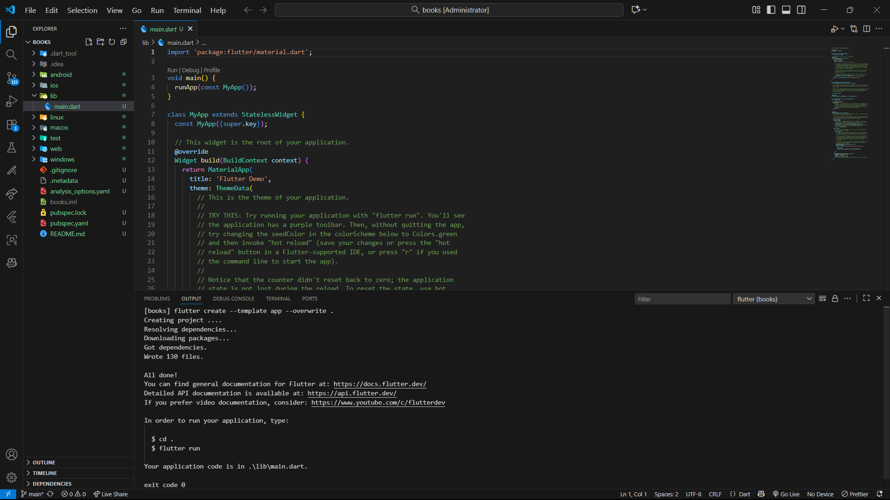

Kemudian Tambahkan dependensi `http` dengan mengetik perintah berikut di terminal.
```dart
flutter pub add http
```
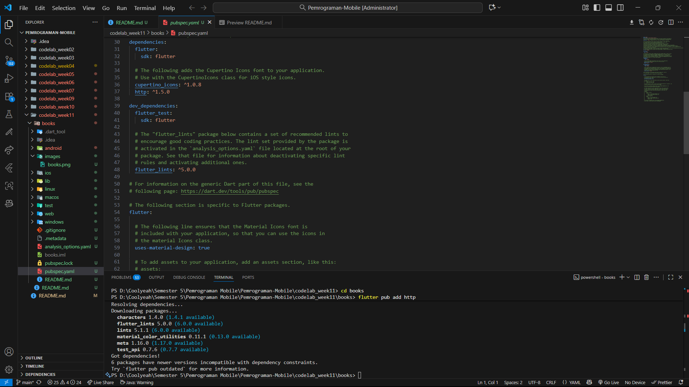

### **Langkah 2: Cek file pubspec.yaml**
Jika berhasil install plugin, pastikan plugin `http` telah ada di file `pubspec` ini seperti berikut.
```dart
dependencies:
  flutter:
    sdk: flutter
  http: ^1.1.0
```
**Jika Anda menggunakan macOS**, Anda harus mengaktifkan fitur networking pada file `macos/Runner/DebugProfile.entitlements` dan `macos/Runner/Release.entitlements` dengan menambahkan kode berikut:

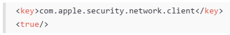

### **Langkah 3: Buka file main.dart**
Ketiklah kode seperti berikut ini.

>#### **Soal 1**
>Tambahkan **nama panggilan Anda** pada `title` app sebagai identitas hasil pekerjaan Anda.
```dart
import 'dart:async';
import 'package:flutter/material.dart';
import 'paxkage:http/http.dart';
import 'package:http/http.dart' as http;

void main() {
  runApp(const MyApp());
}

class MyApp extends StatelessWidget {
  const MyApp({super.key});

  @override
  Widget build(BuildContext context) {
    return MaterialApp(
      title: 'Future Demo',
      theme: ThemeData(
        primarySwatch: Colors.blue,
        visualDensity: VisualDensity.adaptivePlatformDensity,
      ),
      home: const FuturePage(),
    );
  }
}

class FuturePage extends StatefulWidget {
  const FuturePage({super.key});

  @override
  State<FuturePage> createState() => _FuturePageState();
}

class _FuturePageState extends State<FuturePage> {
  String result = '';

  @override
  Widget build(BuildContext context) {
    return Scaffold(
      appBar: AppBar(title: const Text('Back from the Future - Chiko')),
      body: Center(
        child: Column(
          children: [
            const Spacer(),
            ElevatedButton(child: const Text('GO!'), onPressed: () {}),
            const Spacer(),
            Text(result),
            const Spacer(),
            const CircularProgressIndicator(),
            const Spacer(),
          ],
        ),
      ),
    );
  }
}
```

>#### **Catatan:**
>Tidak ada yang spesial dengan kode di `main.dart` tersebut. Perlu diperhatikan di kode tersebut terdapat widget `CircularProgressIndicator` yang akan menampilkan animasi berputar secara terus-menerus, itu pertanda bagus bahwa aplikasi Anda responsif (tidak freeze/lag). Ketika animasi terlihat berhenti, itu berarti UI menunggu proses lain sampai selesai.

### **Langkah 4: Tambah method getData()**
Tambahkan method ini ke dalam `class _FuturePageState` yang berguna untuk mengambil data dari API Google Books.
```dart
Future<Response> getData() async {
  const authority = 'www.googleapis.com';
  const path = '/books/v1/volumes/junbDwAAQBAJ';
  Uri url = Uri.https(authority, path);
  return http.get(url);
}
```

>#### **Soal 2**
>* Carilah judul buku favorit Anda di Google Books, lalu ganti ID buku pada variabel `path` di kode tersebut. Caranya ambil di URL browser Anda seperti gambar berikut ini.
>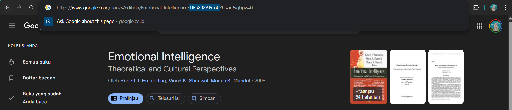
>* Kemudian cobalah akses di browser URI tersebut dengan lengkap seperti ini. Jika menampilkan data JSON, maka Anda telah berhasil. Lakukan capture milik Anda dan tulis di `README` pada laporan praktikum. Lalu lakukan commit dengan pesan "**W11: Soal 2**".
>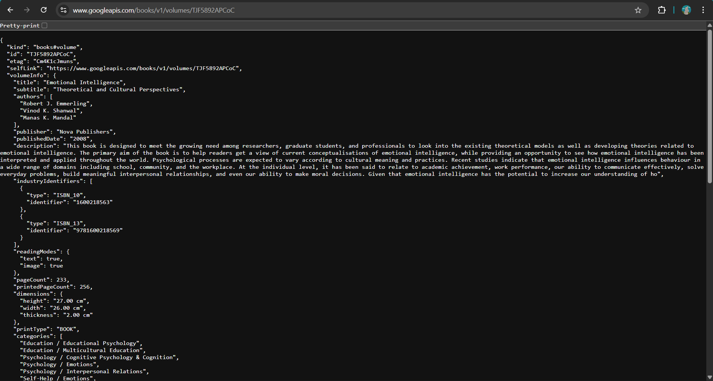

### **Langkah 5: Tambah kode di ElevatedButton**
Tambahkan kode pada `onPressed` di `ElevatedButton` seperti berikut.
```dart
ElevatedButton(
  child: Text('GO!'),
  onPressed: (){
    setState(() {});
    getData()
    .then((value) {
      result = value.body.toString().substring(0, 450);
      setState(() {});
    }).catchError((_){
      result = 'An error occurred';
      setState(() {});
    });
  },
),
```
Lakukan run aplikasi Flutter Anda. Anda akan melihat tampilan akhir seperti gambar berikut. Jika masih terdapat error, silakan diperbaiki hingga bisa running.

>#### **Soal 3**
>* Jelaskan maksud kode langkah 5 tersebut terkait `substring` dan `catchError`!
>
>**Jawab:**
>
>* **Penjelasan `substring(0, 450)`:**
>   - Method `substring(0, 450)` digunakan untuk **memotong string** dari response body API
>   - Angka `0` adalah **index awal** (karakter pertama)
>   - Angka `450` adalah **index akhir** (karakter ke-450)
>   - Fungsinya untuk **membatasi panjang text** yang ditampilkan karena response JSON dari Google Books API sangat panjang (bisa ribuan karakter)
>   - Jika tidak dibatasi, text akan memenuhi layar dan membuat UI tidak rapi
>   - Dengan membatasi 450 karakter, kita hanya menampilkan sebagian data untuk preview
>
>* **Penjelasan `catchError`:**
>    - `catchError()` adalah method untuk **menangani error** (error handling) pada operasi asynchronous
>   - Jika terjadi error saat proses `getData()` (misal: tidak ada koneksi internet, timeout, API error, dll), maka blok `catchError` akan dieksekusi
>   - Parameter `(_)` menggunakan underscore karena kita tidak menggunakan object error-nya
>   - Di dalam catchError, kita set `result = 'An error occurred'` untuk memberi tahu user bahwa terjadi kesalahan
>   - `setState()` dipanggil untuk memperbarui UI dan menampilkan pesan error
>
>* Capture hasil praktikum Anda berupa GIF dan lampirkan di README. Lalu lakukan commit dengan pesan "**W11: Soal 3**".


## **Praktikum 2: Menggunakan await/async untuk menghindari callbacks**
Ada alternatif penggunaan Future yang lebih clean, mudah dibaca dan dirawat, yaitu pola **async/await**. Intinya pada dua kata kunci ini:
* `async` digunakan untuk menandai suatu method sebagai asynchronous dan itu harus ditambahkan di depan kode function.
* `await` digunakan untuk memerintahkan menunggu sampai eksekusi suatu function itu selesai dan mengembalikan sebuah value. Untuk then bisa digunakan pada jenis method apapun, sedangkan await hanya bekerja di dalam method async.
Berikut ini contoh kode perbedaan Future dengan then dan async/await.

Berikut ini contoh kode perbedaan `Future` dengan `then` dan `async/await`.

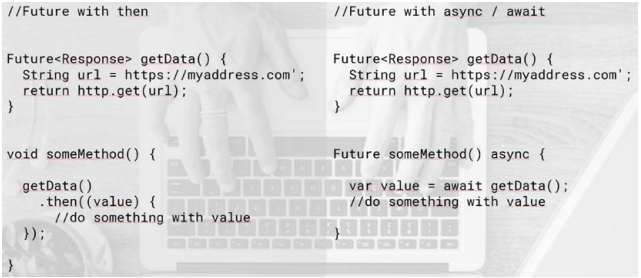

Untuk memahami lebih dalam penggunaan **async/await**, simaklah video berikut.

[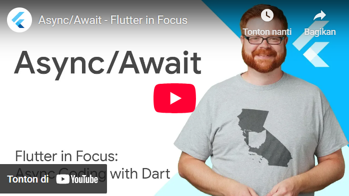](https://youtu.be/SmTCmDMi4BY) 

Setelah Anda menyelesaikan praktikum 1, Anda dapat melanjutkan praktikum 2 ini. Selesaikan langkah-langkah praktikum berikut ini menggunakan editor Visual Studio Code (VS Code) atau Android Studio atau code editor lain kesukaan Anda. Jawablah di laporan praktikum Anda pada setiap soal yang ada di beberapa langkah praktikum ini.

>**Perhatian**: Diasumsikan Anda telah berhasil menyelesaikan Praktikum 1.

Pada codelab ini, kita akan menambah kode dari aplikasi **books** di praktikum sebelumnya.

### **Langkah 1: Buka file main.dart**
Tambahkan tiga method berisi kode seperti berikut di dalam `class _FuturePageState`.
```dart
Future<int> returnOneAsync() async {
  await Future.delayed(const Duration(seconds: 3));
  return 1;
}

Future<int> returnTwoAsync() async {
  await Future.delayed(const Duration(seconds: 3));
  return 2;
}

Future<int> returnThreeAsync() async {
  await Future.delayed(const Duration(seconds: 3));
  return 3;
}
```

### **Langkah 2: Tambah method count()**
Lalu tambahkan lagi method ini di bawah ketiga method sebelumnya.
```dart
Future count() async {
  int total = 0;
  total = await returnOneAsync();
  total += await returnTwoAsync();
  total += await returnThreeAsync();
  setState(() {
    result = total.toString();
  });
}
```

### **Langkah 3: Panggil count()**
Lakukan comment kode sebelumnya, ubah isi kode onPressed() menjadi seperti berikut.
```dart
ElevatedButton(
   child: const Text('GO!'),
      onPressed: () {
          count();
      },
}
```

### **Langkah 4: Run**
Akhirnya, **run** atau tekan **F5** jika aplikasi belum running. Maka Anda akan melihat seperti gambar berikut, hasil angka 6 akan tampil setelah delay 9 detik.


>#### **Soal 4**
>* Jelaskan maksud kode langkah 1 dan 2 tersebut!
>
>**Jawab:**
>
>**Penjelasan Langkah 1 (Method returnOneAsync, returnTwoAsync, returnThreeAsync):**
>
>Ketiga method ini adalah contoh **fungsi asynchronous** yang mengembalikan nilai Future<int>:
>
>1. **`Future<int>`**: Menandakan bahwa fungsi ini akan mengembalikan nilai integer di masa depan (tidak langsung/instant)
>
>2. **`async`**: Keyword yang menandai bahwa fungsi ini bersifat asynchronous, artinya dapat melakukan operasi yang membutuhkan waktu tanpa memblokir thread utama
>
>3. **`await Future.delayed(const Duration(seconds: 3))`**: 
>     - Menunda eksekusi selama 3 detik
>     - `await` membuat program menunggu hingga delay selesai sebelum melanjutkan ke baris berikutnya
>     - Simulasi operasi yang membutuhkan waktu (seperti request API, baca file, dll)
>
>4. **`return 1/2/3`**: Setelah delay 3 detik, masing-masing fungsi mengembalikan nilai 1, 2, dan 3
>
>**Penjelasan Langkah 2 (Method count):**
>
>Method `count()` adalah fungsi asynchronous yang memanggil ketiga fungsi di atas secara **berurutan** (sequential):
>
>1. **`Future<void> count() async`**: 
>     - Fungsi async yang tidak mengembalikan nilai (void)
>     - Digunakan untuk mengeksekusi operasi async dan update UI
>
>2. **`int total = 0`**: Inisialisasi variabel untuk menyimpan total
>
>3. **`total = await returnOneAsync()`**: 
>     - Menunggu 3 detik hingga `returnOneAsync()` selesai
>     - Mendapat nilai 1, lalu assign ke `total`
>     - Total sekarang = 1
>
>4. **`total += await returnTwoAsync()`**: 
>     - Menunggu 3 detik lagi hingga `returnTwoAsync()` selesai
>     - Mendapat nilai 2, lalu tambahkan ke `total`
>     - Total sekarang = 1 + 2 = 3
>
>5. **`total += await returnThreeAsync()`**: 
>     - Menunggu 3 detik lagi hingga `returnThreeAsync()` selesai
>     - Mendapat nilai 3, lalu tambahkan ke `total`
>     - Total sekarang = 3 + 3 = 6
>
>6. **`setState(() { result = total.toString(); })`**: 
>     - Update state untuk memperbarui UI
>     - Menampilkan hasil total (6) di layar
>
>**Total waktu eksekusi: 9 detik** (3 detik × 3 fungsi, karena dijalankan secara berurutan)
>
>* Capture hasil praktikum Anda berupa GIF dan lampirkan di README. Lalu lakukan commit dengan pesan "**W11: Soal 4**".

## **Praktikum 3: Menggunakan Completer di Future**
Menggunakan Future dengan `then`, `catchError`, `async`, dan `await` mungkin sudah cukup untuk banyak kasus, tetapi ada alternatif melakukan operasi async di Dart dan Flutter yaitu dengan `class Completer`.

**Completer** membuat object Future yang mana Anda dapat menyelesaikannya nanti (late) dengan return sebuah value atau error.

Setelah Anda menyelesaikan praktikum 2, Anda dapat melanjutkan praktikum 3 ini. Selesaikan langkah-langkah praktikum berikut ini menggunakan editor Visual Studio Code (VS Code) atau Android Studio atau code editor lain kesukaan Anda. Jawablah di laporan praktikum Anda pada setiap soal yang ada di beberapa langkah praktikum ini.

>**Perhatian**: Diasumsikan Anda telah berhasil menyelesaikan Praktikum 2.

### **Langkah 1: Buka main.dart**
Pastikan telah impor package async berikut.
```dart
import 'package:async/async.dart';
```

### **Langkah 2: Tambahkan variabel dan method**
Tambahkan variabel late dan method di **class _FuturePageState** seperti ini.
```dart
late Completer completer;

Future getNumber() {
  completer = Completer<int>();
  calculate();
  return completer.future;
}

Future calculate() async {
  await Future.delayed(const Duration(seconds : 5));
  completer.complete(42);
}
```

### **Langkah 3: Ganti isi kode onPressed()**
Tambahkan kode berikut pada fungsi **onPressed()**. Kode sebelumnya bisa Anda comment.
```dart
getNumber().then((value) {
                setState(() {
                  result = value.toStrin();
                });
              });
```
### **Langkah 4:**
Terakhir, **run** atau tekan **F5** untuk melihat hasilnya jika memang belum running. Bisa juga lakukan **hot restart** jika aplikasi sudah running. Maka hasilnya akan seperti gambar berikut ini. Setelah 5 detik, maka angka 42 akan tampil.


>#### **Soal 5**
>* Jelaskan maksud kode langkah 2 tersebut!
>
>**Jawab:**
>
>**Penjelasan Kode Langkah 2:**
>
>**1. Variabel `late Completer completer;`**
>- `late` adalah modifier yang menandakan variabel akan diinisialisasi nanti (bukan saat deklarasi)
>- `Completer` adalah class yang digunakan untuk membuat dan mengontrol Future secara manual
>- Berbeda dengan Future biasa yang langsung dieksekusi, Completer memberi kontrol penuh kapan Future selesai
>
>**2. Method `getNumber()`**
>```dart
>Future getNumber() {
>  completer = Completer<int>();     // ← Membuat instance Completer bertipe int
>  calculate();                       // ← Memanggil fungsi calculate
>  return completer.future;           // ← Mengembalikan Future dari Completer
>}
>```
>- **`completer = Completer<int>()`**: Membuat objek Completer yang akan menghasilkan Future bertipe integer
>- **`calculate()`**: Memanggil fungsi asynchronous yang akan menyelesaikan Completer
>- **`return completer.future`**: Mengembalikan Future yang terkait dengan Completer ini, Future ini akan selesai ketika `completer.complete()` dipanggil
>
>**3. Method `calculate()`**
>```dart
>Future calculate() async {
>  await Future.delayed(const Duration(seconds: 5));  // ← Delay 5 detik
>  completer.complete(42);                            // ← Selesaikan dengan nilai 42
>}
>```
>- **`await Future.delayed(const Duration(seconds: 5))`**: Menunggu selama 5 detik (simulasi operasi yang memakan waktu)
>- **`completer.complete(42)`**: Menyelesaikan Future dengan nilai 42
>  - Setelah baris ini dijalankan, semua listener `.then()` yang menunggu Future ini akan dieksekusi
>  - Nilai 42 akan dikirim ke callback `.then()`
>
>* Capture hasil praktikum Anda berupa GIF dan lampirkan di README. Lalu lakukan commit dengan pesan "**W11: Soal 5**".

**Langkah 5: Ganti method calculate()**
Gantilah isi code method `calculate()` seperti kode berikut, atau Anda dapat membuat `calculate2()`
```dart
calculate() async {
  try {
    await new Future.delayed(const Duration(seconds : 5));
    completer.complete(42);
    // throw Exception();
  }
  catch (_) {
    completer.completeError({});
  }
}
```

**Langkah 6: Pindah ke onPressed()**
Ganti menjadi kode seperti berikut.
```dart
getNumber().then((value) {
  setState(() {
    result = value.toString();
  });
}).catchError((e) {
  result = 'An error occurred';
});
```


>#### **Soal 6**
>* Jelaskan maksud perbedaan kode langkah 2 dengan langkah 5-6 tersebut!
>
>**Jawab:**
>
>**Perbedaan Kode Langkah 2 dengan Langkah 5-6:**
>
>**Langkah 2 (Tanpa Error Handling):**
>```dart
>// Method calculate - TANPA error handling
>Future calculate() async {
>  await Future.delayed(const Duration(seconds: 5));
>  completer.complete(42);
>}
>
>// onPressed - TANPA catchError
>getNumber().then((value) {
>  setState(() {
>    result = value.toString();
>  });
>});
>```
>
>**Langkah 5-6 (Dengan Error Handling):**
>```dart
>// Method calculate - DENGAN error handling
>Future calculate() async {
>  try {
>    await Future.delayed(const Duration(seconds: 5));
>    completer.complete(42);
>  } catch (e) {
>    completer.completeError({});  // ← Menangani error
>  }
>}
>
>// onPressed - DENGAN catchError
>getNumber().then((value) {
>  setState(() {
>    result = value.toString();
>  });
>}).catchError((e) {              // ← Menangkap error
>  result = 'An error occurred';
>});
>```
>
>**Perbedaan Utama:**
>
>**1. Error Handling di Method `calculate()`:**
>
>| Aspek | Langkah 2 | Langkah 5 |
>|-------|-----------|-----------|
>| Try-Catch | ❌ Tidak ada | ✅ Ada `try-catch` block |
>| Error Completion | ❌ Tidak ada | ✅ `completer.completeError({})` |
>| Handling Error | ❌ Error akan crash app | ✅ Error ditangkap dan dikirim ke Future |
>
>- **Langkah 2**: Jika terjadi error di `calculate()`, error tidak ditangani dan bisa menyebabkan crash
>- **Langkah 5**: Error ditangkap oleh `try-catch` dan Completer diselesaikan dengan error menggunakan `completer.completeError({})`
>
>**2. Error Handling di onPressed():**
>
>| Aspek | Langkah 2 | Langkah 6 |
>|-------|-----------|-----------|
>| CatchError | ❌ Tidak ada | ✅ Ada `.catchError()` |
>| User Feedback | ❌ Tidak ada pesan error | ✅ Menampilkan 'An error occurred' |
>| User Experience | ❌ Buruk (tidak jelas apa yang terjadi) | ✅ Baik (user tahu ada error) |
>
>- **Langkah 2**: Tidak ada penanganan error di UI, jika Future gagal, user tidak tahu apa yang terjadi
>- **Langkah 6**: Menggunakan `.catchError()` untuk menangkap error dan menampilkan pesan error ke user
>
>**Kesimpulan:**
>
>a. **Langkah 2**: Kode sederhana tanpa error handling (cocok untuk pembelajaran dasar)
>
>b. **Langkah 5-6**: Kode production-ready dengan error handling yang proper
>
>c. **Best Practice**: Selalu gunakan error handling seperti di langkah 5-6 untuk aplikasi nyata
>
>d. **Manfaat**: Aplikasi lebih stabil, user experience lebih baik, debugging lebih mudah
>
>* Capture hasil praktikum Anda berupa GIF dan lampirkan di README. Lalu lakukan commit dengan pesan "**W11: Soal 6**"

## **Praktikum 4: Memanggil Future secara paralel**
Ketika Anda membutuhkan untuk menjalankan banyak Future secara bersamaan, ada sebuah class yang dapat Anda gunakan yaitu: `FutureGroup`.

`FutureGroup` tersedia di package `async`, yang mana itu harus diimpor ke file dart Anda, seperti berikut.
```dart
import 'package:async/async.dart';
```
>**Catatan**: Package `dart:async` dan `async/async.dart` merupakan library yang berbeda. Pada beberapa kasus, Anda membutuhkan kedua lib tersebut untuk me-*run code async*.

**FutureGroup** adalah sekumpulan dari Future yang dapat run secara paralel. Ketika run secara paralel, maka konsumsi waktu menjadi lebih hemat (cepat) dibanding run method async secara single setelah itu method async lainnya.

Ketika semua code async paralel selesai dieksekusi, maka FutureGroup akan return value sebagai sebuah `List`, sama juga ketika ingin menambahkan operasi paralel dalam bentuk `List`.

Setelah Anda menyelesaikan praktikum 3, Anda dapat melanjutkan praktikum 4 ini. Selesaikan langkah-langkah praktikum berikut ini menggunakan editor Visual Studio Code (VS Code) atau Android Studio atau code editor lain kesukaan Anda. Jawablah di laporan praktikum Anda pada setiap soal yang ada di beberapa langkah praktikum ini.

>**Perhatian**: Diasumsikan Anda telah berhasil menyelesaikan Praktikum 3.

### **Langkah 1: Buka file main.dart**
Tambahkan method ini ke dalam `class _FuturePageState`
```dart
void returnFG() {
  FutureGroup<int> futuresGroup = FutureGroup<int>();
  futuresGroup.add(returnOneAsync());
  futuresGroup.add(returnTwoAsync());
  futuresGroup.add(returnThreeAsync());
  futuresGroup.close();
  futuresGroup.future.then((List<int> value) {
    int total = 0;
    for (var element in value) {
      total += element;
    }
    setState(() {
      result = total.toString();
    });
  });
}
```

### **Langkah 2: Edit onPressed()**
Anda bisa hapus atau comment kode sebelumnya, kemudian panggil method dari langkah 1 tersebut.
```dart
onPressed: () {
    returnFG();
}
```

### **Langkah 3: Run**
Anda akan melihat hasilnya dalam 3 detik berupa angka 6 lebih cepat dibandingkan praktikum sebelumnya menunggu sampai 9 detik.


>#### **Soal 7**
>* Capture hasil praktikum Anda berupa GIF dan lampirkan di README. Lalu lakukan commit dengan pesan "**W11: Soal 7**".

### **Langkah 4: Ganti variabel futureGroup**
Anda dapat menggunakan FutureGroup dengan `Future.wait` seperti kode berikut.
```dart
final futures = Future.wait<int>([
  returnOneAsync(),
  returnTwoAsync(),
  returnThreeAsync(),
]);
```

>#### **Soal 8**
>* Jelaskan maksud perbedaan kode langkah 1 dan 4!
>
>**Jawab:**
>
>**Perbedaan Kode Langkah 1 dan Langkah 4:**
>
>**Langkah 1 (Menggunakan FutureGroup):**
>```dart
>void returnFG() {
>  // 1. Membuat instance FutureGroup
>  FutureGroup<int> futuresGroup = FutureGroup<int>();
>  
>  // 2. Menambahkan Future satu per satu
>  futuresGroup.add(returnOneAsync());
>  futuresGroup.add(returnTwoAsync());
>  futuresGroup.add(returnThreeAsync());
>  
>  // 3. Menutup group (tidak bisa tambah Future lagi)
>  futuresGroup.close();
>  
>  // 4. Menunggu semua Future selesai
>  futuresGroup.future.then((List<int> value) {
>    int total = 0;
>    for (var element in value) {
>      total += element;
>    }
>    setState(() {
>      result = total.toString();
>    });
>  });
>}
>```
>
>**Langkah 4 (Menggunakan Future.wait):**
>```dart
>void returnFG() {
>  // Langsung membuat dan menjalankan Future secara paralel
>  final futures = Future.wait<int>([
>    returnOneAsync(),
>    returnTwoAsync(),
>    returnThreeAsync(),
>  ]);
>  
>  futures.then((List<int> value) {
>    int total = 0;
>    for (var element in value) {
>      total += element;
>    }
>    setState(() {
>      result = total.toString();
>    });
>  });
>}
>```
>
>**Tabel Perbandingan:**
>
>| Aspek | FutureGroup (Langkah 1) | Future.wait (Langkah 4) |
>|-------|-------------------------|-------------------------|
>| **Sintaks** | Verbose (lebih panjang) | Concise (lebih ringkas) |
>| **Cara Menambah Future** | `.add()` satu per satu | Langsung dalam List `[]` |
>| **Perlu Close** | ✅ Ya, harus `.close()` | ❌ Tidak perlu |
>| **Fleksibilitas** | ✅ Bisa tambah Future dinamis | ❌ Harus tahu semua Future di awal |
>| **Readability** | ❌ Kurang readable | ✅ Lebih mudah dibaca |
>| **Use Case** | Dynamic list of futures | Fixed list of futures |
>| **Performance** | Sama | Sama |
>| **Rekomendasi** | Untuk kasus dinamis | **Untuk kasus umum (recommended)** |
>
>**Penjelasan Detail:**
>
>**1. FutureGroup (Langkah 1) - Approach Manual:**
>
>**Kelebihan:**
>- ✅ **Fleksibel**: Bisa menambahkan Future secara dinamis (contoh: dari loop atau kondisi)
>- ✅ **Kontrol penuh**: Kita kontrol kapan menambah dan kapan menutup
>
>**Kekurangan:**
>- ❌ **Verbose**: Butuh lebih banyak baris code
>- ❌ **Harus close**: Wajib panggil `.close()` sebelum `.future`
>- ❌ **Kurang intuitive**: Lebih kompleks untuk dibaca
>
>**Contoh use case FutureGroup:**
>```dart
>void processFiles(List<String> filePaths) {
>  FutureGroup<File> futuresGroup = FutureGroup<File>();
>  
>  // Dinamis: jumlah Future tergantung panjang list
>  for (var path in filePaths) {
>    futuresGroup.add(readFile(path));
>  }
>  
>  futuresGroup.close();
>  futuresGroup.future.then((files) {
>    // Process all files
>  });
>}
>```
>
>**2. Future.wait (Langkah 4) - Modern Approach:**
>
>**Kelebihan:**
>- ✅ **Concise**: Code lebih ringkas dan clean
>- ✅ **Readable**: Lebih mudah dibaca dan dipahami
>- ✅ **No close needed**: Tidak perlu memanggil `.close()`
>- ✅ **Standard Dart**: Bagian dari Dart core library
>- ✅ **Modern practice**: Lebih direkomendasikan oleh Flutter community
>
>**Kekurangan:**
>- ❌ **Fixed list**: Harus tahu semua Future di awal (tidak dinamis)
>
>**Contoh use case Future.wait:**
>```dart
>// Fetch data dari multiple API sekaligus
>void fetchAllData() {
>  final futures = Future.wait([
>    fetchUserData(),
>    fetchPosts(),
>    fetchComments(),
>  ]);
>  
>  futures.then((results) {
>    var userData = results[0];
>    var posts = results[1];
>    var comments = results[2];
>    // Process data
>  });
>}
>```
>
>**Kesimpulan dan Rekomendasi:**
>
>**Kapan menggunakan FutureGroup (Langkah 1):**
>- ✅ Ketika jumlah Future tidak diketahui di awal
>- ✅ Ketika Future ditambahkan secara dinamis (loop, kondisi)
>- ✅ Ketika butuh kontrol manual kapan mulai menunggu
>
>**Kapan menggunakan Future.wait (Langkah 4):**
>- ✅ **Ketika jumlah Future sudah fix/diketahui** (RECOMMENDED)
>- ✅ Ketika ingin code lebih clean dan readable
>- ✅ Untuk kasus-kasus umum paralel execution
>- ✅ Lebih modern dan idiomatic Dart/Flutter
>
>**Best Practice:**
>```dart
>// ❌ Tidak disarankan untuk kasus sederhana
>FutureGroup<int> fg = FutureGroup<int>();
>fg.add(future1());
>fg.add(future2());
>fg.close();
>
>// ✅ Lebih disarankan
>final results = await Future.wait([
>  future1(),
>  future2(),
>]);
>```
>
>**Perbedaan Waktu Eksekusi:**
>- **Praktikum 2 (Sequential)**: 9 detik (3+3+3)
>- **Praktikum 4 (Parallel dengan FutureGroup)**: 3 detik
>- **Praktikum 4 (Parallel dengan Future.wait)**: 3 detik
>
>**Keduanya sama-sama efektif untuk paralel execution, tapi `Future.wait` lebih direkomendasikan karena lebih simple dan modern!**

## **Praktikum 5: Menangani Respon Error pada Async Code**
Ada beberapa teknik untuk melakukan handle error pada code async. Pada praktikum ini Anda akan menggunakan 2 cara, yaitu `then()` callback dan pola `async/await`.

Setelah Anda menyelesaikan praktikum 4, Anda dapat melanjutkan praktikum 5 ini. Selesaikan langkah-langkah praktikum berikut ini menggunakan editor Visual Studio Code (VS Code) atau Android Studio atau code editor lain kesukaan Anda. Jawablah di laporan praktikum Anda pada setiap soal yang ada di beberapa langkah praktikum ini.

>**Perhatian**: Diasumsikan Anda telah berhasil menyelesaikan Praktikum 4.

### **Langkah 1: Buka file main.dart**
Tambahkan method ini ke dalam `class _FuturePageState`
```dart
Future returnError() async {
  await Future.delayed(const Duration(seconds: 2));
  throw Exception('Something terrible happened!');
}
```

### **Langkah 2: ElevatedButton**
Ganti dengan kode berikut
```dart
returnError()
  .then((value){
    setState(() {
      result = 'Success';
    });
  }).catchError((onError){
    setState(() {
      result = onError.toString();
    });
  }).whenComplete(() => print('Complete'));
```

### **Langkah 3: Run**
Lakukan run dan klik tombol **GO!** maka akan menghasilkan seperti gambar berikut.


Pada bagian debug console akan melihat teks `Complete` seperti berikut.

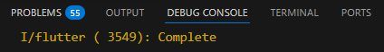

>#### **Soal 9**
>* Capture hasil praktikum Anda berupa GIF dan lampirkan di README. Lalu lakukan commit dengan pesan "**W11: Soal 9**".

### **Langkah 4: Tambah method handleError()**
Tambahkan kode ini di dalam `class _FutureStatePage`
```dart
Future handleError() async {
  try {
    await returnError();
  } 
  catch (error) {
    setState(() {
      result = error.toString();
    });
  } 
  finally {
    print('Complete');
  }
}
```

>#### **Soal 10**
>* Panggil method `handleError()` tersebut di `ElevatedButton`, lalu run. Apa hasilnya? Jelaskan perbedaan kode langkah 1 dan 4!
>
>**Jawaban:**
>
>**Hasil Running:**
>
>Setelah menjalankan aplikasi dan menekan tombol "GO!":
>- Setelah 2 detik, muncul text error: **"Exception: Something terrible happened!"**
>- Di debug console muncul text **"Complete"**
>- Aplikasi tetap berjalan normal (tidak crash)
>
>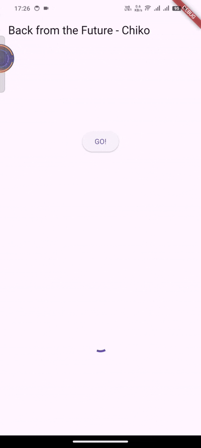
>
>**Perbedaan Kode Langkah 2 dan Langkah 4:**
>
>**Langkah 2 (Menggunakan then-catchError-whenComplete):**
>```dart
>returnError()
>  .then((value) {
>    setState(() {
>      result = 'Success';
>    });
>  }).catchError((onError) {
>    setState(() {
>      result = onError.toString();
>    });
>  }).whenComplete(() => print('Complete'));
>```
>
>**Langkah 4 (Menggunakan try-catch-finally dengan async/await):**
>```dart
>Future handleError() async {
>  try {
>    await returnError();
>  } 
>  catch (error) {
>    setState(() {
>      result = error.toString();
>    });
>  } 
>  finally {
>    print('Complete');
>  }
>}
>```
>
>**Tabel Perbandingan:**
>
>| Aspek | Langkah 2 (then-catchError) | Langkah 4 (try-catch) |
>|-------|----------------------------|----------------------|
>| **Pola** | Callback-based | async/await |
>| **Sintaks** | Chaining methods | Sequential code |
>| **Readability** | ❌ Kurang readable (callback chain) | ✅ Lebih mudah dibaca |
>| **Success Handling** | `.then()` | Kode setelah `await` |
>| **Error Handling** | `.catchError()` | `catch (error)` |
>| **Cleanup/Finally** | `.whenComplete()` | `finally` block |
>| **Nesting** | Bisa jadi callback hell | ✅ Flat structure |
>| **Debugging** | ❌ Lebih sulit | ✅ Lebih mudah |
>| **Modern Practice** | ❌ Old style | ✅ Recommended |
>
>**Penjelasan Detail:**
>
>**1. Langkah 2 - then/catchError/whenComplete Pattern:**
>
>```dart
>returnError()                          // 1. Panggil Future
>  .then((value) {                      // 2. Jika SUCCESS (tidak dijalankan karena error)
>    setState(() {
>      result = 'Success';
>    });
>  })
>  .catchError((onError) {              // 3. Jika ERROR (dijalankan)
>    setState(() {
>      result = onError.toString();     // Tampilkan error message
>    });
>  })
>  .whenComplete(() => print('Complete')); // 4. Selalu dijalankan (success/error)
>```
>
>**2. Langkah 4 - try/catch/finally Pattern:**
>
>```dart
>Future handleError() async {           // 1. Method harus async
>  try {                                 // 2. Try block
>    await returnError();                // 3. Tunggu Future selesai
>    // Jika success, kode di sini dijalankan (tidak tercapai karena error)
>  } 
>  catch (error) {                       // 4. Catch block - tangkap error
>    setState(() {
>      result = error.toString();        // Tampilkan error message
>    });
>  } 
>  finally {                             // 5. Finally block - selalu dijalankan
>    print('Complete');
>  }
>}
>```
>
>**Perbedaan Utama:**
>
>**1. Struktur Kode:**
>```dart
>// Langkah 2: Horizontal (chaining)
>returnError().then().catchError().whenComplete();
>
>// Langkah 4: Vertical (sequential)
>try {
>  await returnError();
>} catch (error) {
>  // handle
>} finally {
>  // cleanup
>}
>```
>
>**2. Error Information:**
>```dart
>// Langkah 2: Parameter onError tidak di-type
>.catchError((onError) { ... })
>
>// Langkah 4: Bisa specific error type
>catch (Exception error) { ... }  // Hanya tangkap Exception
>catch (e) { ... }                // Tangkap semua error
>```
>
>**3. Multiple Async Operations:**
>```dart
>// Langkah 2: Nested callbacks (callback hell)
>future1()
>  .then((v1) => future2())
>  .then((v2) => future3())
>  .catchError((e) => ...);
>
>// Langkah 4: Sequential & clean
>try {
>  var v1 = await future1();
>  var v2 = await future2();
>  var v3 = await future3();
>} catch (e) {
>  // handle
>}
>```
>
>**Best Practice Recommendation:**
>
>```dart
>// ❌ Hindari callback hell
>getData()
>  .then((data) => processData(data))
>  .then((result) => saveResult(result))
>  .catchError((e) => print(e));
>
>// ✅ Gunakan async/await
>Future<void> handleData() async {
>  try {
>    final data = await getData();
>    final result = await processData(data);
>    await saveResult(result);
>  } catch (e) {
>    print(e);
>  } finally {
>    // cleanup
>  }
>}
>```
>
>**Rekomendasi:** Untuk development modern, **gunakan pattern try-catch-finally (Langkah 4)** karena lebih readable, maintainable, dan sesuai dengan best practice Flutter/Dart! ✅

## **Praktikum 6: Menggunakan Future dengan StatefulWidget**
Seperti yang Anda telah pelajari, `Stateless` widget tidak dapat menyimpan informasi (state), `StatefulWidget` dapat mengelola variabel dan properti dengan method `setState()`, yang kemudian dapat ditampilkan pada UI. `State` adalah informasi yang dapat berubah selama life cycle widget itu berlangsung.

Ada **4 method** utama dalam life cycle `StatefullWidget`:

* `initState()`: dipanggil sekali ketika state dibangun. Bisa dikatakan ini juga sebagai konstruktor class.
* `build()`: dipanggil setiap kali ada perubahan state atau UI. Method ini melakukan destroy UI dan membangun ulang dari nol.
* `deactive()` dan `dispose()`: digunakan untuk menghapus widget dari tree, pada beberapa kasus dimanfaatkan untuk menutup koneksi ke database atau menyimpan data sebelum berpindah screen.

Setelah Anda menyelesaikan praktikum 5, Anda dapat melanjutkan praktikum 6 ini. Selesaikan langkah-langkah praktikum berikut ini menggunakan editor Visual Studio Code (VS Code) atau Android Studio atau code editor lain kesukaan Anda. Jawablah di laporan praktikum Anda pada setiap soal yang ada di beberapa langkah praktikum ini

>**Perhatian**: Diasumsikan Anda telah berhasil menyelesaikan Praktikum 5.

### **Langkah 1: install plugin geolocator**
Tambahkan plugin geolocator dengan mengetik perintah berikut di terminal.
```dart
flutter pub add geolocator
```

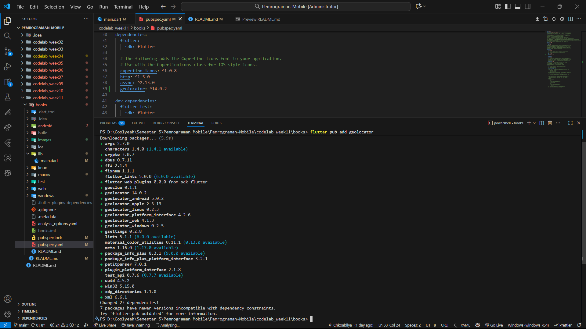

### **Langkah 2: Tambah permission GPS**
Jika Anda menargetkan untuk platform **Android**, maka tambahkan baris kode berikut di file `android/app/src/main/androidmanifest.xml`
```dart
<uses-permission android:name="android.permission.ACCESS_FINE_LOCATION"/>
<uses-permission android:name="android.permission.ACCESS_COARSE_LOCATION"/>
```

Jika Anda menargetkan untuk platform **iOS**, maka tambahkan kode ini ke file `Info.plist`

```dart
<key>NSLocationWhenInUseUsageDescription</key>
<string>This app needs to access your location</string>
```

### **Langkah 3: Buat file geolocation.dart**
Tambahkan file baru ini di folder lib project Anda.


### **Langkah 4: Buat StatefulWidget**
Buat `class LocationScreen` di dalam file `geolocation.dart`

### **Langkah 5: Isi kode geolocation.dart**
```dart
import 'package:flutter/material.dart';
import 'package:geolocator/geolocator.dart';

class LocationScreen extends StatefulWidget {
  const LocationScreen({super.key});

  @override
  State<LocationScreen> createState() => _LocationScreenState();
}

class _LocationScreenState extends State<LocationScreen> {
  String myPosition = '';

  @override
  void initState() {
    super.initState();
    getPosition().then((Position myPos) {
      myPosition =
          'Latitude: ${myPos.latitude.toString()} - Longitude: ${myPos.longitude.toString()}';
      setState(() {
        myPosition = myPosition;
      });
    });
  }

  @override
  Widget build(BuildContext context) {
    return Scaffold(
      appBar: AppBar(title: const Text('Current Location - Chiko')),
      body: Center(child: Text(myPosition)),
    );
  }

  Future<Position> getPosition() async {
    await Geolocator.requestPermission();
    await Geolocator.isLocationServiceEnabled();
    Position position =
        await Geolocator.getCurrentPosition();
    return position;
  }
}
```
>#### **Soal 11**
>* Tambahkan **nama panggilan Anda** pada tiap properti `title` sebagai identitas pekerjaan Anda.

### **Langkah 6: Edit main.dart**
Panggil screen baru tersebut di file main Anda seperti berikut.
```dart
home: LocationScreen(),
```

### **Langkah 7: Run**
Run project Anda di **device** atau **emulator** (**bukan browser**), maka akan tampil seperti berikut ini.


### **Langkah 8: Tambahkan animasi loading**
Tambahkan widget loading seperti kode berikut. Lalu hot restart, perhatikan perubahannya.
```dart
@override
Widget build(BuildContext context) {
  final myWidget = myPosition == ''
      ? const CircularProgressIndicator()
      : const Text(myPosition);;

  return Scaffold(
    appBar: AppBar(title: Text('Current Location')),
    body: Center(child: myWidget),
  );
}
```


>#### **Soal 12**
>* Jika Anda tidak melihat animasi loading tampil, kemungkinan itu berjalan sangat cepat. Tambahkan delay pada method `getPosition()` dengan kode `await Future.delayed(const Duration(seconds: 3));`
>* Apakah Anda mendapatkan koordinat GPS ketika run di browser? Mengapa demikian?
>
>**Jawaban:**
>
>**YA, BISA!** Koordinat GPS **dapat muncul** ketika run di browser.
>
>**Penjelasan:**
>
>Plugin `geolocator` **mendukung web platform** dan menggunakan **HTML5 Geolocation API** yang tersedia di browser modern.
>
>**Cara Kerja di Browser:**
>
>1. **Browser memiliki Geolocation API**: API bawaan browser yang bisa akses lokasi
>2. **Geolocator plugin otomatis detect platform**: 
>   - Di mobile → gunakan native GPS
>   - Di web → gunakan browser Geolocation API
>3. **User harus grant permission**: Browser akan meminta izin akses lokasi
>4. **Akurasi berbeda**:
>   - Mobile: GPS hardware (sangat akurat)
>   - Browser: IP address / WiFi triangulation (kurang akurat)
>
>**Saat Run di Browser:**
>
>
>
>Browser akan menampilkan popup:
>```
>"localhost wants to know your location"
>[Block] [Allow]
>```
>
>**Jika ALLOW:**
>- ✅ Koordinat akan muncul
>- Contoh: `Latitude: -7.xxxx, Longitude: 110.xxxx`
>- Koordinat didapat dari WiFi/IP location
>
>**Jika BLOCK:**
>- ❌ Error: "User denied Geolocation"
>- Tidak ada koordinat yang muncul
>
>**Perbedaan Mobile vs Browser:**
>
>| Aspek | Mobile (Android/iOS) | Browser (Web) |
>|-------|---------------------|---------------|
>| **Source** | GPS Hardware | WiFi/IP Location |
>| **Akurasi** | Sangat tinggi (1-10m) | Sedang (50-500m) |
>| **Permission** | System dialog | Browser popup |
>| **Offline** | ✅ Bisa (GPS tetap jalan) | ❌ Butuh internet |
>| **Kecepatan** | Cepat | Tergantung koneksi |
>
>**Kesimpulan:**
>
>- ✅ **Geolocator support web** menggunakan browser Geolocation API
>- ✅ Koordinat GPS **bisa muncul di browser**
>- ⚠️ Akurasi di browser **lebih rendah** daripada mobile
>- ⚠️ User **harus allow** permission di browser
>- 🎯 Untuk **production app**, lebih baik test di **device asli** untuk akurasi maksimal
>
>* Capture hasil praktikum Anda berupa GIF dan lampirkan di README. Lalu lakukan commit dengan pesan "**W11: Soal 12**".

## **Praktikum 7: Manajemen Future dengan FutureBuilder**
Pola ketika menerima beberapa data secara async dan melakukan update pada UI sebenarnya itu tergantung pada ketersediaan data. Secara umum fakta di Flutter, ada sebuah widget yang membantu Anda untuk memudahkan manajemen future yaitu widget `FutureBuilder`.

Anda dapat menggunakan FutureBuilder untuk manajemen future bersamaan dengan update UI ketika ada update Future. FutureBuilder memiliki status future sendiri, sehingga Anda dapat mengabaikan penggunaan `setState`, Flutter akan membangun ulang bagian UI ketika update itu dibutuhkan.

Untuk lebih memahami widget FutureBuilder, mari kita coba dengan praktikum ini.

Setelah Anda menyelesaikan praktikum 6, Anda dapat melanjutkan praktikum 7 ini. Selesaikan langkah-langkah praktikum berikut ini menggunakan editor Visual Studio Code (VS Code) atau Android Studio atau code editor lain kesukaan Anda. Jawablah di laporan praktikum Anda pada setiap soal yang ada di beberapa langkah praktikum ini.

>**Perhatian**: Diasumsikan Anda telah berhasil menyelesaikan Praktikum 6.

### **Langkah 1: Modifikasi method getPosition()**
Buka file `geolocation.dart` kemudian ganti isi method dengan kode ini.
```dart
Future<Position> getPosition() async {
  await Geolocator.isLocationServiceEnabled();
  await Future.delayed(const Duration(seconds: 3));
  Position position = await Geolocator.getCurrentPosition();
  return position; }
```

### **Langkah 2: Tambah variabel**
Tambah variabel ini di class `_LocationScreenState`
```dart
Future<Position>? position;
```

### **Langkah 3: Tambah initState()**
Tambah method ini dan set variabel `position`
```dart
@override
void initState() {
  super.initState();
  position = getPosition();
}
```

### **Langkah 4: Edit method build()**
Ketik kode berikut dan sesuaikan. Kode lama bisa Anda comment atau hapus.
```dart
@override
Widget build(BuildContext context) {
  return Scaffold(
    appBar: AppBar(title: Text('Current Location')),
    body: Center(child: FutureBuilder(
      future: position,
      builder: (BuildContext context, AsyncSnapshot<Position>
          snapshot) {
        if (snapshot.connectionState ==
            ConnectionState.waiting) {
          return const CircularProgressIndicator();
        }
        else if (snapshot.connectionState ==
            ConnectionState.done) {
          return Text(snapshot.data.toString());
        }
        else {
          return const Text('');
        }
      },
    ),
  ));
}
```


>#### **Soal 13**
>* Apakah ada perbedaan UI dengan praktikum sebelumnya? Mengapa demikian?
>
>**Jawab:**
>
>**Perbedaan UI: TIDAK ADA** (secara visual sama)
>
>**Yang Berubah:**
>
>| Aspek | Praktikum 6 | Praktikum 7 |
>|-------|-------------|-------------|
>| **Widget** | Manual dengan `setState()` | Otomatis dengan `FutureBuilder` |
>| **State Management** | Manual | Otomatis |
>| **Kode** | Lebih panjang | Lebih clean |
>| **Rebuild UI** | Manual `setState()` | Otomatis oleh Flutter |
>| **Rekomendasi** | ❌ Kurang efisien | ✅ **Lebih efisien** |
>
>**Penjelasan Singkat:**
>
>**Praktikum 6 (Manual setState):**
>```dart
>String myPosition = ''; // ← Variabel state manual
>
>void initState() {
>  getPosition().then((Position myPos) {
>    myPosition = 'Lat: ${myPos.latitude}...';
>    setState(() {          // ← Harus panggil setState manual
>      myPosition = myPosition;
>    });
>  });
>}
>
>Widget build(BuildContext context) {
>  final myWidget = myPosition == ''
>      ? CircularProgressIndicator()
>      : Text(myPosition);
>  return Center(child: myWidget);
>}
>```
>❌ Harus kelola state manual  
>❌ Harus panggil `setState()`  
>❌ Kode lebih panjang
>
>**Praktikum 7 (FutureBuilder):**
>```dart
>Future<Position>? position; // ← Future, bukan String
>
>void initState() {
>  position = getPosition(); // ← Cukup assign Future
>}
>
>Widget build(BuildContext context) {
>  return FutureBuilder(
>    future: position,
>    builder: (context, snapshot) {
>      if (snapshot.connectionState == ConnectionState.waiting) {
>        return CircularProgressIndicator(); // ← Otomatis tampil saat loading
>      } else if (snapshot.connectionState == ConnectionState.done) {
>        return Text(snapshot.data.toString()); // ← Otomatis tampil saat selesai
>      }
>      return Text('');
>    },
>  );
>}
>```
>✅ State dikelola otomatis oleh FutureBuilder  
>✅ Tidak perlu `setState()`  
>✅ Kode lebih clean dan reactive
>
>**Mengapa Praktikum 7 Lebih Baik:**
>
>1. **Tidak perlu setState()**: FutureBuilder otomatis rebuild UI saat Future selesai
>2. **Lebih reactive**: UI langsung bereaksi terhadap perubahan Future
>3. **Lebih clean**: Kode lebih mudah dibaca dan dipahami
>4. **Handle semua state**: `waiting`, `done`, `error` di satu tempat
>5. **Best practice Flutter**: Cara yang direkomendasikan untuk Future + UI
>
>**Kesimpulan:**
>
>a. UI terlihat **SAMA** (loading → koordinat GPS)
>
>b. **Cara kerja di balik layar BERBEDA**
>
>c. **FutureBuilder lebih efisien dan modern** ✅
>
>* Capture hasil praktikum Anda berupa GIF dan lampirkan di README. Lalu lakukan commit dengan pesan "**W11: Soal 13"**.
>* Seperti yang Anda lihat, menggunakan FutureBuilder lebih efisien, clean, dan reactive dengan Future bersama UI.

### **Langkah 5: Tambah handling error**
Tambahkan kode berikut untuk menangani ketika terjadi error. Kemudian hot restart.
```dart
else if (snapshot.connectionState == ConnectionState.done) {
  if (snapshot.hasError) {
     return Text('Something terrible happened!');
  }
  return Text(snapshot.data.toString());
}
```

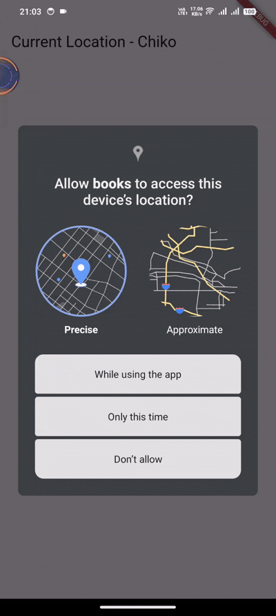 

>#### **Soal 14**
>* Apakah ada perbedaan UI dengan langkah sebelumnya? Mengapa demikian?
>
>**Jawab:**
>
>**Perbedaan UI: TIDAK ADA** (jika tidak ada error)
>
>**Penjelasan:**
>
>**Kondisi Normal (Tidak Ada Error):**
>- UI tetap sama seperti Soal 13
>- Menampilkan loading → koordinat GPS
>- Tidak ada perbedaan visual
>
>**Kondisi Error:**
>- **Langkah 4 (Soal 13)**: Jika error, app bisa crash atau tampil error merah
>- **Langkah 5 (Soal 14)**: Jika error, tampil text "Something terrible happened!"
>
>**Kode Sebelumnya (Langkah 4):**
>```dart
>else if (snapshot.connectionState == ConnectionState.done) {
>  return Text(snapshot.data.toString()); // ❌ Langsung akses data, bisa error
>}
>```
>
>**Kode Baru (Langkah 5):**
>```dart
>else if (snapshot.connectionState == ConnectionState.done) {
>  if (snapshot.hasError) {              // ✅ Cek error dulu
>    return Text('Something terrible happened!');
>  }
>  return Text(snapshot.data.toString()); // ✅ Akses data setelah yakin tidak error
>}
>```
>
>**Perbandingan:**
>
>| Aspek | Langkah 4 (Tanpa Error Handling) | Langkah 5 (Dengan Error Handling) |
>|-------|----------------------------------|-----------------------------------|
>| **Cek Error** | ❌ Tidak ada | ✅ Ada `snapshot.hasError` |
>| **Jika Error** | App crash / Error merah | Tampil pesan user-friendly |
>| **User Experience** | ❌ Buruk | ✅ Baik |
>| **Production Ready** | ❌ Tidak aman | ✅ Aman |
>
>**Mengapa Tidak Ada Perbedaan Visual (Kondisi Normal)?**
>
>1. **GPS berfungsi normal** → tidak ada error
>2. **Permission granted** → user izinkan akses lokasi
>3. **Location service aktif** → GPS device hidup
>4. **Kode error handling hanya jalan jika ada error**
>
>**Cara Test Error Handling:**
>
>Untuk melihat perbedaan, buat error sengaja:
>
>```dart
>Future<Position> getPosition() async {
>  await Geolocator.isLocationServiceEnabled();
>  await Future.delayed(const Duration(seconds: 3));
>  throw Exception('GPS Error!'); // ← Tambahkan ini untuk test
>  Position position = await Geolocator.getCurrentPosition();
>  return position;
>}
>```
>
>**Hasil:**
>- **Tanpa error handling**: App crash atau error merah
>- **Dengan error handling**: Tampil "Something terrible happened!"
>
>**Kesimpulan:**
>
>- **Tidak ada perbedaan UI** saat kondisi normal (GPS berhasil)
>- **Ada perbedaan besar** saat terjadi error:
>  - Langkah 4: App crash ❌
>  - Langkah 5: Tampil pesan error yang friendly ✅
>- **Langkah 5 lebih aman dan production-ready** karena handle error dengan baik
>
>**Best Practice FutureBuilder:**
>
>```dart
>FutureBuilder(
>  future: myFuture,
>  builder: (context, snapshot) {
>    // 1. Handle loading
>    if (snapshot.connectionState == ConnectionState.waiting) {
>      return CircularProgressIndicator();
>    }
>    // 2. Handle done
>    if (snapshot.connectionState == ConnectionState.done) {
>      // 3. Handle error ✅ PENTING!
>      if (snapshot.hasError) {
>        return Text('Error: ${snapshot.error}');
>      }
>      // 4. Handle success
>      if (snapshot.hasData) {
>        return Text(snapshot.data.toString());
>      }
>      // 5. Handle no data
>      return Text('No data');
>    }
>    return Text('');
>  },
>)
>```
>
>**Selalu tambahkan `snapshot.hasError` check untuk aplikasi yang robust!** ✅
>
>* Capture hasil praktikum Anda berupa GIF dan lampirkan di README. Lalu lakukan commit dengan pesan "**W11: Soal 14**".

## **Praktikum 8: Navigation route dengan Future Function**
Praktikum kali ini Anda akan melihat manfaat Future untuk Navigator dalam transformasi Route menjadi sebuah function async. Anda akan melakukan push screen baru dan fungsi await menunggu data untuk melakukan update warna background pada screen.

Setelah Anda menyelesaikan praktikum 7, Anda dapat melanjutkan praktikum 8 ini. Selesaikan langkah-langkah praktikum berikut ini menggunakan editor Visual Studio Code (VS Code) atau Android Studio atau code editor lain kesukaan Anda. Jawablah di laporan praktikum Anda pada setiap soal yang ada di beberapa langkah praktikum ini.

>**Perhatian**: Diasumsikan Anda telah berhasil menyelesaikan Praktikum 7.

### **Langkah 1: Buat file baru navigation_first.dart**
Buatlah file baru ini di project lib Anda.

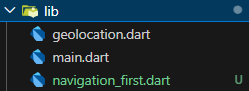

### **Langkah 2: Isi kode navigation_first.dart**
```dart
import 'package:flutter/material.dart';

class NavigationFirst extends StatefulWidget {
  const NavigationFirst({super.key});

  @override
  State<NavigationFirst> createState() => _NavigationFirstState();
}

class _NavigationFirstState extends State<NavigationFirst> {
  Color color = Colors.blue.shade700;
  @override
  Widget build(BuildContext context) {
    return Scaffold(
      backgroundColor: color,
      appBar: AppBar(
        title: const Text('Navigation First Screen - Chiko'),
      ),
      body: Center(
        child: ElevatedButton(
          child: const Text('Change Color'),
          onPressed: () {
            _navigateAndGetColor(context);
          },
        ),
      ),
    );
  }
}
```

>#### **Soal 15**
>* Tambahkan **nama panggilan Anda** pada tiap properti `title` sebagai identitas pekerjaan Anda.
>* Silakan ganti dengan warna tema favorit Anda.

### **Langkah 3: Tambah method di class _NavigationFirstState**
Tambahkan method ini.
```dart
Future _navigateAndGetColor(BuildContext context) async {
   color = await Navigator.push(context,
        MaterialPageRoute(builder: (context) => const NavigationSecond()),) ?? Colors.blue;
   setState(() {});
   });
}
```

### **Langkah 4: Buat file baru navigation_second.dart**
Buat file baru ini di project lib Anda. Silakan jika ingin mengelompokkan view menjadi satu folder dan sesuaikan impor yang dibutuhkan.

### **Langkah 5: Buat class NavigationSecond dengan StatefulWidget**
```dart
import 'package.flutter/material.dart';

class NavigationSecond extends StatefulWidget {
  const NavigationSecond({super.key});

  @override
  State<NavigationSecond> createState() => _NavigationSecondState();
}

class _NavigationSecondState extends State<NavigationSecond> {
  @override
  Widget build(BuildContext context) {
    Color color;
    return Scaffold(
      appBar: AppBar(
        title: const Text('Navigation Second Screen - Chiko'),
      ),
      body: Center(
        child: Column(
          mainAxisAlignment: MainAxisAlignment.spaceEvenly,
          children: [
            ElevatedButton(
              child: const Text('Yellow'),
              onPressed: () {
                color = Colors.yellow.shade700;
                Navigator.pop(context, color);
              },
            ),
            ElevatedButton(
              child: const Text('Red'),
              onPressed: () {
                color = Colors.red.shade700;
                Navigator.pop(context, color);
              },
            ),
            ElevatedButton(
              child: const Text('Orange'),
              onPressed: () {
                color = Colors.orange.shade700;
                Navigator.pop(context, color);
              },
            ),
          ],
        ),
      ),
    );
  }
}
```

### **Langkah 6: Edit main.dart**
Lakukan edit properti home.
```dart
home: const NavigationFirst(),
```

### **Langkah 8: Run**
Lakukan run, jika terjadi error silakan diperbaiki.

>#### **Soal 16**
>* Cobalah klik setiap button, apa yang terjadi ? Mengapa demikian ?
>
>**Jawab:**
>
>**Apa yang Terjadi:**
>
>1. **Saat klik tombol "Change Color"** di screen pertama:
>   - Aplikasi pindah ke screen kedua (NavigationSecond)
>   - Background screen pertama tetap dengan warna sebelumnya
>
>2. **Saat klik tombol warna** (Yellow/Red/Orange) di screen kedua:
>   - Screen kedua **tertutup** (pop/kembali)
>   - Screen pertama **muncul kembali**
>   - **Background berubah** sesuai warna yang dipilih
>
>**Mengapa Demikian:**
>
>**Flow Kerja Navigation dengan Future:**
>
>```dart
>// Di NavigationFirst
>Future _navigateAndGetColor(BuildContext context) async {
>  // 1. PUSH ke screen kedua & TUNGGU hasilnya
>  color = await Navigator.push(
>    context,
>    MaterialPageRoute(builder: (context) => const NavigationSecond()),
>  ) ?? Colors.blue;  // 3. Terima warna (atau default blue jika null)
>  
>  // 4. Update UI dengan warna baru
>  setState(() {});
>}
>```
>
>```dart
>// Di NavigationSecond
>ElevatedButton(
>  child: const Text('Red'),
>  onPressed: () {
>    color = Colors.red.shade700;
>    Navigator.pop(context, color);  // 2. POP & kirim warna ke screen pertama
>  },
>),
>```
>
>**Penjelasan Detail:**
>
>**1. `Navigator.push()` dengan `await`:**
>- `Navigator.push()` mengembalikan **Future**
>- `await` membuat program **menunggu** hingga user kembali dari screen kedua
>- Future selesai ketika `Navigator.pop()` dipanggil di screen kedua
>- Data yang di-`pop` dikembalikan sebagai hasil Future
>
>**2. `Navigator.pop(context, color)`:**
>- `pop()` menutup screen kedua
>- Parameter kedua (`color`) adalah **data yang dikembalikan**
>- Data ini diterima oleh `await Navigator.push()` di screen pertama
>
>**3. Operator `??` (Null-aware):**
>```dart
>color = await Navigator.push(...) ?? Colors.blue;
>```
>- Jika user kembali tanpa pilih warna (tekan back button), hasil = `null`
>- Operator `??` memberikan default value `Colors.blue`
>- Mencegah error jika `color` null
>
>**4. `setState()`:**
>- Setelah menerima warna baru, `setState()` dipanggil
>- Flutter rebuild UI dengan `color` yang baru
>- Background screen berubah
>
>* Gantilah 3 warna pada langkah 5 dengan warna favorit Anda!
>
>```dart
>ElevatedButton(
>  child: const Text('Yellow'),
>  onPressed: () {
>    color = Colors.yellow.shade700; // ← Warna favorit 1
>    Navigator.pop(context, color);
>  },
>),
>ElevatedButton(
>  child: const Text('Red'),
>  onPressed: () {
>    color = Colors.red.shade700; // ← Warna favorit 2
>    Navigator.pop(context, color);
>  },
>),
>ElevatedButton(
>  child: const Text('Orange'),
>  onPressed: () {
>    color = Colors.orange.shade700; // ← Warna favorit 3
>    Navigator.pop(context, color);
>  },
>),
>```
>
>* Capture hasil praktikum Anda berupa GIF dan lampirkan di README. Lalu lakukan commit dengan pesan "**W11: Soal 16**".

Hasilnya akan seperti gambar berikut ini.

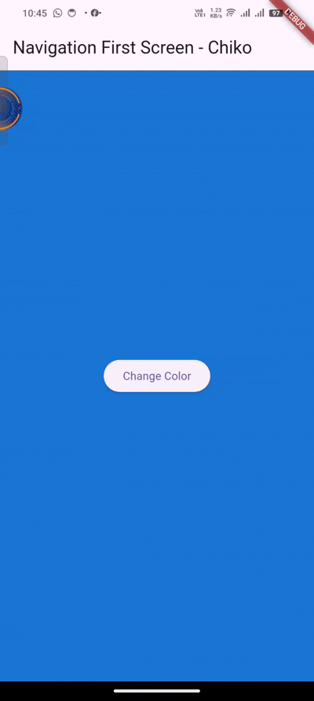

## **Praktikum 9: Memanfaatkan async/await dengan Widget Dialog**
Pada praktikum ini, Anda akan memanfaatkan widget `AlertDialog`. Anda bisa manfaatkan widget ini misal untuk memilih operasi Save, Delete, Accept, dan sebagainya.

Setelah Anda menyelesaikan praktikum 8, Anda dapat melanjutkan praktikum 9 ini. Selesaikan langkah-langkah praktikum berikut ini menggunakan editor Visual Studio Code (VS Code) atau Android Studio atau code editor lain kesukaan Anda. Jawablah di laporan praktikum Anda pada setiap soal yang ada di beberapa langkah praktikum ini.

>**Perhatian**: Diasumsikan Anda telah berhasil menyelesaikan Praktikum 8.

### **Langkah 1: Buat file baru navigation_dialog.dart**
Buat file dart baru di folder lib project Anda.

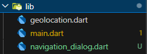

### **Langkah 2: Isi kode navigation_dialog.dart**
```dart
import 'package:flutter/material.dart';

class NavigationDialogScreen extends StatefulWidget {
  const NavigationDialogScreen({super.key});

  @override
  State<NavigationDialogScreen> createState() =>
      _NavigationDialogScreenState();
}

class _NavigationDialogScreenState extends
    State<NavigationDialogScreen> {
  Color color = Colors.blue.shade700;
  @override
  Widget build(BuildContext context) {
    return Scaffold(
      backgroundColor: color,
      appBar: AppBar(
        title: const Text('Navigation Dialog Screen - Chiko'),
      ),
      body: Center(
        child:
          ElevatedButton(child: const Text('Change Color'),
          onPressed: () {},
        ),
      ),
    );
  }
}
```

### **Langkah 3: Tambah method async**
```dart
_showColorDialog(BuildContext context) async {

  await showDialog(
    barrierDismissible: false,
    context: context,
    builder: (_) {
      return AlertDialog(
        title: const Text('Very important question'),
        content: const Text('Please choose a color'),
        actions: <Widget>[
          TextButton(
            child: const Text('Yellow'),
            onPressed: () {
              color = Colors.yellow.shade700;
              Navigator.pop(context, color);
            },
          ),
          TextButton(
            child: const Text('Red'),
            onPressed: () {
              color = Colors.red.shade700;
              Navigator.pop(context, color);
            },
          ),
          TextButton(
            child: const Text('Orange'),
            onPressed: () {
              color = Colors.orange.shade700;
              Navigator.pop(context, color);
            },
          ),
        ],
      );
    },
  );
  setState(() {});
}
```

### **Langkah 4: Panggil method di ElevatedButton**
```dart
onPressed: () {
  _showColorDialog(context);
},
```

### **Langkah 5: Edit main.dart**
Ubah properti home
```dart
home: const NavigationDialog(),
```

### **Langkah 6: Run**
Coba ganti warna background dengan widget dialog tersebut. Jika terjadi error, silakan diperbaiki. Jika berhasil, akan tampil seperti gambar berikut.


>#### **Soal 17**
>* Cobalah klik setiap button, apa yang terjadi ? Mengapa demikian ?
>
>**Jawab:**
>
>**Apa yang Terjadi:**
>
>1. **Saat klik tombol "Change Color"**:
>   - Muncul **AlertDialog** di tengah layar
>   - Background menjadi gelap (overlay)
>   - Dialog menampilkan 3 tombol warna (Yellow, Red, Orange)
>
>2. **Saat klik tombol warna di dialog**:
>   - Dialog **tertutup** otomatis
>   - **Background berubah** sesuai warna yang dipilih
>   - Screen kembali normal dengan warna baru
>
>**Mengapa Demikian:**
>
>**Flow Kerja Dialog dengan Async/Await:**
>
>```dart
>_showColorDialog(BuildContext context) async {
>  // 1. Tampilkan dialog dan TUNGGU user pilih warna
>  await showDialog(
>    barrierDismissible: false,  // User tidak bisa close dengan tap di luar
>    context: context,
>    builder: (_) {
>      return AlertDialog(
>        title: const Text('Very important question'),
>        content: const Text('Please choose a color'),
>        actions: <Widget>[
>          TextButton(
>            child: const Text('Yellow'),
>            onPressed: () {
>              color = Colors.yellow.shade700;
>              Navigator.pop(context, color);  // 2. Close dialog & kirim warna
>            },
>          ),
>          // ... tombol lainnya
>        ],
>      );
>    },
>  );
>  // 3. Setelah dialog close, update UI
>  setState(() {});
>}
>```
>
>**Penjelasan Detail:**
>
>**1. `showDialog()` dengan `await`:**
>- `showDialog()` mengembalikan **Future**
>- `await` membuat program **menunggu** hingga dialog ditutup
>- Dialog bersifat modal (blocking) - user harus pilih warna
>- `barrierDismissible: false` → user tidak bisa close dengan tap di luar dialog
>
>**2. `Navigator.pop(context, color)`:**
>- `pop()` menutup dialog
>- Parameter kedua (`color`) adalah **data yang dikembalikan** ke caller
>- Warna ini akan diproses setelah `await showDialog()` selesai
>
>**3. `setState()` setelah dialog:**
>- Dipanggil setelah `await showDialog()` selesai
>- Flutter rebuild UI dengan `color` yang baru
>- Background berubah sesuai pilihan user
>
>* Gantilah 3 warna pada langkah 3 dengan warna favorit Anda!
>
>```dart
>actions: <Widget>[
>  TextButton(
>    child: const Text('Yellow'),
>    onPressed: () {
>      color = Colors.yellow.shade700; // ← Warna favorit 1
>      Navigator.pop(context, color);
>    },
>  ),
>  TextButton(
>    child: const Text('Red'),
>    onPressed: () {
>      color = Colors.red.shade700; // ← Warna favorit 2
>      Navigator.pop(context, color);
>    },
>  ),
>  TextButton(
>    child: const Text('Orange'),
>    onPressed: () {
>      color = Colors.orange.shade700; // ← Warna favorit 3
>      Navigator.pop(context, color);
>    },
>  ),
>],
>```
>
>* Capture hasil praktikum Anda berupa GIF dan lampirkan di README. Lalu lakukan commit dengan pesan "**W11: Soal 17**".