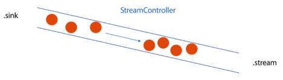
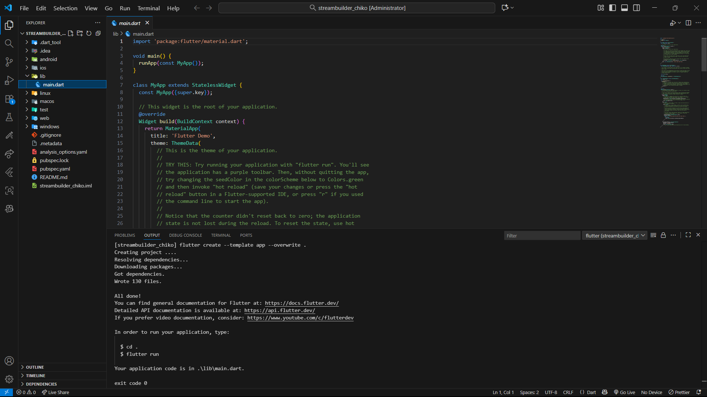

<div align="center">

# LAPORAN PRAKTIKUM

## PEMROGRAMAN MOBILE


---

## JOBSHEET 10

### Streams

---

**Dosen Pengampu:**  
Habibie Ed Dien, S.Kom., M.T.

---

**Disusun oleh:**  
Chiko Abilla Basya  
2341720005  
TI-3G  
D-4 Teknik Informatika  
Politeknik Negeri Malang

---

Jl. Soekarno Hatta No.9, Jatimulyo,  
Kec. Lowokwaru, Kota Malang, Jawa Timur 65141

Phone: (0341) 404424, 404425  
Email: [Polinema.ac.id](https://www.polinema.ac.id)

</div>

---

## **Praktikum 1: Dart Streams**
Selesaikan langkah-langkah praktikum berikut ini menggunakan editor Visual Studio Code (VS Code) atau Android Studio atau code editor lain kesukaan Anda. Jawablah di laporan praktikum Anda (ketik di **README.md**) pada setiap soal yang ada di beberapa langkah praktikum ini.

>**Perhatian**: Diasumsikan Anda telah berhasil melakukan setup environment Flutter SDK, VS Code, Flutter Plugin, dan Android SDK pada pertemuan pertama.

### **Langkah 1: Buat Project Baru**
Buatlah sebuah project flutter baru dengan nama **stream_nama** (beri nama panggilan Anda) di folder **week-12/src/** repository GitHub Anda.


### **Langkah 2: Buka file main.dart**
Ketiklah kode seperti berikut ini.
```dart
import 'package:flutter/material.dart';

void main() {
  runApp(const MyApp());
}

class MyApp extends StatelessWidget {
  const MyApp({super.key});

  @override
  Widget build(BuildContext context) {
    return MaterialApp(
      title: 'Stream - Chiko',
      theme: ThemeData(primarySwatch: Colors.blue),
      home: const StreamHomePage(),
    );
  }
}

class StreamHomePage extends StatefulWidget {
  const StreamHomePage({super.key});

  @override
  State<StreamHomePage> createState() => _StreamHomePageState();
}

class _StreamHomePageState extends State<StreamHomePage> {
  @override
  Widget build(BuildContext context) {
    return Container();
  }
}
```

>#### **Soal 1**
>* Tambahkan **nama panggilan Anda** pada `title` app sebagai identitas hasil pekerjaan Anda.
>* Gantilah warna tema aplikasi sesuai kesukaan Anda.
>* Lakukan commit hasil jawaban Soal 1 dengan pesan **"W12: Jawaban Soal 1"**

### **Langkah 3: Buat file baru stream.dart**
Buat file baru di folder lib project Anda. Lalu isi dengan kode berikut.
```dart
import 'package:flutter/material.dart';

class ColorStream {

}
```

### **Langkah 4: Tambah variabel colors**
Tambahkan variabel di dalam class `ColorStream` seperti berikut.
```dart
final List<Color> colors = [
  Colors.red,
  Colors.green,
  Colors.pink,
  Colors.yellow,
  Colors.orange,
  Colors.purple,
];
```

>#### **Soal 2**
>* Tambahkan 5 warna lainnya sesuai keinginan Anda pada variabel `colors` tersebut.
>* Lakukan commit hasil jawaban Soal 2 dengan pesan **"W12: Jawaban Soal 2"**

### **Langkah 5: Tambah method getColors()**
Di dalam `class ColorStream` ketik method seperti kode berikut. Perhatikan tanda bintang di akhir keyword `async*` (ini digunakan untuk melakukan `Stream` data)
```dart
Stream<Color> getColors() async* {

}
```

### **Langkah 6: Tambah perintah yield***
Tambahkan kode berikut ini.
```dart
yield* Stream.periodic(
  const Duration(seconds: 1), (int t) {
    int index = t % colors.length;
    return colors[index];
});
```

>#### **Soal 3**
>* Jelaskan fungsi keyword `yield*` pada kode tersebut!
>
>**Jawab:**
>
>Fungsi keyword `yield*` digunakan untuk mengembalikan (yield) **seluruh nilai dari Stream lain** ke dalam Stream yang sedang dibuat. Berbeda dengan `yield` yang mengembalikan satu nilai, `yield*` mengembalikan semua nilai dari Stream secara berurutan.
>
>* Apa maksud isi perintah kode tersebut?
>
>**Jawab:**
>
>1. Stream.periodic → Membuat stream yang mengirimkan data secara berkala/periodik
>2. Duration(seconds: 1) → Interval waktu 1 detik untuk setiap emission
>3. (int t) → Parameter t adalah counter yang dimulai dari 0 dan bertambah setiap interval
>4. t % colors.length → Operasi modulo untuk mendapatkan index yang berputar (0 sampai panjang colors - 1)
>5. return colors[index] → Mengembalikan warna pada index tersebut
>
>* Lakukan commit hasil jawaban Soal 3 dengan pesan **"W12: Jawaban Soal 3"**

### **Langkah 7: Buka main.dart**
Ketik kode impor file ini pada file `main.dart`
```dart
import 'stream.dart';
```

### **Langkah 8: Tambah variabel**
Ketik dua properti ini di dalam `class _StreamHomePageState`
```dart
Color bgColor = Color.blueGrey;
late ColorStream colorStream;
```

### **Langkah 9: Tambah method changeColor()**
Tetap di file main, Ketik kode seperti berikut
```dart
void changeColor() async {
  await for (var eventColor in colorStream.getColors()) {
    setState(() {
      bgColor = eventColor;
    });
  }
}
```

### **Langkah 10: Lakukan override initState()**
Ketika kode seperti berikut
```dart
@override
void initState() {
  super.initState();
  colorStream = ColorStream();
  changeColor();
}
```

### **Langkah 11: Ubah isi Scaffold()**
Sesuaikan kode seperti berikut.
```dart
return Scaffold(
  appBar: AppBar(
    title: const Text('Stream'),
  ),
  body: Container(
    decoration: BoxDecoration(color: bgColor),
  ));
}
```

### **Langkah 12: Run**
Lakukan running pada aplikasi Flutter Anda, maka akan terlihat berubah warna background setiap detik.


>#### **Soal 4**
>* Capture hasil praktikum Anda berupa GIF dan lampirkan di README.
>* Lakukan commit hasil jawaban Soal 4 dengan pesan **"W12: Jawaban Soal 4"**

### **Langkah 13: Ganti isi method changeColor()**
Anda boleh comment atau hapus kode sebelumnya, lalu ketika kode seperti berikut.
```dart
colorStream.getColors().listen((eventColor) {
  setState(() {
    bgColor = eventColor;
  });
});
```

>#### **Soal 5**
>* Jelaskan perbedaan menggunakan `listen` dan `await for` (langkah 9) !
>
>**Jawab:**
>
>#### **Perbedaan `listen()` dan `await for`:**
>
>| Aspek | `await for` | `listen()` |
>|-------|-------------|------------|
>| **Sifat** | Synchronous & Blocking | Asynchronous & Non-blocking |
>| **Eksekusi** | Menunggu setiap item secara berurutan | Mendengarkan tanpa memblokir kode lain |
>| **Kontrol** | Lebih sederhana, linear | Lebih fleksibel dengan callback |
>| **Use Case** | Ketika perlu proses sequential | Ketika perlu proses parallel/reactive |
>| **Error Handling** | Menggunakan try-catch | Menggunakan `onError` parameter |
>| **Pembatalan** | Sulit dibatalkan | Mudah dibatalkan dengan `subscription.cancel()` |
>
>#### **1. `await for` (Langkah 9):**
>```dart
>void changeColor() async {
>  await for (var eventColor in colorStream.getColors()) {
>    setState(() {
>      bgColor = eventColor;
>    });
>  }
>}
>```
>
>**Karakteristik:**
>- **Blocking**: Kode menunggu setiap event dari stream
>- **Sequential**: Memproses satu per satu secara berurutan
>- **Simple**: Sintaks lebih sederhana seperti for loop biasa
>- **Sulit cancel**: Tidak mudah untuk membatalkan subscription
>- **Error handling**: Menggunakan try-catch
>
>#### **2. `listen()` (Langkah 13):**
>```dart
>void changeColor() {
>  colorStream.getColors().listen((eventColor) {
>    setState(() {
>      bgColor = eventColor;
>    });
>  });
>}
>```
>
>**Karakteristik:**
>- **Non-blocking**: Kode tidak menunggu, langsung lanjut
>- **Reactive**: Bereaksi saat ada data baru
>- **Flexible**: Bisa tambahkan `onError`, `onDone`, `cancelOnError`
>- **Controllable**: Bisa di-cancel dengan `subscription.cancel()`
>- **Better error handling**: Mendukung callback untuk error
>
>#### **Contoh dengan Error Handling:**
>```dart
>void changeColor() {
>  colorStream.getColors().listen(
>    (eventColor) {
>      setState(() {
>        bgColor = eventColor;
>      });
>    },
>    onError: (error) {
>      print('Error occurred: $error');
>    },
>    onDone: () {
>      print('Stream completed');
>    },
>  );
>}
>```
>
>#### **Kesimpulan:**
>a. **Gunakan `await for`** ketika perlu proses sequential/berurutan dan kode lebih sederhana
>
>b.  **Gunakan `listen()`** ketika perlu proses non-blocking, kontrol penuh (cancel, error handling), dan aplikasi reactive
>
>c. **`listen()` lebih cocok untuk aplikasi Flutter** karena tidak memblokir UI thread
>
>* Lakukan commit hasil jawaban Soal 5 dengan pesan **"W12: Jawaban Soal 5"**

>**Catatan**: Stream di Flutter memiliki fitur yang powerfull untuk menangani data secara async. Stream dapat dimanfaatkan pada skenario dunia nyata seperti real-time messaging, unggah dan unduh file, tracking lokasi user, bekerja dengan data sensor IoT, dan lain sebagainya.

## **Praktikum 2: Stream controllers dan sinks**
`StreamControllers` akan membuat jembatan antara `Stream` dan `Sink`. `Stream` berisi data secara sekuensial yang dapat diterima oleh subscriber manapun, sedangkan `Sink` digunakan untuk mengisi (injeksi) data.

Secara sederhana, StreamControllers merupakan stream management. Ia akan otomatis membuat stream dan sink serta beberapa method untuk melakukan kontrol terhadap event dan fitur-fitur yang ada di dalamnya.

Anda dapat membayangkan stream sebagai pipa air yang mengalir searah, dari salah satu ujung Anda dapat mengisi data dan dari ujung lain data itu keluar. Anda dapat melihat konsep stream pada gambar diagram berikut ini.



Di Flutter, Anda dapat menggunakan `StreamController` untuk mengontrol aliran data `stream`. Sebuah `StreamController` memiliki sebuah properti bernama `sink` yang berguna untuk insert data. Sedangkan properti `stream` berguna untuk menerima atau keluarnya data dari `StreamController` tersebut.

Setelah Anda menyelesaikan praktikum 1, Anda dapat melanjutkan praktikum 2 ini. Selesaikan langkah-langkah praktikum berikut ini menggunakan editor Visual Studio Code (VS Code) atau Android Studio atau code editor lain kesukaan Anda. Jawablah di laporan praktikum Anda pada setiap soal yang ada di beberapa langkah praktikum ini.

>**Perhatian**: Diasumsikan Anda telah berhasil menyelesaikan Praktikum 1.

Pada codelab ini, kita akan menambah kode dari aplikasi **stream** di praktikum sebelumnya.

### **Langkah 1: Buka file stream.dart**
Lakukan impor dengan mengetik kode ini.
```dart
import 'dart:async';
```

### **Langkah 2: Tambah class NumberStream**
Tetap di file stream.dart tambah class baru seperti berikut.
```dart
class NumberStream {
}
```

### **Langkah 3: Tambah StreamController**
Di dalam `class NumberStream` buatlah variabel seperti berikut.
```dart
final StreamController<int> controller = StreamController<int>();
```

### **Langkah 4: Tambah method addNumberToSink**
Tetap di `class NumberStream` buatlah method ini
```dart
void addNumberToSink(int newNumber) {
  controller.sink.add(newNumber);
}
```

### **Langkah 5: Tambah method close()**
```dart
close() {
  controller.close();
}
```

### **Langkah 6: Buka main.dart**
Ketik kode import seperti berikut
```dart
import 'dart:async';
import 'dart:math';
```

### **Langkah 7: Tambah variabel**
Di dalam `class _StreamHomePageState` ketik variabel berikut
```dart
int lastNumber = 0;
late StreamController numberStreamController;
late NumberStream numberStream;
```

### **Langkah 8: Edit initState()**
```dart
@override
void initState() {
  numberStream = NumberStream();
  numberStreamController = numberStream.controller;
  Stream stream = numberStreamController.stream;
  stream.listen((event) {
    setState(() {
      lastNumber = event;
    });
  });
  super.initState();
}
```

### **Langkah 9: Edit dispose()**
```dart
@override
void dispose() {
  numberStreamController.close();
  super.dispose();
}
```

### **Langkah 10: Tambah method addRandomNumber()**
```dart
void addRandomNumber() {
  Random random = Random();
  int myNum = random.nextInt(10);
  numberStream.addNumberToSink(myNum);
}
```

### **Langkah 11: Edit method build()**
```dart
body: SizedBox(
  width: double.infinity,
  child: Column(
    mainAxisAlignment: MainAxisAlignment.spaceEvenly,
    crossAxisAlignment: CrossAxisAlignment.center,
    children: [
      Text(lastNumber.toString()),
      ElevatedButton(
        onPressed: () => addRandomNumber(),
        child: Text('New Random Number'),
      )
    ],
  ),
)
```

### **Langkah 12: Run**
Lakukan running pada aplikasi Flutter Anda, maka akan terlihat seperti gambar berikut.


>#### **Soal 6**
>* Jelaskan maksud kode langkah 8 dan 10 tersebut!
>
>**Jawab:**
>
>#### **Penjelasan Langkah 8 (initState):**
>
>```dart
>@override
>void initState() {
>  numberStream = NumberStream();              // 1
>  numberStreamController = numberStream.controller;  // 2
>  Stream stream = numberStreamController.stream;     // 3
>  stream.listen((event) {                     // 4
>    setState(() {                             // 5
>      lastNumber = event;
>    });
>  });
>  super.initState();
>}
>```
>
>**Penjelasan baris per baris:**
>
>1. **`numberStream = NumberStream()`**
>   - Membuat instance baru dari class `NumberStream`
>   - Instance ini akan membuat `StreamController<int>` baru di dalamnya
>
>2. **`numberStreamController = numberStream.controller`**
>   - Mengambil reference ke `StreamController` dari object `NumberStream`
>   - Controller ini digunakan untuk mengontrol stream (close, add data, dll)
>
>3. **`Stream stream = numberStreamController.stream`**
>   - Mengambil stream dari controller
>   - Stream ini yang akan mengirimkan/emit data ke listener
>
>4. **`stream.listen((event) { ... })`**
>   - **Subscribe/listen** ke stream untuk mendengarkan data yang masuk
>   - Setiap ada data baru masuk ke stream, callback akan dipanggil
>   - Parameter `event` berisi data integer yang dikirim melalui stream
>
>5. **`setState(() { lastNumber = event; })`**
>   - Update state dengan nilai terbaru dari stream
>   - `setState()` akan trigger rebuild UI
>   - Variabel `lastNumber` diupdate dengan nilai dari `event`
>   - UI akan menampilkan angka terbaru
>
>---
>
>#### **Penjelasan Langkah 10 (addRandomNumber):**
>
>```dart
>void addRandomNumber() {
>  Random random = Random();              // 1
>  int myNum = random.nextInt(10);       // 2
>  numberStream.addNumberToSink(myNum);  // 3
>}
>```
>
>**Penjelasan baris per baris:**
>
>1. **`Random random = Random()`**
>   - Membuat instance dari class `Random` (dari `dart:math`)
>   - Digunakan untuk generate angka random
>
>2. **`int myNum = random.nextInt(10)`**
>   - Generate angka random integer antara **0-9**
>   - `nextInt(10)` artinya: 0 (inclusive) sampai 10 (exclusive)
>   - Hasil disimpan di variabel `myNum`
>
>3. **`numberStream.addNumberToSink(myNum)`**
>   - Memanggil method `addNumberToSink()` dari class `NumberStream`
>   - Method ini akan mengirim angka ke **sink** dari stream
>   - Sink adalah "pintu masuk" untuk memasukkan data ke stream
>   - Data yang masuk ke sink akan otomatis keluar melalui stream
>   - Listener yang sudah di-setup di `initState()` akan menangkap data ini
>
>---
>
>* Capture hasil praktikum Anda berupa GIF dan lampirkan di README.
>* Lalu lakukan commit dengan pesan **"W12: Jawaban Soal 6"**.

### **Langkah 13: Buka stream.dart**
Tambahkan method berikut ini.
```dart
addError() {
  controller.sink.addError('error');
}
```

### **Langkah 14: Buka main.dart**
Tambahkan method onError di dalam class StreamHomePageState pada method listen di fungsi initState() seperti berikut ini.
```dart
stream.listen((event) {
  setState(() {
    lastNumber = event;
  });
}).onError((error) {
  setState(() {
    lastNumber = -1;
  });
});
```

### **Langkah 15: Edit method addRandomNumber()**
Lakukan comment pada dua baris kode berikut, lalu ketik kode seperti berikut ini.
```dart
void addRandomNumber() {
  Random random = Random();
  //int myNum = random.nextInt(10);
  //numberStream.addNumberToSink(myNum);
  numberStream.addError();
}
```

>#### **Soal 7**
>* Jelaskan maksud kode langkah 13 sampai 15 tersebut!
>
>**Jawab:**
>
>#### **Penjelasan Lengkap Langkah 13-15:**
>
>Ketiga langkah ini mendemonstrasikan **error handling** pada Stream di Flutter. Berikut penjelasan detail setiap langkah:
>
>---
>
>#### **Langkah 13: Menambahkan method addError()**
>
>```dart
>addError() {
>  controller.sink.addError('error');
>}
>```
>
>**Penjelasan:**
>- Membuat method `addError()` di class `NumberStream`
>- Method ini mengirim **error** ke stream menggunakan `controller.sink.addError()`
>- Berbeda dengan `add()` yang mengirim data, `addError()` mengirim error/exception
>- Parameter `'error'` adalah pesan error yang dikirim
>- Sink dapat mengirim dua jenis event:
>  - **Data event** → menggunakan `sink.add(data)`
>  - **Error event** → menggunakan `sink.addError(error)`
>
>**Fungsi:**
>- Mensimulasikan kondisi error dalam stream
>- Berguna untuk testing error handling
>- Meniru kondisi error real seperti: network failure, timeout, invalid data, dll
>
>---
>
>#### **Langkah 14: Menambahkan onError handler**
>
>```dart
>stream.listen((event) {
>  setState(() {
>    lastNumber = event;
>  });
>}).onError((error) {
>  setState(() {
>    lastNumber = -1;
>  });
>});
>```
>
>**Penjelasan:**
>- Menambahkan **error handler** pada stream listener
>- Method `onError()` adalah callback yang dipanggil ketika stream mengirim error
>- Ketika error terjadi, `lastNumber` diset menjadi **-1** sebagai indikator error
>- Ini adalah cara **graceful error handling** - aplikasi tidak crash, tapi menampilkan nilai khusus
>
>**Komponen:**
>1. **`listen((event) { ... })`** → Handler untuk data normal
>2. **`onError((error) { ... })`** → Handler untuk error
>3. **`setState(() { lastNumber = -1; })`** → Update UI dengan nilai error indicator
>
>---
>
>#### **Langkah 15: Mengubah addRandomNumber() untuk trigger error**
>
>```dart
>void addRandomNumber() {
>  Random random = Random();
>  //int myNum = random.nextInt(10);
>  //numberStream.addNumberToSink(myNum);
>  numberStream.addError();
>}
>```
>
>**Penjelasan:**
>- Men-comment kode yang mengirim data normal
>- Menggantinya dengan `numberStream.addError()` untuk mengirim error
>- Sekarang setiap kali button diklik, bukan mengirim angka random, tapi mengirim error
>- Ini untuk **testing** apakah error handling bekerja dengan benar
>
>---
>
>* Kembalikan kode seperti semula pada Langkah 15, comment `addError()` agar Anda dapat melanjutkan ke praktikum 3 berikutnya
>* Lalu lakukan commit dengan pesan **"W12: Jawaban Soal 7"**. 

## **Praktikum 3: Injeksi data ke streams**
Skenario yang umum dilakukan adalah melakukan manipulasi atau transformasi data stream sebelum sampai pada UI end user. Hal ini sangatlah berguna ketika Anda membutuhkan untuk filter data berdasarkan kondisi tertentu, melakukan validasi data, memodifikasinya, atau melakukan proses lain yang memicu beberapa output baru. Contohnya melakukan konversi angka ke string, membuat sebuah perhitungan, atau menghilangkan data yang berulang terus tampil.

Pada praktikum 3 ini, Anda akan menggunakan `StreamTransformers` ke dalam `stream` untuk melakukan `map` dan filter data.

Setelah Anda menyelesaikan praktikum 2, Anda dapat melanjutkan praktikum 3 ini. Selesaikan langkah-langkah praktikum berikut ini menggunakan editor Visual Studio Code (VS Code) atau Android Studio atau code editor lain kesukaan Anda. Jawablah di laporan praktikum Anda pada setiap soal yang ada di beberapa langkah praktikum ini.

>**Perhatian**: Diasumsikan Anda telah berhasil menyelesaikan Praktikum 2.

### **Langkah 1: Buka main.dart**
Tambahkan variabel baru di dalam `class _StreamHomePageState`
```dart
late StreamTransformer transformer;
```

### **Langkah 2: Tambahkan kode ini di initState**
```dart
transformer = StreamTransformer<int, int>.fromHandlers(
  handleData: (value, sink) {
    sink.add(value * 10);
  },
  handleError: (error, trace, sink) {
    sink.add(-1);
  },
  handleDone: (sink) => sink.close());
```

### **Langkah 3: Tetap di initState**
Lakukan edit seperti kode berikut.
```dart
stream.transform(transformer).listen((event) {
  setState(() {
    lastNumber = event;
  });
}).onError((error) {
  setState(() {
    lastNumber = -1;
  });
});
super.initState();
```

### **Langkah 4: Run**
Terakhir, run atau tekan **F5** untuk melihat hasilnya jika memang belum running. Bisa juga lakukan **hot restart** jika aplikasi sudah running. Maka hasilnya akan seperti gambar berikut ini. Anda akan melihat tampilan angka dari 0 hingga 90.


>#### **Soal 8**
>* Jelaskan maksud kode langkah 1-3 tersebut!
>
>**Jawab:**
>
>#### **Penjelasan Lengkap StreamTransformer (Langkah 1-3):**
>
>`StreamTransformer` adalah tool untuk **memanipulasi/transformasi data** sebelum data sampai ke listener. Ini sangat berguna untuk:
>- ✅ Mengubah format data
>- ✅ Melakukan kalkulasi/perhitungan
>- ✅ Filter data berdasarkan kondisi
>- ✅ Validasi data
>- ✅ Menangani error dengan cara khusus
>
>---
>
>#### **Langkah 1: Deklarasi StreamTransformer**
>
>```dart
>late StreamTransformer transformer;
>```
>
>**Penjelasan:**
>- Mendeklarasikan variabel `transformer` dengan tipe `StreamTransformer`
>- Menggunakan keyword `late` karena inisialisasi dilakukan di `initState()`
>- Transformer ini akan digunakan untuk memodifikasi data stream
>
>---
>
>#### **Langkah 2: Inisialisasi StreamTransformer dengan Handlers**
>
>```dart
>transformer = StreamTransformer<int, int>.fromHandlers(
>  handleData: (value, sink) {
>    sink.add(value * 10);
>  },
>  handleError: (error, trace, sink) {
>    sink.add(-1);
>  },
>  handleDone: (sink) => sink.close()
>);
>```
>
>**Penjelasan Detail:**
>
>**1. `StreamTransformer<int, int>.fromHandlers`**
>   - `<int, int>` → Input: int, Output: int
>   - `.fromHandlers` → Membuat transformer dengan custom handlers
>   - Ada 3 handler yang bisa didefinisikan: `handleData`, `handleError`, `handleDone`
>
>**2. `handleData: (value, sink) { sink.add(value * 10); }`**
>   - **Handler untuk data normal** yang masuk ke stream
>   - Parameter `value` → Data asli dari stream (angka 0-9)
>   - Parameter `sink` → Sink output untuk mengirim data yang sudah ditransform
>   - **`sink.add(value * 10)`** → Mengalikan nilai dengan 10 sebelum dikirim
>   - Contoh transformasi:
>     - Input: 0 → Output: 0
>     - Input: 1 → Output: 10
>     - Input: 5 → Output: 50
>     - Input: 9 → Output: 90
>
>**3. `handleError: (error, trace, sink) { sink.add(-1); }`**
>   - **Handler untuk error** yang terjadi di stream
>   - Parameter `error` → Object error yang terjadi
>   - Parameter `trace` → Stack trace untuk debugging
>   - Parameter `sink` → Sink output untuk mengirim data
>   - **`sink.add(-1)`** → Mengirim -1 sebagai indikator error
>   - Ini akan menggantikan error dengan nilai -1
>
>**4. `handleDone: (sink) => sink.close()`**
>   - **Handler ketika stream selesai/completed**
>   - Parameter `sink` → Sink output
>   - **`sink.close()`** → Menutup sink ketika stream selesai
>   - Memastikan tidak ada memory leak
>
>---
>
>#### **Langkah 3: Menggunakan Transformer pada Stream**
>
>```dart
>stream.transform(transformer).listen((event) {
>  setState(() {
>    lastNumber = event;
>  });
>}).onError((error) {
>  setState(() {
>    lastNumber = -1;
>  });
>});
>super.initState();
>```
>
>**Penjelasan:**
>
>**1. `stream.transform(transformer)`**
>   - Menerapkan transformer ke stream
>   - Data dari stream akan melalui transformer terlebih dahulu
>   - Transformer akan mengalikan data dengan 10
>
>**2. `.listen((event) { ... })`**
>   - Subscribe ke stream yang sudah ditransform
>   - Parameter `event` berisi data yang **sudah ditransform** (0, 10, 20, ..., 90)
>   - Bukan data asli (0, 1, 2, ..., 9)
>
>**3. `setState(() { lastNumber = event; })`**
>   - Update UI dengan nilai yang sudah ditransform
>   - Menampilkan angka hasil perkalian 10
>
>**4. `.onError((error) { ... })`**
>   - Error handler untuk stream
>   - Jika ada error, set `lastNumber = -1`
>   - Double protection (sudah di-handle di transformer dan di listener)
>
>---
>
>* Capture hasil praktikum Anda berupa GIF dan lampirkan di README.
>* Lalu lakukan commit dengan pesan **"W12: Jawaban Soal 8"**.

## **Praktikum 4: Subscribe ke stream events**
Dari praktikum sebelumnya, Anda telah menggunakan method `listen` mendapatkan nilai dari `stream`. Ini akan menghasilkan sebuah `Subscription`. `Subscription` berisi method yang dapat digunakan untuk melakukan `listen` pada suatu event dari `stream` secara terstruktur.

Pada praktikum 4 ini, kita akan gunakan `Subscription` untuk menangani event dan error dengan teknik praktik baik (best practice), dan menutup `Subscription` tersebut.

Setelah Anda menyelesaikan praktikum 3, Anda dapat melanjutkan praktikum 4 ini. Selesaikan langkah-langkah praktikum berikut ini menggunakan editor Visual Studio Code (VS Code) atau Android Studio atau code editor lain kesukaan Anda. Jawablah di laporan praktikum Anda pada setiap soal yang ada di beberapa langkah praktikum ini.

>**Perhatian**: Diasumsikan Anda telah berhasil menyelesaikan Praktikum 3.

### **Langkah 1: Tambah variabel**
Tambahkan variabel berikut di `class _StreamHomePageState`
```dart
late StreamSubscription subscription;
```

### **Langkah 2: Edit initState()**
Edit kode seperti berikut ini.
```dart
@override
void initState() {
  numberStream = NumberStream();
  numberStreamController = numberStream.controller;
  Stream stream = numberStreamController.stream;
  subscription = stream.listen((event) {
    setState(() {
      lastNumber = event;
    });
  });
  super.initState();
}
```

### **Langkah 3: Tetap di initState()**
Tambahkan kode berikut ini.
```dart
subscription.onError((error) {
  setState(() {
    lastNumber = -1;
  });
});
```

### **Langkah 4: Tambah properti onDone()**
Tambahkan dibawahnya kode ini setelah onError
```dart
subscription.onDone(() {
  print('OnDone was called');
});
```

### **Langkah 5: Tambah method baru**
Ketik method ini di dalam class _StreamHomePageState
```dart
void stopStream() {
  numberStreamController.close();
}
```

### **Langkah 6: Pindah ke method dispose()**
Jika method dispose() belum ada, Anda dapat mengetiknya dan dibuat override. Ketik kode ini didalamnya.
```dart
subscription.cancel();
```

### **Langkah 7: Pindah ke method build()**
Tambahkan button kedua dengan isi kode seperti berikut ini.
```dart
ElevatedButton(
  onPressed: () => stopStream(),
  child: const Text('Stop Subscription'),
)
```

### **Langkah 8: Edit method addRandomNumber()**
Edit kode seperti berikut ini.
```dart
void addRandomNumber() {
  Random random = Random();
  int myNum = random.nextInt(10);
  if (!numberStreamController.isClosed) {
    numberStream.addNumberToSink(myNum);
  } else {
    setState(() {
      lastNumber = -1;
    });
  }
}
```

### **Langkah 9: Run**
Anda akan melihat dua button seperti gambar berikut.


### **Langkah 10: Tekan button ‘Stop Subscription'**
Anda akan melihat pesan di Debug Console seperti berikut.


>#### **Soal 9**
>* Jelaskan maksud kode langkah 2, 6 dan 8 tersebut!
>
>**Jawab:**
>
>#### **Penjelasan Lengkap StreamSubscription (Langkah 2, 6, dan 8):**
>
>`StreamSubscription` adalah object yang dikembalikan ketika kita melakukan `listen()` pada stream. Subscription ini memberikan **kontrol penuh** atas stream listening, seperti pause, resume, cancel, dan handle events.
>
>---
>
>#### **Langkah 2: Membuat dan Menyimpan Subscription**
>
>```dart
>@override
>void initState() {
>  numberStream = NumberStream();
>  numberStreamController = numberStream.controller;
>  Stream stream = numberStreamController.stream;
>  subscription = stream.listen((event) {
>    setState(() {
>      lastNumber = event;
>    });
>  });
>  super.initState();
>}
>```
>
>**Penjelasan:**
>
>**1. Perubahan dari praktikum sebelumnya:**
>   - **Sebelumnya (Praktikum 3):** 
>     ```dart
>     stream.transform(transformer).listen((event) { ... });
>     ```
>   - **Sekarang (Praktikum 4):**
>     ```dart
>     subscription = stream.listen((event) { ... });
>     ```
>
>**2. Mengapa disimpan ke variabel `subscription`?**
>   - Agar bisa **mengontrol** subscription di kemudian hari
>   - Bisa di-**cancel**, **pause**, atau **resume**
>   - Bisa menambahkan **error handler** dan **done handler**
>   - **Best practice** untuk memory management
>
>**3. Method `listen()` mengembalikan `StreamSubscription`:**
>   - Type: `StreamSubscription<int>`
>   - Berisi method: `cancel()`, `pause()`, `resume()`, `onError()`, `onDone()`
>
>**4. Keuntungan menyimpan subscription:**
>   - ✅ Bisa di-cancel saat widget di-dispose → **Mencegah memory leak**
>   - ✅ Bisa menambahkan error handler secara terpisah
>   - ✅ Bisa menambahkan done handler
>   - ✅ Lebih terstruktur dan mudah di-maintain
>
>---
>
>#### **Langkah 6: Cancel Subscription di dispose()**
>
>```dart
>@override
>void dispose() {
>  subscription.cancel();
>  super.dispose();
>}
>```
>
>**Penjelasan:**
>
>**1. Mengapa perlu cancel subscription?**
>   - **Mencegah memory leak** → Stream terus berjalan meskipun widget sudah dihapus
>   - **Mencegah error** → setState() dipanggil pada widget yang sudah di-dispose
>   - **Best practice** → Selalu cleanup resources yang tidak dipakai
>   - **Performance** → Menghentikan proses yang tidak perlu
>
>**2. `subscription.cancel()`:**
>   - Membatalkan/menghentikan subscription ke stream
>   - Stream tidak akan mengirim data ke listener lagi
>   - Memory yang digunakan subscription akan dibersihkan
>   - Subscription tidak bisa di-resume setelah di-cancel
>
>**3. Kapan `dispose()` dipanggil?**
>   - Ketika widget dihapus dari widget tree
>   - Ketika user navigate ke halaman lain
>   - Ketika aplikasi ditutup
>
>**4. Konsekuensi jika TIDAK cancel subscription:**
>   - ❌ Memory leak → Memory terus terpakai
>   - ❌ Error: "setState() called after dispose()"
>   - ❌ Listener masih berjalan di background
>   - ❌ Battery drain (untuk real-time apps)
>
>---
>
>#### **Langkah 8: Validasi sebelum mengirim data**
>
>```dart
>void addRandomNumber() {
>  Random random = Random();
>  int myNum = random.nextInt(10);
>  if (!numberStreamController.isClosed) {
>    numberStream.addNumberToSink(myNum);
>  } else {
>    setState(() {
>      lastNumber = -1;
>    });
>  }
>}
>```
>
>**Penjelasan:**
>
>**1. `if (!numberStreamController.isClosed)`:**
>   - Mengecek apakah StreamController **masih terbuka/aktif**
>   - `isClosed` returns `true` jika controller sudah di-close
>   - `!isClosed` berarti controller **belum** di-close (masih aktif)
>
>**2. Mengapa perlu pengecekan ini?**
>   - **Mencegah error** → Tidak bisa add data ke controller yang sudah closed
>   - **User experience** → Memberikan feedback yang jelas
>   - **Defensive programming** → Antisipasi kondisi edge case
>
>**3. Kondisi 1: Controller masih terbuka (`!isClosed = true`)**
>   ```dart
>   numberStream.addNumberToSink(myNum);
>   ```
>   - Kirim data random ke stream **secara normal**
>   - Data akan diterima oleh listener
>   - UI akan update dengan angka baru
>
>**4. Kondisi 2: Controller sudah tertutup (`!isClosed = false`)**
>   ```dart
>   setState(() {
>     lastNumber = -1;
>   });
>   ```
>   - Tidak bisa kirim data karena controller sudah closed
>   - Tampilkan **-1** sebagai indikator bahwa stream sudah berhenti
>   - User mendapat feedback visual bahwa subscription sudah di-stop
>
>---
>
>#### **Rangkuman Ketiga Langkah:**
>
>| Langkah | Fungsi Utama | Tujuan |
>|---------|--------------|--------|
>| **Langkah 2** | Simpan subscription | Kontrol stream listening |
>| **Langkah 6** | Cancel subscription | Cleanup & prevent memory leak |
>| **Langkah 8** | Validasi controller | Prevent error & better UX |
>
>---
>
>* Capture hasil praktikum Anda berupa GIF dan lampirkan di README.
>* Lalu lakukan commit dengan pesan **"W12: Jawaban Soal 9"**.

## **Praktikum 5: Multiple stream subscriptions**
Secara default, stream hanya bisa digunakan untuk satu subscription. Jika Anda mencoba untuk melakukan subscription yang sama lebih dari satu, maka akan terjadi error. Untuk menangani hal itu, tersedia **broadcast** stream yang dapat digunakan untuk multiple subscriptions. Pada praktikum ini, Anda akan mencoba untuk melakukan multiple stream subscriptions.

Setelah Anda menyelesaikan praktikum 4, Anda dapat melanjutkan praktikum 5 ini. Selesaikan langkah-langkah praktikum berikut ini menggunakan editor Visual Studio Code (VS Code) atau Android Studio atau code editor lain kesukaan Anda. Jawablah di laporan praktikum Anda pada setiap soal yang ada di beberapa langkah praktikum ini.

>**Perhatian**: Diasumsikan Anda telah berhasil menyelesaikan Praktikum 4.

### **Langkah 1: Buka file main.dart**
Ketik variabel berikut di `class _StreamHomePageState`
```dart
late StreamSubscription subscription2;
String values = '';
```

### **Langkah 2: Edit initState()**
Ketik kode seperti berikut.
```dart
subscription = stream.listen((event) {
  setState(() {
    values += '$event - ';
  });
});

subscription2 = stream.listen((event) {
  setState(() {
    values += '$event - ';
  });
});
```

### **Langkah 3: Run**
Lakukan run maka akan tampil error seperti gambar berikut.


>#### **Soal 10**
>* Jelaskan mengapa error itu bisa terjadi ?
>
>**Jawab:**
>
>Error terjadi karena **default stream adalah single-subscription stream**, yang hanya bisa di-listen oleh **satu listener**. Ketika mencoba melakukan listen kedua kali pada stream yang sama, Dart akan throw error `"Stream has already been listened to"`.
>
>**Penjelasan:**
>1. `StreamController` secara default membuat **single-subscription stream**
>2. Single-subscription stream hanya mengizinkan **1 listener aktif**
>3. Ketika `subscription = stream.listen(...)` dipanggil, stream ditandai sebagai "sudah di-listen"
>4. Ketika `subscription2 = stream.listen(...)` dipanggil, stream mendeteksi sudah ada listener dan throw error
>
>**Solusi:**
>Gunakan **broadcast stream** untuk mengizinkan multiple subscriptions:
>```dart
>Stream stream = numberStreamController.stream.asBroadcastStream();
>```
>
>Atau buat broadcast controller dari awal:
>```dart
>final StreamController<int> controller = StreamController<int>.broadcast();
>```

### **Langkah 4: Set broadcast stream**
Ketik kode seperti berikut di method `initState()`
```dart
void initState() {
  numberStream = NumberStream();
  numberStreamController = numberStream.controller;
  Stream stream = numberStreamController.stream.
asBroadcastStream();
  ...
```

### **Langkah 5: Edit method build()**
Tambahkan text seperti berikut
```dart
child: Column(
  mainAxisAlignment: MainAxisAlignment.spaceEvenly,
  crossAxisAlignment: CrossAxisAlignment.center,
  children: [
    Text(values),
```

### **Langkah 6: Run**
Tekan button ‘**New Random Number**' beberapa kali, maka akan tampil teks angka terus bertambah sebanyak dua kali.


>#### **Soal 11**
>* Jelaskan mengapa hal itu bisa terjadi ?
>
>**Jawab:**
>
>Angka muncul **dua kali** karena terdapat **dua subscription** (`subscription` dan `subscription2`) yang mendengarkan stream yang sama. Ketika broadcast stream emit data, **semua listener menerima data tersebut secara bersamaan**.
>
>**Kesimpulan:**
>- Broadcast stream memungkinkan **multiple listeners**
>- Setiap listener menerima **data yang sama**
>- Karena ada 2 listeners yang sama-sama menambah ke variabel `values`, maka setiap angka muncul **2 kali**
>- Jika ada 3 listeners, maka akan muncul **3 kali**, dan seterusnya
>
>---
>
>* Capture hasil praktikum Anda berupa GIF dan lampirkan di README.
>* Lalu lakukan commit dengan pesan **"W12: Jawaban Soal 10,11"**.

## **Praktikum 6: StreamBuilder**
`StreamBuilder` adalah sebuah widget untuk melakukan listen terhadap event dari stream. Ketika sebuah event terkirim, maka akan dibangun ulang semua turunannya. Seperti halnya widget `FutureBuilder` pada pertemuan pekan lalu, `StreamBuilder` berguna untuk membangun UI secara reaktif yang diperbarui setiap data baru tersedia.

Setelah Anda menyelesaikan praktikum 5, Anda dapat melanjutkan praktikum 6 ini. Selesaikan langkah-langkah praktikum berikut ini menggunakan editor Visual Studio Code (VS Code) atau Android Studio atau code editor lain kesukaan Anda. Jawablah di laporan praktikum Anda pada setiap soal yang ada di beberapa langkah praktikum ini.

>**Perhatian**: Diasumsikan Anda telah berhasil menyelesaikan Praktikum 5.

### **Langkah 1: Buat Project Baru**
Buatlah sebuah project flutter baru dengan nama **streambuilder_nama** (beri nama panggilan Anda) di folder **week-12/src/** repository GitHub Anda.



### **Langkah 2: Buat file baru stream.dart**
Ketik kode ini
```dart
class NumberStream {}
```

### **Langkah 3: Tetap di file stream.dart**
Ketik kode seperti berikut.
```dart
import 'dart:math';

class NumberStream {
  Stream<int> getNumbers() async* {
    yield* Stream.periodic(const Duration(seconds: 1), (int t) {
      Random random = Random();
      int myNum = random.nextInt(10);
      return myNum;
    });
  }
}
```

### **Langkah 4: Edit main.dart**
Ketik kode seperti berikut ini.
```dart
import 'package.flutter/material.dart';
import 'stream.dart';
import 'dart:async';

void main() {
  runApp(const MyApp());
}

class MyApp extends StatelessWidget {
  const MyApp({super.key});

  @override
  Widget build(BuildContext context) {
    return MaterialApp(
      title: 'Stream',
      theme: ThemeData(
        primarySwatch: Colors.deepPurple,
      ),
      home: const StreamHomePage(),
    );
  }
}

class StreamHomePage extends StatefulWidget {
  const StreamHomePage({super.key});

  @override
  State<StreamHomePage> createState() => _StreamHomePageState();
}

class _StreamHomePageState extends State<StreamHomePage> {
  @override
  Widget build(BuildContext context) {
    return Scaffold(

        appBar: AppBar(
        title: const Text('Stream'),
      ),
      body: Container(
      ),
    );
  }
}
```

### **Langkah 5: Tambah variabel**
Di dalam `class _StreamHomePageState`, ketika variabel ini.
```dart
late Stream<int> numberStream;
```

### **Langkah 6: Edit initState()**
Ketik kode seperti berikut.
```dart
@override
void initState() {
  numberStream = NumberStream().getNumbers();
  super.initState();
}
```

### **Langkah 7: Edit method build()**
```dart
body: StreamBuilder(
  stream: numberStream,
  initialData: 0,
  builder: (context, snapshot) {
    if (snapshot.hasError) {
      print('Error!');
    }
    if (snapshot.hasData) {
      return Center(
        child: Text(
          snapshot.data.toString(),
          style: const TextStyle(fontSize: 96),
        ));
    } else {
      return const SizedBox.shrink();
    }
  },
),
```

### **Langkah 8: Run**
Hasilnya, setiap detik akan tampil angka baru seperti berikut.


>#### **Soal 12**
>* Jelaskan maksud kode pada langkah 3 dan 7 !
>
>**Jawab:**
>
>#### **Langkah 3: Stream Generator `getNumbers()`**
>
>```dart
>Stream<int> getNumbers() async* {
>  yield* Stream.periodic(const Duration(seconds: 1), (int t) {
>    Random random = Random();
>    int myNum = random.nextInt(10);
>    return myNum;
>  });
>}
>```
>
>**Penjelasan:**
>- `async*` → Generator function yang menghasilkan stream
>- `Stream.periodic` → Membuat stream yang emit data secara periodik (setiap 1 detik)
>- `Random().nextInt(10)` → Generate angka random 0-9
>- `yield*` → Meneruskan semua nilai dari `Stream.periodic` ke stream output
>- **Hasil:** Stream yang emit angka random (0-9) setiap 1 detik secara terus-menerus
>
>#### **Langkah 7: StreamBuilder Widget**
>
>```dart
>StreamBuilder(
>  stream: numberStream,
>  initialData: 0,
>  builder: (context, snapshot) {
>    if (snapshot.hasError) {
>      print('Error!');
>    }
>    if (snapshot.hasData) {
>      return Center(
>        child: Text(
>          snapshot.data.toString(),
>          style: const TextStyle(fontSize: 96),
>        ),
>      );
>    } else {
>      return const SizedBox.shrink();
>    }
>  },
>)
>```
>
>**Penjelasan:**
>- `StreamBuilder` → Widget yang listen ke stream dan rebuild UI otomatis
>- `stream: numberStream` → Stream yang di-listen
>- `initialData: 0` → Data awal sebelum stream emit data pertama
>- `builder` → Callback yang dipanggil setiap ada data baru
>- `snapshot.hasData` → Cek apakah ada data
>- `snapshot.data` → Data terbaru dari stream
>- **Hasil:** UI otomatis update setiap 1 detik dengan angka random baru tanpa perlu manual `setState()`
>
>---
>
>* Capture hasil praktikum Anda berupa GIF dan lampirkan di README.
>* Lalu lakukan commit dengan pesan "W12: Jawaban Soal 12".