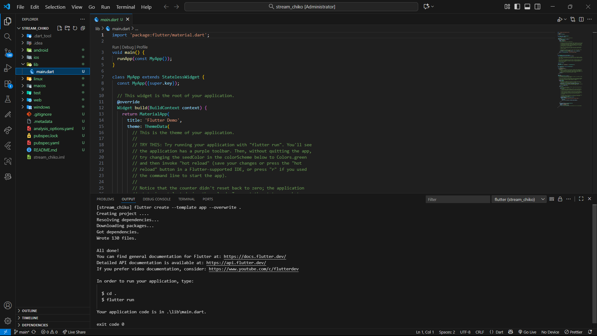

<div align="center">

# LAPORAN PRAKTIKUM

## PEMROGRAMAN MOBILE


---

## JOBSHEET 10

### Streams

---

**Dosen Pengampu:**  
Habibie Ed Dien, S.Kom., M.T.

---

**Disusun oleh:**  
Chiko Abilla Basya  
2341720005  
TI-3G  
D-4 Teknik Informatika  
Politeknik Negeri Malang

---

Jl. Soekarno Hatta No.9, Jatimulyo,  
Kec. Lowokwaru, Kota Malang, Jawa Timur 65141

Phone: (0341) 404424, 404425  
Email: [Polinema.ac.id](https://www.polinema.ac.id)

</div>

---

## **Praktikum 1: Dart Streams**
Selesaikan langkah-langkah praktikum berikut ini menggunakan editor Visual Studio Code (VS Code) atau Android Studio atau code editor lain kesukaan Anda. Jawablah di laporan praktikum Anda (ketik di **README.md**) pada setiap soal yang ada di beberapa langkah praktikum ini.

>**Perhatian**: Diasumsikan Anda telah berhasil melakukan setup environment Flutter SDK, VS Code, Flutter Plugin, dan Android SDK pada pertemuan pertama.

### **Langkah 1: Buat Project Baru**
Buatlah sebuah project flutter baru dengan nama **stream_nama** (beri nama panggilan Anda) di folder **week-12/src/** repository GitHub Anda.



### **Langkah 2: Buka file main.dart**
Ketiklah kode seperti berikut ini.
```dart
import 'package:flutter/material.dart';

void main() {
  runApp(const MyApp());
}

class MyApp extends StatelessWidget {
  const MyApp({super.key});

  @override
  Widget build(BuildContext context) {
    return MaterialApp(
      title: 'Stream - Chiko',
      theme: ThemeData(primarySwatch: Colors.blue),
      home: const StreamHomePage(),
    );
  }
}

class StreamHomePage extends StatefulWidget {
  const StreamHomePage({super.key});

  @override
  State<StreamHomePage> createState() => _StreamHomePageState();
}

class _StreamHomePageState extends State<StreamHomePage> {
  @override
  Widget build(BuildContext context) {
    return Container();
  }
}
```

>#### **Soal 1**
>* Tambahkan **nama panggilan Anda** pada `title` app sebagai identitas hasil pekerjaan Anda.
>* Gantilah warna tema aplikasi sesuai kesukaan Anda.
>* Lakukan commit hasil jawaban Soal 1 dengan pesan **"W12: Jawaban Soal 1"**

### **Langkah 3: Buat file baru stream.dart**
Buat file baru di folder lib project Anda. Lalu isi dengan kode berikut.
```dart
import 'package:flutter/material.dart';

class ColorStream {

}
```

### **Langkah 4: Tambah variabel colors**
Tambahkan variabel di dalam class `ColorStream` seperti berikut.
```dart
final List<Color> colors = [
  Colors.red,
  Colors.green,
  Colors.pink,
  Colors.yellow,
  Colors.orange,
  Colors.purple,
];
```

>#### **Soal 2**
>* Tambahkan 5 warna lainnya sesuai keinginan Anda pada variabel `colors` tersebut.
>* Lakukan commit hasil jawaban Soal 2 dengan pesan **"W12: Jawaban Soal 2"**