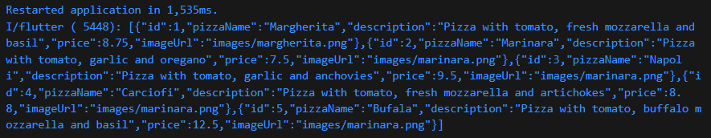
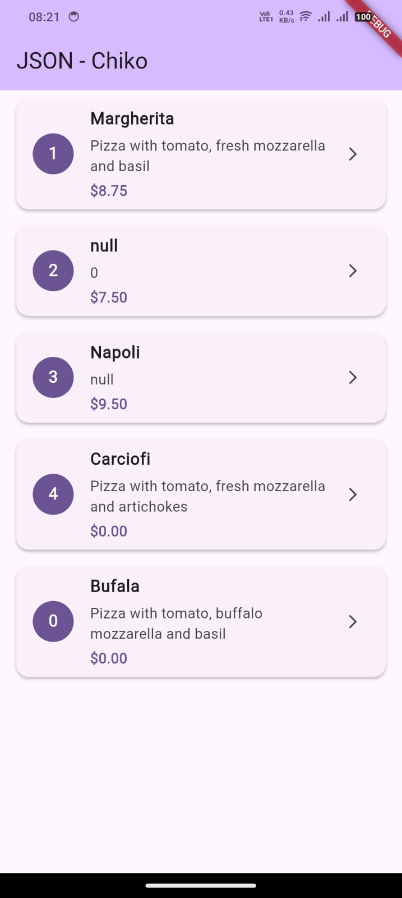
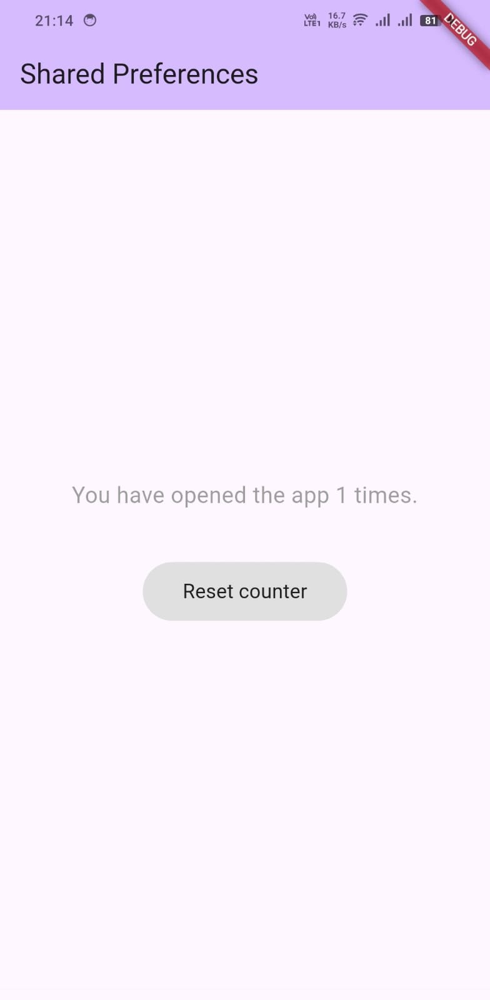

<div align="center">

# LAPORAN PRAKTIKUM

## PEMROGRAMAN MOBILE


---

## JOBSHEET 11

### Persistensi Data

---

**Dosen Pengampu:**  
Habibie Ed Dien, S.Kom., M.T.

---

**Disusun oleh:**  
Chiko Abilla Basya  
2341720005  
TI-3G  
D-4 Teknik Informatika  
Politeknik Negeri Malang

---

Jl. Soekarno Hatta No.9, Jatimulyo,  
Kec. Lowokwaru, Kota Malang, Jawa Timur 65141

Phone: (0341) 404424, 404425  
Email: [Polinema.ac.id](https://www.polinema.ac.id)

</div>

---

## **Praktikum 1: Konversi Dart model ke JSON**
Selesaikan langkah-langkah praktikum berikut ini menggunakan editor Visual Studio Code (VS Code) atau Android Studio atau code editor lain kesukaan Anda. Jawablah di laporan praktikum Anda (ketik di **README.md**) pada setiap soal yang ada di beberapa langkah praktikum ini.

>**Perhatian**: Diasumsikan Anda telah berhasil melakukan setup environment Flutter SDK, VS Code, Flutter Plugin, dan Android SDK pada pertemuan pertama.

### **Langkah 1: Buat Project Baru**
Buatlah sebuah project flutter baru dengan nama **store_data_nama** (beri nama panggilan Anda) di folder **week-13/src/** repository GitHub Anda.


### **Langkah 2: Buka file main.dart**
Ketiklah kode seperti berikut ini.
```dart
import 'package:flutter/material.dart';

void main() {
  runApp(const MyApp());
}

class MyApp extends StatelessWidget {
  const MyApp({super.key});

  // This widget is the root of your application.
  @override
  Widget build(BuildContext context) {
    return MaterialApp(
      title: 'Flutter JSON Demo - Chiko',
      theme: ThemeData(
        primarySwatch: Colors.purple,
      ),
      home: const MyHomePage(),
    );
  }
}

class MyHomePage extends StatefulWidget {
  const MyHomePage({super.key});

  @override
  State<MyHomePage> createState() => _MyHomePageState();
}

class _MyHomePageState extends State<MyHomePage> {
  @override
  Widget build(BuildContext context) {
    return Scaffold(
      appBar: AppBar(title: const Text('JSON - Chiko')),
      body: Container(),
    );
  }
}
```

>#### **Soal 1**
>* Tambahkan **nama panggilan** Anda pada **title** app sebagai identitas hasil pekerjaan Anda.
>* Gantilah warna tema aplikasi sesuai kesukaan Anda.
>* Lakukan commit hasil jawaban Soal 1 dengan pesan **"W13: Jawaban Soal 1"**

### **Langkah 3: Buat folder baru assets**
Buat folder baru `assets` di root project Anda

### **Langkah 4: Buat file baru pizzalist.json**
Letakkan file ini di dalam folder `assets`, lalu salin data JSON berikut ke file tersebut.
```dart
[ 
    { 
      "id": 1, 
      "pizzaName": "Margherita", 
      "description": "Pizza with tomato, fresh mozzarella and basil",
      "price": 8.75, 
      "imageUrl": "images/margherita.png" 
    }, 
    { 
      "id": 2, 
      "pizzaName": "Marinara", 
      "description": "Pizza with tomato, garlic and oregano",
      "price": 7.50, 
      "imageUrl": "images/marinara.png"  
    }, 
    { 
      "id": 3, 
      "pizzaName": "Napoli", 
      "description": "Pizza with tomato, garlic and anchovies",
      "price": 9.50, 
      "imageUrl": "images/marinara.png"  
    }, 
    { 
      "id": 4, 
      "pizzaName": "Carciofi", 
      "description": "Pizza with tomato, fresh mozzarella and artichokes",
      "price": 8.80, 
      "imageUrl": "images/marinara.png"  
    }, 
    { 
      "id": 5, 
      "pizzaName": "Bufala", 
      "description": "Pizza with tomato, buffalo mozzarella and basil",
      "price": 12.50, 
      "imageUrl": "images/marinara.png"  
    }
]
```
Jika Anda ingin menggunakan data JSON yang lain, Anda dapat mengakses salah satu dari daftar API di tautan ini: https://github.com/public-apis/public-apis 

### **Langkah 5: Edit pubspec.yaml**
Tambahkan referensi folder `assets` ke file pubspec.yaml seperti berikut ini.
```
assets:
  - assets/
```

### **Langkah 6: Edit maint.dart**
Buatlah variabel seperti berikut ini class `_MyHomePageState`.
```dart
String pizzaString = '';
```

### **Langkah 7: Tetap di main.dart**
Untuk membaca isi dari file `pizzalist.json` di dalam class _MyHomePageState, tambahkan method `readJsonFile` seperti kode berikut untuk membaca file json.
```dart
Future readJsonFile() async {
  String myString = await DefaultAssetBundle.of(context)
      .loadString('assets/pizzalist.json');
  setState(() {
    pizzaString = myString;
  });
}
```

### **Langkah 8: Panggil method readJsonFile**
Panggil method `readJsonFile` di initState
```dart
@override
void initState() {
  super.initState();
  readJsonFile();
}
```

### **Langkah 9: Tampilkan hasil JSON**
Kemudian tampilkan hasil JSON di body scaffold.
```dart
body: Text(pizzaString),
```

### **Langkah 10: Run**
Jika kode sudah benar, seharusnya tampil seperti gambar berikut ini.


>#### **Soal 2**
>* Masukkan hasil capture layar ke laporan praktikum Anda.
>* Lakukan commit hasil jawaban Soal 2 dengan pesan **"W13: Jawaban Soal 2"**

### **Langkah 11: Buat file baru pizza.dart**
Kita ingin mengubah data json tersebut dari String menjadi objek List. Maka perlu membuat file class baru di folder `lib/model` dengan nama file `pizza.dart`.

### **Langkah 12: Model pizza.dart**
Ketik kode berikut pada file `pizza.dart`
```dart
class Pizza {
  final int id;
  final String pizzaName;
  final String description;
  final double price;
  final String imageUrl;
}
```

### **Langkah 13: Buat constructor()**
Di dalam class `Pizza` definisikan constructor `fromJson`, yang mana akan mengambil data berupa Map sebagai parameter dan mengubah Map ke objek Pizza seperti kode berikut:
```dart
Pizza.fromJson(Map<String, dynamic> json) :
  id = json['id'],
  pizzaName = json['pizzaName'],
  description = json['description'],
  price = json['price'],
  imageUrl = json['imageUrl'];
```

### **Langkah 14: Pindah ke class _MyHomePageState**
Tambahkan kode jsonDecode seperti berikut.
```dart
Future readJsonnFile() async {
  String myString = await DefaultAssetBundle.of(context)
      .loadString('assets/pizzalist.json');
  List pizzaMapList = jsonDecode(myString);
  ...
}
```

### **Langkah 15: Pastikan impor class**
Perhatikan pada bagian atas file bahwa telah berhasil impor kedua file berikut.
```dart
import 'dart:convert';
import './pizza.dart';
```

Anda telah berhasil mengimpor pustaka yang diperlukan dan melakukan decoding string JSON menjadi List pizzaMapList pada Langkah ini. Selanjutnya, kita akan mengonversi List Map tersebut menjadi List objek Dart (List<Pizza>).

### **Langkah 16: Konversi List Map ke List Objek Dart**
Di dalam method readJsonFile(), setelah baris List pizzaMapList = jsonDecode(myString);, tambahkan kode berikut untuk mengonversi setiap Map di pizzaMapList menjadi objek Pizza dan menyimpannya ke myPizzas.
```dart
List<Pizza> myPizzas = [];
for (var pizza in pizzaMapList) {
  Pizza myPizza = Pizza.fromJson(pizza);
  myPizzas.add(myPizza);
}
```

### **Langkah 17: return myPizzas**
Hapus atau komentari `setState` yang menampilkan `pizzaString` dari Langkah 7. Kemudian, kembalikan `myPizzas`.
```dart
return myPizzas;
```

### **Langkah 18: Perbarui Signature Method**
Perbarui signature method `readJsonFile()` untuk secara eksplisit menunjukkan bahwa ia mengembalikan `Future` yang berisi `List`.
```dart
Future<List<Pizza>> readJsonFile() async {
```

### **Langkah 19: Deklarasikan Variabel State**
Di dalam `class _MyHomePageState`, deklarasikan variabel state baru untuk menampung List objek Pizza.
```dart
List<Pizza> myPizzas = [];
```

### **Langkah 20: Panggil di initState dan Perbarui State**
Perbarui method `initState()` di `_MyHomePageState` untuk memanggil `readJsonFile()`. Karena `readJsonFile()` mengembalikan `Future`, gunakan `.then()` untuk mendapatkan hasilnya, dan perbarui state `myPizzas`.
```dart
@override
void initState() {
  super.initState();
  readJsonFile().then((value) {
    setState(() {
      myPizzas = value;
    });
  });
}
```

### **Langkah 21: Tampilkan Data di ListView**
Perbarui body dari Scaffold untuk menggunakan ListView.builder yang menampilkan pizzaName sebagai judul dan description sebagai subjudul dari setiap objek Pizza.
```dart
body: ListView.builder(
  itemCount: myPizzas.length,
  itemBuilder: (context, index) {
    return ListTile(
      title: Text(myPizzas[index].pizzaName),
      subtitle: Text(myPizzas[index].description),
    );
  },
 ));
}
```

### **Langkah 22: Run**
Jalankan aplikasi. Sekarang, Anda akan melihat data pizza ditampilkan dalam daftar yang lebih terstruktur sebagai objek List Dart.


>### **Soal 3**
>* Masukkan hasil capture layar ke laporan praktikum Anda.
>* Lakukan commit hasil jawaban Soal 2 dengan pesan **"W13: Jawaban Soal 3"**

### **Langkah 23: Tambahkan Method toJson() (Serialization)**
Di file pizza.dart, tambahkan method toJson() ke class Pizza. Method ini berfungsi untuk mengonversi objek Dart kembali menjadi Map (langkah pertama menuju JSON String).
```dart
Map<String, dynamic> toJson() {
  return {
    'id': id,
    'pizzaName': pizzaName,
    'description': description,
    'price': price,
    'imageUrl': imageUrl,
  };
}
```

### **Langkah 24: Buat Fungsi Konversi JSON String**
Di main.dart, tambahkan fungsi convertToJSON di dalam _MyHomePageState untuk menggunakan jsonEncode (dari dart:convert) yang mengubah List objek Dart menjadi JSON String.
```dart
String convertToJSON(List<Pizza> pizzas) {
  return jsonEncode(pizzas.map((pizza) => jsonEncode(pizza)).toList());
}
```

### **Langkah 25: Tampilkan Output JSON di Konsol**
Di method readJsonFile(), tambahkan kode untuk memanggil convertToJSON dan mencetak hasilnya ke Debug Console sebelum mengembalikan myPizzas.
```dart
String json = convertToJSON(myPizzas);
print(json);
return myPizzas;
```

Langkah 26: Cek Output Konsol
Jalankan aplikasi. Periksa Debug Console untuk melihat List objek Pizza telah berhasil dikonversi kembali menjadi JSON String.



## **Praktikum 2: Handle kompatibilitas data JSON**
Setelah Anda menyelesaikan praktikum 1, Anda dapat melanjutkan praktikum 2 ini. Selesaikan langkah-langkah praktikum berikut ini menggunakan editor Visual Studio Code (VS Code) atau Android Studio atau code editor lain kesukaan Anda. Jawablah di laporan praktikum Anda pada setiap soal yang ada di beberapa langkah praktikum ini.

>**Perhatian**: Diasumsikan Anda telah berhasil menyelesaikan Praktikum 1.

Pada codelab ini, kita akan berfokus pada skema JSON yang tidak kompatibel dengan model yang telah kita buat sebelumnya. Kita akan membuat kode lebih tangguh dengan menangani *type casting* dan nilai *null*.

>**Catatan**: Langkah-langkah ini mensimulasikan penggunaan data JSON yang tidak konsisten atau "rusak" (`pizzalist_broken.json`).

### **Langkah 1: Simulasikan Error**
Anggaplah Anda telah mengganti file `pizzalist.json` dengan data yang tidak konsisten.

### **Langkah 2: Lihat Error Tipe Data String ke Int**
Jika ID pizza di JSON dikirim sebagai String (misalnya `"id": "1"` di JSON) sementara model Dart mengharapkan int, Anda akan melihat runtime error.
```dart
pizza.fromJson(Map<string, dynamic> json) {
  this.id = json['id'];
}
```

### **Langkah 3: Terapkan tryParse dan Null Coalescing pada ID**
Di Pizza.fromJson (file pizza.dart), ganti cara mendapatkan nilai id menggunakan int.tryParse dan null coalescing operator (??) untuk memberikan nilai default 0 jika parsing gagal atau nilainya null. Tujuannya adalah memastikan nilai id selalu integer.
```dart
int.tryParse(json['id'].toString()) ?? 0;
```

### **Langkah 4: Simulasikan Error Null pada String**
Jika Anda menjalankan ulang dan ada bidang yang hilang (misalnya imageUrl hilang), Anda mungkin mendapatkan error Null.
```dart
Pizza.fromJson(Map<String, dynamic> json)
    id = int.tryParse(json['id']) ?? 0,
    pizzaName = json['pizzaName'],
    description = json['description'],
    price = json['price'],
    imageUrl = json['imageUrl'];
```

### **Langkah 5: Terapkan Null Coalescing pada String**
Tambahkan null coalescing operator (??) pada imageUrl untuk memberikan string kosong ('') jika nilai yang diterima adalah null. Lakukan hal yang sama untuk bidang String lainnya seperti pizzaName dan description jika perlu.
```dart
imageUrl = json['imageUrl'] ?? '';
```

### **Langkah 6: Gunakan toString() untuk Field String**
Untuk memastikan semua nilai yang digunakan sebagai String benar-benar String (bahkan jika mereka mungkin dikirim sebagai int atau tipe lain), gunakan toString().
```dart
Pizza.fromJson(Map<String, dynamic> json) {
  id = json['id'];
  pizzaName = json['pizzaName'].toString();
  description = json['description'].toString();
  price = json['price'];
  imageUrl = json['imageUrl'] ?? '';
}
```

### **Langkah 7: Simulasikan Error Tipe Data String ke Double**
Jika Anda menjalankan ulang, Anda mungkin menemukan error saat mengonversi String ke Double untuk bidang price.
```dart
this.price = json[keyPrice];
```

### **Langkah 8: Terapkan double.tryParse**
Terapkan double.tryParse dengan null coalescing (?? 0) untuk bidang price, sama seperti yang Anda lakukan pada id.
```dart
Pizza.fromJson(Map<String, dynamic> json) {
  id = int.tryParse(json['id'].toString());
  pizzaName = json['pizzaName'].toString();
  description = json['description'].toString();
  price = double.tryParse(json['price'].toString()) ?? 0;
  imageUrl = json['imageUrl'].toString();
}
```

### **Langkah 9: Run dan Perhatikan Output Null**
Setelah mengimplementasikan semua perbaikan tipe data, aplikasi akan berjalan, tetapi mungkin menampilkan "null" di UI jika ada bidang yang hilang atau gagal diparsing (seperti pizzaName atau description).



### **Langkah 10: Tambahkan Operator Ternary untuk Output User-Friendly**
Perbaiki masalah tampilan "null" dengan menambahkan operator ternary yang memeriksa apakah nilai null sebelum mengubahnya menjadi String. Jika null, berikan nilai pengganti yang ramah pengguna seperti 'No name' atau string kosong ('').
```dart
Pizza.fromJson(Map<String, dynamic> json) {
  id = int.tryParse(json['id'].toString()) ?? 0;
  pizzaName = json['pizzaName'] != null ? json['pizzaName'].toString() : 'No name';
  description = 
      (json['description'] != null) ? json['description'].toString() : '';
  price = double.tryParse(json['price'].toString()) ?? 0;
  imageUrl = json['imageUrl'] ?? '';
}
```

### **Langkah 11: Run**
Jalankan aplikasi. Sekarang data yang tidak konsisten telah ditangani dengan baik, dan UI tidak menampilkan nilai null.


>#### **Soal 4**
>* Capture hasil running aplikasi Anda, kemudian impor ke laporan praktikum Anda!
>* Lalu lakukan commit dengan pesan **"W13: Jawaban Soal 4"**.

## **Praktikum 3: Menangani error JSON**
Pada praktikum 3 ini, Anda akan berfokus pada Catching common JSON errors, yaitu dengan mengganti string literals (nama kunci JSON) dengan konstanta untuk menghindari error yang sulit di-debug (kesalahan pengetikan).

Setelah Anda menyelesaikan praktikum 2, Anda dapat melanjutkan praktikum 3 ini. Selesaikan langkah-langkah praktikum berikut ini menggunakan editor Visual Studio Code (VS Code) atau Android Studio atau code editor lain kesukaan Anda. Jawablah di laporan praktikum Anda pada setiap soal yang ada di beberapa langkah praktikum ini.

>**Perhatian**: Diasumsikan Anda telah berhasil menyelesaikan Praktikum 2.

### **Langkah 1: Buka pizza.dart dan Buat Konstanta**
Di bagian atas file pizza.dart, di luar class Pizza, deklarasikan konstanta untuk setiap kunci JSON.
```dart
const keyId = 'id';
const keyName = 'pizzaName';
const keyDescription = 'description';
const keyPrice = 'price';
const keyImage = 'imageUrl';
```

### **Langkah 2: Perbarui fromJson() menggunakan Konstanta**
Di constructor Pizza.fromJson, ganti semua string literal kunci JSON (misalnya 'id') dengan konstanta yang sesuai (keyId).
```dart
Pizza.fromJson(Map<String, dynamic> json) {
  id = int.tryParse(json[keyId].toString()) ?? 0;
  
  pizzaName = 
      json[keyName] != null ? json[keyName].toString() : 'No name';
      
  description =
      (json[keyDescription] != null) ? json[keyDescription].toString() : '';
      
  price = double.tryParse(json[keyPrice].toString()) ?? 0;
  
  imageUrl = json[keyImage] ?? '';
}
```

>**Catatan**: Konstruktor ini menggunakan sintaks inisialisasi, tetapi untuk kesederhanaan, kita menggunakan sintaks body.

### **Langkah 3: Perbarui toJson() menggunakan Konstanta**
Perbarui juga method toJson() agar menggunakan konstanta yang sama.
```dart
Map<String, dynamic> toJson() {
  return {
    keyId: id,
    keyName: pizzaName,
    keyDescription: description,
    keyPrice: price,
    keyImage: imageUrl,
  };
}
```

### **Langkah 4: Run**
Jalankan aplikasi. Tidak akan ada perubahan visual, tetapi kode Anda kini lebih safe dan maintainable.


>#### **Soal 5**
>* Jelaskan maksud kode lebih safe dan maintainable!
>
>**Jawab:**
>
>Menggunakan konstanta untuk JSON keys membuat kode menjadi lebih **safe (aman)** dan **maintainable (mudah dipelihara)** karena beberapa alasan berikut:
>
>#### **1. Safe (Aman) - Mencegah Runtime Errors**
>
>**a. Compile-Time Error Detection**
>```dart
>// ❌ SEBELUM - Error baru ketahuan saat runtime
>json['pizzaName']  // Jika typo: json['pizaName'] → runtime error (sulit di-debug)
>
>// ✅ SESUDAH - Error langsung ketahuan saat compile
>json[keyName]      // Jika typo: json[keyNam] → compile error (mudah diperbaiki)
>```
>
>**b. Autocomplete & IntelliSense**
>- IDE memberikan suggestion untuk konstanta
>- Mengurangi kemungkinan typo karena bisa menggunakan autocomplete
>- Ctrl+Click untuk langsung ke deklarasi konstanta
>
>**c. Type Safety**
>```dart
>// Konstanta memiliki tipe yang jelas
>const keyId = 'id';  // String type
>// Tidak bisa accidentally menggunakan tipe lain
>```
>
>#### **2. Maintainable (Mudah Dipelihara)**
>
>**a. Single Source of Truth (SSOT)**
>```dart
>// Semua kunci JSON didefinisikan di SATU tempat
>const keyId = 'id';
>const keyName = 'pizzaName';
>const keyDescription = 'description';
>const keyPrice = 'price';
>const keyImage = 'imageUrl';
>
>// Jika API berubah, cukup update di satu tempat saja!
>```
>
>**b. Refactoring yang Aman dan Cepat**
>```dart
>// Skenario: Backend mengubah 'pizzaName' menjadi 'name'
>
>// ❌ TANPA KONSTANTA - Harus update banyak tempat
>Pizza.fromJson(Map<String, dynamic> json) {
>  pizzaName = json['pizzaName'];  // ← Update 1
>}
>Map<String, dynamic> toJson() {
>  return {'pizzaName': pizzaName};  // ← Update 2
>}
>// ... masih banyak lagi di file lain
>
>// ✅ DENGAN KONSTANTA - Update 1 tempat saja
>const keyName = 'name';  // ← Update HANYA di sini
>// Semua penggunaan keyName otomatis terupdate!
>```
>
>**c. Dokumentasi Implicit**
>```dart
>// Konstanta berfungsi sebagai dokumentasi
>const keyId = 'id';           // Field untuk ID
>const keyName = 'pizzaName';  // Field untuk nama pizza
>const keyPrice = 'price';     // Field untuk harga
>
>// Developer baru bisa langsung tahu struktur JSON
>```
>
>**d. Code Search & Navigation**
>- Mudah mencari semua penggunaan key tertentu
>- Cukup "Find All References" pada konstanta `keyName`
>- Akan menampilkan semua tempat yang menggunakan `keyName`
>
>#### **3. Perbandingan Praktis**
>
>| Aspek | Tanpa Konstanta | Dengan Konstanta |
>|-------|-----------------|------------------|
>| **Bug Risk** | High (typo tidak terdeteksi) | Low (compile check) |
>| **Refactoring Time** | 30+ menit | 2 menit |
>| **Code Search** | Sulit (string search) | Mudah (find references) |
>| **Onboarding** | Lambat (cari manual) | Cepat (lihat konstanta) |
>| **Testing** | Complex | Simple |
>| **IDE Support** | Limited | Full (autocomplete) |
>
>#### **4. Contoh Error yang Dicegah**
>
>**Skenario 1: Typo saat Development**
>```dart
>// ❌ TANPA KONSTANTA
>json['descripton']  // ❌ Typo! Tidak ketahuan sampai runtime
>// Error: "The getter 'descripton' isn't defined"
>// Sulit di-debug karena bisa di mana saja
>
>// ✅ DENGAN KONSTANTA
>json[keyDescrption]  // ❌ Typo! Langsung error saat compile
>// Error: "Undefined name 'keyDescrption'"
>// Mudah diperbaiki: ubah ke keyDescription
>```
>
>**Skenario 2: Inkonsistensi Antar Method**
>```dart
>// ❌ TANPA KONSTANTA - Rawan inkonsisten
>Pizza.fromJson(Map<String, dynamic> json) {
>  pizzaName = json['pizzaName'];  // Pakai 'pizzaName'
>}
>Map<String, dynamic> toJson() {
>  return {'pizza_name': pizzaName};  // ❌ Pakai 'pizza_name' (berbeda!)
>}
>
>// ✅ DENGAN KONSTANTA - Konsistensi terjamin
>Pizza.fromJson(Map<String, dynamic> json) {
>  pizzaName = json[keyName];  // Pakai keyName
>}
>Map<String, dynamic> toJson() {
>  return {keyName: pizzaName};  // Pakai keyName (konsisten!)
>}
>```
>
>#### **Kesimpulan**
>
>Menggunakan konstanta untuk JSON keys adalah **investment kecil** (5-10 menit membuat konstanta) untuk **benefit besar** (menghemat banyak waktu debugging dan maintenance di masa depan). Ini adalah **best practice industry standard** yang membuat kode lebih professional, robust, dan siap untuk production.
>
>* Capture hasil praktikum Anda dan lampirkan di README.
>* Lalu lakukan commit dengan pesan **"W13: Jawaban Soal 5"**.

## **Praktikum 4: SharedPreferences**
Praktikum ini membahas menyimpan data sederhana dengan SharedPreferences. Kita akan menggunakan shared_preferences untuk menyimpan hitungan sederhana.

Setelah Anda menyelesaikan praktikum 3, Anda dapat melanjutkan praktikum 4 ini. Selesaikan langkah-langkah praktikum berikut ini menggunakan editor Visual Studio Code (VS Code) atau Android Studio atau code editor lain kesukaan Anda. Jawablah di laporan praktikum Anda pada setiap soal yang ada di beberapa langkah praktikum ini.

>**Perhatian**: Diasumsikan Anda telah berhasil menyelesaikan Praktikum 3.

### **Langkah 1: Tambahkan Dependensi**
Di Terminal, tambahkan package shared_preferences.
```dart
flutter pub add shared_preferences
```

### **Langkah 2: Install Dependensi**
Jalankan flutter pub get jika editor Anda tidak melakukannya secara otomatis.

### **Langkah 3: Lakukan Import**
Di file main.dart, tambahkan import untuk shared_preferences.
```dart
import 'package:shared_preferences/shared_preferences.dart';
```

### **Langkah 4: Tambahkan Variabel appCounter**
Di dalam class _MyHomePageState (atau State class yang Anda gunakan), deklarasikan variabel appCounter.
```dart
int appCounter = 0;
```

### **Langkah 5: Buat Method readAndWritePreference**
Buat method asinkron `readAndWritePreference()`.
```dart
Future readAndWritwPrefences() async {}
```

### **Langkah 6: Dapatkan Instance SharedPreferences**
Di dalam method tersebut, dapatkan instance SharedPreferences. Perlu diingat bahwa ini adalah operasi asinkron, jadi gunakan await.
```dart
SharedPreferences prefs = await SharedPreferences.getInstance();
```

### **Langkah 7: Baca, Cek Null, dan Increment Counter**
Baca nilai appCounter dari storage. Gunakan null coalescing (?? 0) untuk memastikan nilai default 0 jika data belum ada. Kemudian increment nilai tersebut.
```dart
appCounter = prefs.getInt('appCounter') ?? 0;
appCounter++;
```

### **Langkah 8: Simpan Nilai Baru**
Simpan nilai appCounter yang sudah di-increment kembali ke storage menggunakan prefs.setInt().
```dart
await prefs.setInt('appCounter', appCounter);
```

### **Langkah 9: Perbarui State**
Panggil setState() untuk memperbarui UI dengan nilai baru appCounter.
```dart
setState(() {
  appCounter = appCounter;
});
```

### **Langkah 10: Panggil di initState()**
Panggil readAndWritePreference() di initState() agar penghitung dibaca saat aplikasi pertama kali dibuka.
```dart
@override
void initState() {
  super.initState();
  readAndWritePreference();
}
```

### **Langkah 11: Perbarui Tampilan (body)**
Ganti body Scaffold Anda dengan tata letak yang menampilkan hitungan dan tombol 'Reset counter'.
```dart
child: Center(
  child: Column(
    mainAxisAlignment: MainAxisAlignment.spaceEvenly,
    children: [
      Text(
        'You have opened the app $appCounter times.',
      ),
      ElevatedButton(
        onPressed: () {},
        child: Text('Reset counter'),
      ),
    ],
  ),
),
```

### **Langkah 12: Run**
Aplikasi sekarang akan menampilkan "You have opened the app 1 times" (jika ini pembukaan pertama).



### **Langkah 13: Buat Method deletePreference()**
Tambahkan method asinkron deletePreference() yang berfungsi untuk menghapus data menggunakan prefs.clear().
```dart
Future deletePreference() async {
  SharedPreferences prefs = await SharedPreferences.getInstance();
  await prefs.clear();
  setState(() {
    appCounter = 0;
  });
}
```

### **Langkah 14: Panggil deletePreference()**
Hubungkan deletePreference() ke tombol 'Reset counter'.
```dart
onPressed: () {
  deletePreference();
},
child: Text('Reset counter'),
)
```

### **Langkah 15: Run**
Jalankan aplikasi. Tombol reset sekarang akan berfungsi, menghapus semua pasangan kunci-nilai dan mereset hitungan.


>#### **Soal 6**
>* Capture hasil praktikum Anda berupa GIF dan lampirkan di README.
>* Lalu lakukan commit dengan pesan **"W13: Jawaban Soal 6"**.

## **Praktikum 5: Akses filesystem dengan path_provider**
Praktikum ini berfokus untuk mengakses *file system* menggunakan path_provider untuk menemukan direktori umum (documents dan temp) pada perangkat.

Setelah Anda menyelesaikan praktikum 4, Anda dapat melanjutkan praktikum 5 ini. Selesaikan langkah-langkah praktikum berikut ini menggunakan editor Visual Studio Code (VS Code) atau Android Studio atau code editor lain kesukaan Anda. Jawablah di laporan praktikum Anda pada setiap soal yang ada di beberapa langkah praktikum ini.

>**Perhatian**: Diasumsikan Anda telah berhasil menyelesaikan Praktikum 4.

### **Langkah 1: Tambahkan Dependensi**
Tambahkan package path_provider melalui Terminal.
```dart
flutter pub add path_provider
```

### **Langkah 2: Lakukan Import**
Di file main.dart, tambahkan import untuk path_provider.
```dart
import 'package:path_provider/path_provider.dart';
```

### **Langkah 3: Tambahkan Variabel Path State**
Di State class Anda, tambahkan variabel untuk menyimpan jalur direktori dokumen dan temporer.
```dart
String documentsPath = '';
String tempPath = '';
```

### **Langkah 4: Buat Method getPaths()**
Buat method asinkron getPaths() yang menggunakan getApplicationDocumentsDirectory() dan getTemporaryDirectory() untuk mengambil jalur sistem file yang tepat, lalu perbarui state.
```dart
Future getPaths() async {
  final docDir = await getApplicationDocumentsDirectory();
  final tempDir = await getTemporaryDirectory();
  setState(() {
    documentsPath = docDir.path;
    tempPath = tempDir.path;
  });
}
```

### **Langkah 5: Panggil getPaths() di initState()**
Panggil getPaths() di initState().
```
@override
void initState() {
  super.initState();
  getPaths();
}
```

### **Langkah 6: Perbarui Tampilan**
Perbarui body Scaffold untuk menampilkan kedua jalur yang telah diambil.
```dart
@override
Widget build(BuildContext context) {
  return Scaffold(
    appBar: AppBar(title: const Text('Path Provider')),
    body: Column(
      mainAxisAlignment: MainAxisAlignment.spaceEvenly,
      children: [
        Text('Doc path: $documentsPath'),
        Text('Temp path $tempPath'),
      ],
    ),
  );
}
```

### **Langkah 7: Run**
Jalankan aplikasi. Anda akan melihat path absolut ke direktori dokumen dan cache aplikasi di perangkat Anda.


>#### **Soal 7**
>* Capture hasil praktikum Anda dan lampirkan di README.
>* Lalu lakukan commit dengan pesan **"W13: Jawaban Soal 7"**.

## **Praktikum 6: Akses filesystem dengan direktori**
Praktikum ini melanjutkan dari Praktikum 5, berfokus pada akses *file system* untuk mengakses directories, menggunakan library `dart:io` untuk operasi file.

Setelah Anda menyelesaikan praktikum 5, Anda dapat melanjutkan praktikum 6 ini. Selesaikan langkah-langkah praktikum berikut ini menggunakan editor Visual Studio Code (VS Code) atau Android Studio atau code editor lain kesukaan Anda. Jawablah di laporan praktikum Anda pada setiap soal yang ada di beberapa langkah praktikum ini.

>**Perhatian**: Diasumsikan Anda telah berhasil menyelesaikan Praktikum 5.

### **Langkah 1: Lakukan Import dart:io**
Di file main.dart, tambahkan import untuk pustaka dart:io.
```dart
import 'dart:io'
```

### **Langkah 2: Tambahkan Variabel File dan Text**
Di State class, tambahkan variabel myFile (dengan modifier late) dan fileText untuk menyimpan konten yang akan dibaca.
```dart
late File myFile;
String fileText='';
```

### **Langkah 3: Buat Method writeFile()**
Buat method asinkron writeFile() yang menggunakan myFile.writeAsString() untuk menulis konten ke file. Kata ‘Margherita, Capricciosa, Napoli' silakan Anda ganti dengan Nama Lengkap dan NIM Anda.
```dart
Future<bool> writeFile() async {
  try {
    await myFile.writeAsString('Chiko Abilla Basya, 2341720005');
    return true;
  } catch (e) {
    return false;
  }
}
```

### **Langkah 4: Inisialisasi File dan Panggil writeFile() di initState()**
Perbarui initState(): setelah getPaths() selesai, inisialisasi myFile dengan jalur lengkap di direktori dokumen, dan panggil writeFile().
```dart
@override
void initState() {
  getPaths().then((_) {
    myFile = File('$documentsPath/pizzas.txt');
    writeFile();
  });
  super.initState();
}
```

### **Langkah 5: Buat Method readFile()**
Buat method asinkron readFile() yang menggunakan myFile.readAsString() untuk membaca konten file dan memperbarui fileText melalui setState().
```dart
Future<bool> readFile() async {
  try {
    // Read the file.
    String fileContent = await myFile.readAsString();
    setState(() {
      fileText = fileContent;
    });
    return true;
  } catch (e) {
    // On error, return false.
    return false;
  }
}
```

### **Langkah 6: Edit build() dan Tambahkan Tombol Baca**
Di method build(), tambahkan ElevatedButton yang memanggil readFile() dan Text yang menampilkan fileText di bawahnya.
```dart
children: [
  Text('Doc path: ' + documentsPath),
  Text('Temp path: ' + tempPath),
          
  ElevatedButton(
      child: const Text('Read File'),
      onPressed: () => readFile(),
  ),
  Text(fileText),
],
```

### **Langkah 7: Run**
Jalankan aplikasi. Setelah menekan tombol 'Read File', konten yang ditulis (Margherita, Capricciosa, Napoli) akan ditampilkan atau sesuai nama dan NIM Anda.


>#### **Soal 8**
>* Jelaskan maksud kode pada langkah 3 dan 7 !
>
>**Jawab:**
>
>### **Penjelasan Langkah 3: Method writeFile()**
>
>```dart
>Future<bool> writeFile() async {
>  try {
>    await myFile.writeAsString('Chiko Abilla Basya, 2341720005');
>    return true;
>  } catch (e) {
>    return false;
>  }
>}
>```
>
>**Maksud kode:**
>
>Method `writeFile()` adalah fungsi **asynchronous** yang berfungsi untuk **menulis data ke file** di file system dengan penjelasan sebagai berikut:
>
>**1. Signature Method**
>- `Future<bool>` - Mengembalikan Future yang berisi nilai boolean
>- `async` - Method berjalan secara asynchronous (tidak blocking UI)
>- Return `true` jika berhasil menulis file, `false` jika terjadi error
>
>**2. Try-Catch Block**
>- **Try block**: Mencoba eksekusi kode yang mungkin menimbulkan exception
>- **Catch block**: Menangkap dan menangani error jika terjadi kegagalan
>- **Error Handling**: Mencegah aplikasi crash saat operasi file gagal (misalnya: permission denied, disk full)
>
>**3. Write Operation**
>```dart
>await myFile.writeAsString('Chiko Abilla Basya, 2341720005');
>```
>- `myFile` - Object File yang sudah diinisialisasi dengan path lengkap
>- `.writeAsString()` - Method untuk menulis String ke file
>- `await` - Menunggu operasi write selesai karena ini adalah async operation
>- `'Margherita, Capricciosa, Napoli'` - Data yang akan ditulis ke file
>
>**4. Return Value**
>- Return `true` jika write berhasil
>- Return `false` jika terjadi exception (error ditangkap di catch block)
>
>**Contoh File yang Dibuat:**
>```
>Lokasi: /data/user/0/com.example.store_data_chiko/app_flutter/pizzas.txt
>Isi: Chiko Abilla Basya, 2341720005
>```
>
>---
>
>### **Penjelasan Langkah 7: Run dan Testing**
>
>**Maksud Langkah 7:**
>
>Langkah 7 adalah tahap **testing aplikasi** untuk memverifikasi bahwa operasi file I/O (Input/Output) berjalan dengan benar.
>
>**Proses yang Terjadi:**
>
>**1. Saat App Launch (initState)**
>```dart
>@override
>void initState() {
>  super.initState();
>  getPaths().then((_) {
>    myFile = File('$documentsPath/pizzas.txt');
>    writeFile();
>  });
>}
>```
>- `getPaths()` mendapatkan path documents directory
>- Setelah path didapat, `myFile` diinisialisasi dengan path lengkap
>- `writeFile()` otomatis dipanggil untuk membuat dan menulis file
>- File `pizzas.txt` dibuat dengan konten "Chiko Abilla Basya, 2341720005"
>
>**2. User Interaction**
>```dart
>ElevatedButton(
>  child: const Text('Read File'),
>  onPressed: () => readFile(),
>)
>```
>- User menekan tombol "Read File"
>- Method `readFile()` dipanggil
>
>**3. File Read Operation**
>```dart
>Future<bool> readFile() async {
>  try {
>    String fileContent = await myFile.readAsString();
>    setState(() {
>      fileText = fileContent;
>    });
>    return true;
>  } catch (e) {
>    return false;
>  }
>}
>```
>- `myFile.readAsString()` membaca konten file
>- Data yang dibaca disimpan ke variabel `fileContent`
>- `setState()` memperbarui UI dengan konten file
>- Variabel `fileText` di-update dengan konten yang dibaca
>
>---
>
>* Capture hasil praktikum Anda berupa GIF dan lampirkan di README.
>* Lalu lakukan commit dengan pesan "W13: Jawaban Soal 8".

## **Praktikum 7: Menyimpan data dengan enkripsi/dekripsi**
Pada praktikum ini Anda akan praktik menggunakan secure storage untuk menyimpan data menggunakan package `flutter_secure_storage` untuk menyimpan data sensitif (seperti kata sandi) dengan aman.

Setelah Anda menyelesaikan praktikum 6, Anda dapat melanjutkan praktikum 7 ini. Selesaikan langkah-langkah praktikum berikut ini menggunakan editor Visual Studio Code (VS Code) atau Android Studio atau code editor lain kesukaan Anda. Jawablah di laporan praktikum Anda pada setiap soal yang ada di beberapa langkah praktikum ini.

>**Perhatian**: Diasumsikan Anda telah berhasil menyelesaikan Praktikum 6.

### **Langkah 1: Tambahkan Dependensi**
Tambahkan package flutter_secure_storage melalui Terminal.
```dart
flutter pub add flutter_secure_storage
```

### **Langkah 2: Lakukan Import**
Di main.dart, impor package yang diperlukan.
```dart
import 'package:flutter_secure_storage/flutter_secure_storage.dart';
```

### **Langkah 3: Tambahkan Variabel dan Controller**
Di State class (_MyHomePageState), tambahkan TextEditingController dan variabel untuk menyimpan kata sandi yang dibaca.
```dart
final pwdController = TextEditingController();
String myPass = '';
```

### **Langkah 4: Inisialisasi Secure Storage**
Di State class, inisialisasi FlutterSecureStorage dan tentukan kuncinya.
```dart
final storage = const FlutterSecureStorage();
final myKey = 'myPass';
```

### **Langkah 5: Buat Method writeToSecureStorage()**
Buat method asinkron untuk menulis data dari pwdController ke secure storage.
```dart
Future writeToSecureStorage() async {
  await storage.write(key: myKey, value: pwdController.text);
}
```

### **Langkah 6: Buat Method readFromSecureStorage()**
Buat method asinkron untuk membaca data dari secure storage.
```dart
Future<String> readFromSecureStorage() async {
  String secret = await storage.read(key: myKey) ?? '';
  return secret;
}
```

### **Langkah 7: Edit build() untuk UI dan Logic**
Perbarui method build() untuk menyertakan TextField dan dua ElevatedButton (Save Value dan Read Value). Hubungkan method save ke tombol Save Value.
```dart
// Di dalam body: Column children:
TextField(
  controller: pwdController,
),
ElevatedButton(child: const Text('Save Value'), onPressed: () {
  writeToSecureStorage();
}),
// ...
```

### **Langkah 8: Hubungkan Read ke Tombol**
Hubungkan method read ke tombol Read Value, perbarui myPass dan UI melalui setState().
```dart
ElevatedButton(
  child: Text('Read Value'),
  onPressed: () {
    readFromSecureStorage().then((value) {
      setState(() {
        myPass = value;
      });
    });
  },
)
```

### **Langkah 9: Run**
Jalankan aplikasi. Masukkan teks, simpan, lalu baca kembali. Teks tersebut seharusnya ditampilkan, menandakan data telah disimpan dan diambil dengan aman.


>### **Soal 9**
>* Capture hasil praktikum Anda berupa GIF dan lampirkan di README.
>* Lalu lakukan commit dengan pesan "W13: Jawaban Soal 9".